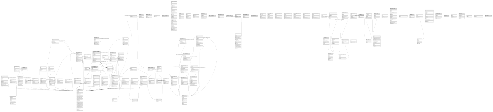

# postgres

## Tables

| Name | Columns | Comment | Type |
| ---- | ------- | ------- | ---- |
| [auth.users](auth.users.md) | 35 | Auth: Stores user login data within a secure schema. | BASE TABLE |
| [auth.refresh_tokens](auth.refresh_tokens.md) | 9 | Auth: Store of tokens used to refresh JWT tokens once they expire. | BASE TABLE |
| [auth.instances](auth.instances.md) | 5 | Auth: Manages users across multiple sites. | BASE TABLE |
| [auth.audit_log_entries](auth.audit_log_entries.md) | 5 | Auth: Audit trail for user actions. | BASE TABLE |
| [auth.schema_migrations](auth.schema_migrations.md) | 1 | Auth: Manages updates to the auth system. | BASE TABLE |
| [extensions.pg_stat_statements_info](extensions.pg_stat_statements_info.md) | 2 |  | VIEW |
| [extensions.pg_stat_statements](extensions.pg_stat_statements.md) | 49 |  | VIEW |
| [vault.secrets](vault.secrets.md) | 8 | Table with encrypted `secret` column for storing sensitive information on disk. | BASE TABLE |
| [vault.decrypted_secrets](vault.decrypted_secrets.md) | 9 |  | VIEW |
| [net.http_request_queue](net.http_request_queue.md) | 6 |  | BASE TABLE |
| [net._http_response](net._http_response.md) | 8 |  | BASE TABLE |
| [supabase_functions.migrations](supabase_functions.migrations.md) | 2 |  | BASE TABLE |
| [supabase_functions.hooks](supabase_functions.hooks.md) | 5 | Supabase Functions Hooks: Audit trail for triggered hooks. | BASE TABLE |
| [_realtime.schema_migrations](_realtime.schema_migrations.md) | 2 |  | BASE TABLE |
| [_realtime.tenants](_realtime.tenants.md) | 24 |  | BASE TABLE |
| [_realtime.extensions](_realtime.extensions.md) | 6 |  | BASE TABLE |
| [_realtime.feature_flags](_realtime.feature_flags.md) | 5 |  | BASE TABLE |
| [realtime.schema_migrations](realtime.schema_migrations.md) | 2 |  | BASE TABLE |
| [realtime.subscription](realtime.subscription.md) | 9 |  | BASE TABLE |
| [realtime.messages](realtime.messages.md) | 9 |  | BASE TABLE |
| [realtime.messages_2026_08_02](realtime.messages_2026_08_02.md) | 9 |  | BASE TABLE |
| [realtime.messages_2026_08_03](realtime.messages_2026_08_03.md) | 9 |  | BASE TABLE |
| [realtime.messages_2026_08_04](realtime.messages_2026_08_04.md) | 9 |  | BASE TABLE |
| [realtime.messages_2026_08_05](realtime.messages_2026_08_05.md) | 9 |  | BASE TABLE |
| [realtime.messages_2026_08_06](realtime.messages_2026_08_06.md) | 9 |  | BASE TABLE |
| [storage.migrations](storage.migrations.md) | 4 |  | BASE TABLE |
| [storage.buckets](storage.buckets.md) | 11 |  | BASE TABLE |
| [storage.objects](storage.objects.md) | 12 |  | BASE TABLE |
| [storage.s3_multipart_uploads](storage.s3_multipart_uploads.md) | 10 |  | BASE TABLE |
| [storage.s3_multipart_uploads_parts](storage.s3_multipart_uploads_parts.md) | 10 |  | BASE TABLE |
| [storage.buckets_analytics](storage.buckets_analytics.md) | 7 |  | BASE TABLE |
| [storage.iceberg_namespaces](storage.iceberg_namespaces.md) | 7 |  | BASE TABLE |
| [storage.iceberg_tables](storage.iceberg_tables.md) | 11 |  | BASE TABLE |
| [storage.buckets_vectors](storage.buckets_vectors.md) | 4 |  | BASE TABLE |
| [storage.vector_indexes](storage.vector_indexes.md) | 9 |  | BASE TABLE |
| [auth.identities](auth.identities.md) | 9 | Auth: Stores identities associated to a user. | BASE TABLE |
| [auth.sessions](auth.sessions.md) | 15 | Auth: Stores session data associated to a user. | BASE TABLE |
| [auth.mfa_factors](auth.mfa_factors.md) | 13 | auth: stores metadata about factors | BASE TABLE |
| [auth.mfa_challenges](auth.mfa_challenges.md) | 7 | auth: stores metadata about challenge requests made | BASE TABLE |
| [auth.mfa_amr_claims](auth.mfa_amr_claims.md) | 5 | auth: stores authenticator method reference claims for multi factor authentication | BASE TABLE |
| [auth.sso_providers](auth.sso_providers.md) | 5 | Auth: Manages SSO identity provider information; see saml_providers for SAML. | BASE TABLE |
| [auth.sso_domains](auth.sso_domains.md) | 5 | Auth: Manages SSO email address domain mapping to an SSO Identity Provider. | BASE TABLE |
| [auth.saml_providers](auth.saml_providers.md) | 9 | Auth: Manages SAML Identity Provider connections. | BASE TABLE |
| [auth.saml_relay_states](auth.saml_relay_states.md) | 8 | Auth: Contains SAML Relay State information for each Service Provider initiated login. | BASE TABLE |
| [auth.flow_state](auth.flow_state.md) | 17 | Stores metadata for all OAuth/SSO login flows | BASE TABLE |
| [auth.one_time_tokens](auth.one_time_tokens.md) | 7 |  | BASE TABLE |
| [auth.oauth_clients](auth.oauth_clients.md) | 13 |  | BASE TABLE |
| [auth.oauth_authorizations](auth.oauth_authorizations.md) | 17 |  | BASE TABLE |
| [auth.oauth_consents](auth.oauth_consents.md) | 6 |  | BASE TABLE |
| [auth.oauth_client_states](auth.oauth_client_states.md) | 4 | Stores OAuth states for third-party provider authentication flows where Supabase acts as the OAuth client. | BASE TABLE |
| [auth.custom_oauth_providers](auth.custom_oauth_providers.md) | 25 |  | BASE TABLE |
| [auth.webauthn_credentials](auth.webauthn_credentials.md) | 14 |  | BASE TABLE |
| [auth.webauthn_challenges](auth.webauthn_challenges.md) | 6 |  | BASE TABLE |
| [supabase_migrations.schema_migrations](supabase_migrations.schema_migrations.md) | 3 |  | BASE TABLE |
| [public.badges](public.badges.md) | 5 |  | BASE TABLE |
| [public.chat_messages](public.chat_messages.md) | 9 |  | BASE TABLE |
| [public.correction_rubrics](public.correction_rubrics.md) | 12 |  | BASE TABLE |
| [public.course_occurrences](public.course_occurrences.md) | 4 |  | BASE TABLE |
| [public.courses](public.courses.md) | 8 |  | BASE TABLE |
| [public.essay_ai_corrections](public.essay_ai_corrections.md) | 12 |  | BASE TABLE |
| [public.exercises](public.exercises.md) | 7 |  | BASE TABLE |
| [public.intensivwoche_anmeldungen](public.intensivwoche_anmeldungen.md) | 18 | Öffentliche Anmeldungen für Intensivwochen-Kurse. Schreibzugriff ausschließlich über die SECURITY DEFINER Funktion book_intensivwoche_kurs(); RLS erlaubt SELECT/UPDATE/DELETE nur für Admins (is_admin()). anon behält nur SELECT (für die aggregierende, security_invoker View intensivwoche_kurse_mit_anmeldungen) — mangels RLS-Policy sieht anon dabei keine einzelnen Zeilen. | BASE TABLE |
| [public.intensivwoche_kurse](public.intensivwoche_kurse.md) | 18 | Intensivwoche-Kurse. RLS: Anon kann nur aktive Kurse lesen, Authenticated hat vollen Zugriff. | BASE TABLE |
| [public.intensivwoche_kurse_mit_anmeldungen](public.intensivwoche_kurse_mit_anmeldungen.md) | 20 | Oeffentliche Kursuebersicht mit aggregierter Belegung. security_invoker=true schuetzt alle Spalten/Joins korrekt per Aufrufer-RLS; aktuelle_teilnehmer/status werden bewusst ueber die SECURITY DEFINER-Funktion count_active_anmeldungen() berechnet, damit anon/authenticated eine korrekte Aggregatzahl sehen, ohne je eine einzelne intensivwoche_anmeldungen-Zeile lesen zu koennen. | VIEW |
| [public.learning_materials](public.learning_materials.md) | 16 |  | BASE TABLE |
| [public.math_solution_steps](public.math_solution_steps.md) | 8 |  | BASE TABLE |
| [public.mentor_skills](public.mentor_skills.md) | 8 |  | BASE TABLE |
| [public.mentorship_listings](public.mentorship_listings.md) | 15 |  | BASE TABLE |
| [public.mentorship_materials](public.mentorship_materials.md) | 17 |  | BASE TABLE |
| [public.mentorship_relations](public.mentorship_relations.md) | 11 |  | BASE TABLE |
| [public.mentorship_requests](public.mentorship_requests.md) | 10 |  | BASE TABLE |
| [public.profiles](public.profiles.md) | 15 |  | BASE TABLE |
| [public.questions](public.questions.md) | 2 |  | BASE TABLE |
| [public.student_essays](public.student_essays.md) | 16 |  | BASE TABLE |
| [public.subjects](public.subjects.md) | 4 |  | BASE TABLE |
| [public.tasks](public.tasks.md) | 9 |  | BASE TABLE |
| [public.trainer_exams](public.trainer_exams.md) | 9 |  | BASE TABLE |
| [public.trainer_progress](public.trainer_progress.md) | 6 |  | BASE TABLE |
| [public.user_badges](public.user_badges.md) | 4 |  | BASE TABLE |
| [public.user_exercises](public.user_exercises.md) | 8 |  | BASE TABLE |
| [public.wake_up](public.wake_up.md) | 3 |  | BASE TABLE |
| [public.intensivwoche_buchungsversuche](public.intensivwoche_buchungsversuche.md) | 3 | Zähl-Log für den Rate-Limiter in book_intensivwoche_kurs() (max. 5 Versuche / 10 Minuten je parent_email). Nur über die SECURITY DEFINER Funktion beschrieben/gelesen, RLS ohne Policies, keine Grants an anon/authenticated. Wird bewusst nicht automatisch bereinigt (Phase B); künftiges Pruning ist ein separater, additiver Schritt. | BASE TABLE |
| [public.material_areas](public.material_areas.md) | 4 | Vier stabile Materialbereiche (Abschnitt 2.11). Nur Lookup-Daten, kein Geschäftsbestand -- oeffentlich lesbar, Schreibzugriff nur ueber service_role. | BASE TABLE |
| [public.self_study_enrollments](public.self_study_enrollments.md) | 10 | Fachliche Selbststudium-Einschreibung (Abschnitt 2.11). Kein Klartext-Einladungstoken (nur invite_token_hash). Erzeugung/Aenderung ausschliesslich ueber service_role bis der Zahlungs-/Admin-Flow gebaut ist -- kein INSERT/UPDATE-Grant fuer anon/authenticated in dieser Runde. | BASE TABLE |
| [public.material_access_grants](public.material_access_grants.md) | 10 | Effektiver Materialzugriff (Abschnitt 2.11). Entzug/Ablauf setzen status/revoked_at, niemals ein Hard-Delete. Admins duerfen admin_grant-Eintraege direkt erteilen/aktualisieren (Schritt 11a); self_study_enrollment-Eintraege bleiben bis zum spaeteren Zahlungs-Flow service_role-only. | BASE TABLE |
| [public.offers](public.offers.md) | 5 | Stabiler fachlicher Schluessel je Angebot (Abschnitt 2.12): (audience_id, kurstyp, slug). Oeffentlich lesbar, Schreibzugriff nur ueber service_role bis die Admin-Maske existiert. | BASE TABLE |
| [public.offer_editions](public.offer_editions.md) | 18 | Jaehrliche Durchfuehrung eines Offers (Abschnitt 2.12): Preise, Texte, Fruehbucher-Konfiguration, Optimistic-Concurrency-Version, Status. Oeffentlich nur wenn status=published, sonst nur fuer lehrperson/admin (is_content_manager()). Schreibzugriff nur ueber service_role bis die Admin-Maske existiert. | BASE TABLE |
| [public.course_sessions](public.course_sessions.md) | 7 | Optionale 1:1-Erweiterung von intensivwoche_kurse (Abschnitt 2.12) -- id ist zugleich PK und FK, kein zweites Durchfuehrungssystem. Name/Datum/Standort/Kapazitaet/Aktivitaet bleiben kanonisch in intensivwoche_kurse. Oeffentlich nur wenn die zugehoerige Edition published ist. Schreibzugriff nur ueber service_role bis die Admin-Maske existiert. | BASE TABLE |
| [public.audit_log](public.audit_log.md) | 7 | Generisches Mutationsprotokoll (Abschnitt 2.12): Benutzer, Zeitpunkt, Entity, Aktion, Vorher-/Nachher-Diff ohne personenbezogene Buchungsdaten. Nur fuer Admins lesbar. Befuellung ist Aufgabe der Admin-Maske-Publish-Server-Action (separate Runde), kein automatischer Trigger. | BASE TABLE |
| [public.course_days](public.course_days.md) | 4 | Kurstage einer course_session (Schritt 10b, Abschnitt 2.13). Admin-only -- kein Schueler-Leserecht in dieser Runde, da nur die Admin-Maske (nicht eine Schueler-Seite) Teil dieser Route ist. | BASE TABLE |
| [public.release_content_catalog](public.release_content_catalog.md) | 5 | Referenzierbare Teilmenge aus exercises/trainer_exams fuer Tagesfreigaben (Schritt 10b). Kein Materialduplikat -- nur echte FKs mit XOR-CHECK. | BASE TABLE |
| [public.daily_releases](public.daily_releases.md) | 11 | Genau eine aktuelle Freigabe pro Kurstag (Schritt 10b, Abschnitt 2.13). Admin-Vollzugriff, eingeschriebene Lernende sehen nur status=active innerhalb des Zeitfensters fuer ihre eigene course_session. | BASE TABLE |
| [public.daily_release_items](public.daily_release_items.md) | 3 | Kuratierte Inhalte + Reihenfolge je Freigabe (Schritt 10b). Die Sichtbarkeitsregel liegt bereits vollstaendig in daily_releases_enrolled_read; hier reicht die Existenz der (dank RLS bereits gefilterten) Elternzeile. | BASE TABLE |
| [public.teacher_assignments](public.teacher_assignments.md) | 7 | Zuteilung Lehrperson <-> course_session (Schritt 10c). Admin-Vollzugriff; Lehrpersonen sehen nur eigene Zuteilungen (fuer die Kurszeit-Vorauswahl in TeacherWorkEntryForm). | BASE TABLE |
| [public.work_entries](public.work_entries.md) | 15 | Geleistete Arbeitszeit (Schritt 10c, Abschnitt 2.14). Lehrpersonen verwalten nur eigene draft/rejected-Eintraege; Genehmigung/Zurueckweisung/Sperrung bleiben admin-only. | BASE TABLE |
| [public.teacher_rate_agreements](public.teacher_rate_agreements.md) | 9 | Zeitlich gueltiger, admin-vereinbarter Stundensatz je Lehrperson (Schritt 10c). Nur Admins schreiben; eine neue Vereinbarung ueberschreibt keine fruehere (Abschnitt 2.14), die EXCLUDE-Constraint verhindert ueberlappende Gueltigkeitszeitraeume. | BASE TABLE |
| [public.payroll_periods](public.payroll_periods.md) | 9 | Monatlicher Lohnperioden-Status (Schritt 10c). Admin-only in jeder Hinsicht. | BASE TABLE |
| [public.payroll_snapshots](public.payroll_snapshots.md) | 7 | Unveraenderliches Ergebnis eines Monatsabschlusses je Lehrperson (Schritt 10c). Wird ausschliesslich durch admin_close_payroll_period() befuellt. | BASE TABLE |
| [public.payroll_snapshot_lines](public.payroll_snapshot_lines.md) | 7 | Unveraenderliche Einzelzeilen eines Payroll-Snapshots (Schritt 10c) -- ein work_entry kann per UNIQUE(work_entry_id) nur in genau einem Snapshot verrechnet werden. | BASE TABLE |
| [public.financial_events](public.financial_events.md) | 14 | Idempotenter, append-only Reporting-Ledger (Schritt 10d, Abschnitt 2.15). Wird ausschliesslich durch SECURITY-DEFINER-Trigger/RPCs befuellt (sync_anmeldung_financial_events, sync_expense_financial_event, sync_financial_adjustment_event, admin_close_payroll_period) -- kein direkter INSERT/UPDATE/DELETE fuer authenticated, admin liest nur. | BASE TABLE |
| [public.expense_entries](public.expense_entries.md) | 13 | Raum-/Material-/Marketing-/externe/Betriebskosten (Schritt 10d). Admin-only. status=approved spiegelt einmalig (ON CONFLICT DO NOTHING) einen course_expense/overhead-Eintrag nach financial_events -- spaetere Bearbeitung nach Genehmigung erzeugt keinen zweiten Ledger-Eintrag. | BASE TABLE |
| [public.financial_periods](public.financial_periods.md) | 8 | Jaehrlicher Finanzabschluss-Status (Schritt 10d). Admin-only. | BASE TABLE |
| [public.budgets](public.budgets.md) | 6 | Budget je Kategorie und Jahr (Schritt 10d). Admin-only. | BASE TABLE |
| [public.financial_adjustments](public.financial_adjustments.md) | 8 | Auditierte manuelle Korrekturbuchung (Schritt 10d) -- spiegelt sich automatisch nach financial_events (event_type=manual_adjustment). | BASE TABLE |
| [public.mail_outbox](public.mail_outbox.md) | 12 | Idempotente Versand-/Retry-Warteschlange fuer Buchungsbestaetigungen (Abschnitt 10.4). Enthaelt bewusst keine Kopie von Name/E-Mail/Notizen -- nur eine Referenz auf intensivwoche_anmeldungen plus Versandstatus. | BASE TABLE |
| [supabase_migrations.seed_files](supabase_migrations.seed_files.md) | 2 |  | BASE TABLE |

## Stored procedures and functions

| Name | ReturnType | Arguments | Type |
| ---- | ------- | ------- | ---- |
| pgbouncer.get_auth | record | p_usename text | FUNCTION |
| extensions.uuid_nil | uuid |  | FUNCTION |
| extensions.uuid_ns_dns | uuid |  | FUNCTION |
| extensions.uuid_ns_url | uuid |  | FUNCTION |
| extensions.uuid_ns_oid | uuid |  | FUNCTION |
| extensions.uuid_ns_x500 | uuid |  | FUNCTION |
| extensions.uuid_generate_v1 | uuid |  | FUNCTION |
| extensions.uuid_generate_v1mc | uuid |  | FUNCTION |
| extensions.uuid_generate_v3 | uuid | namespace uuid, name text | FUNCTION |
| extensions.uuid_generate_v4 | uuid |  | FUNCTION |
| extensions.uuid_generate_v5 | uuid | namespace uuid, name text | FUNCTION |
| extensions.digest | bytea | text, text | FUNCTION |
| extensions.digest | bytea | bytea, text | FUNCTION |
| extensions.hmac | bytea | text, text, text | FUNCTION |
| extensions.hmac | bytea | bytea, bytea, text | FUNCTION |
| extensions.crypt | text | text, text | FUNCTION |
| extensions.gen_salt | text | text | FUNCTION |
| extensions.gen_salt | text | text, integer | FUNCTION |
| extensions.encrypt | bytea | bytea, bytea, text | FUNCTION |
| extensions.decrypt | bytea | bytea, bytea, text | FUNCTION |
| extensions.encrypt_iv | bytea | bytea, bytea, bytea, text | FUNCTION |
| extensions.decrypt_iv | bytea | bytea, bytea, bytea, text | FUNCTION |
| extensions.gen_random_bytes | bytea | integer | FUNCTION |
| extensions.gen_random_uuid | uuid |  | FUNCTION |
| extensions.pgp_sym_encrypt | bytea | text, text | FUNCTION |
| extensions.pgp_sym_encrypt_bytea | bytea | bytea, text | FUNCTION |
| extensions.pgp_sym_encrypt | bytea | text, text, text | FUNCTION |
| extensions.pgp_sym_encrypt_bytea | bytea | bytea, text, text | FUNCTION |
| extensions.pgp_sym_decrypt | text | bytea, text | FUNCTION |
| extensions.pgp_sym_decrypt_bytea | bytea | bytea, text | FUNCTION |
| extensions.pgp_sym_decrypt | text | bytea, text, text | FUNCTION |
| extensions.pgp_sym_decrypt_bytea | bytea | bytea, text, text | FUNCTION |
| extensions.pgp_pub_encrypt | bytea | text, bytea | FUNCTION |
| extensions.pgp_pub_encrypt_bytea | bytea | bytea, bytea | FUNCTION |
| extensions.pgp_pub_encrypt | bytea | text, bytea, text | FUNCTION |
| extensions.pgp_pub_encrypt_bytea | bytea | bytea, bytea, text | FUNCTION |
| extensions.pgp_pub_decrypt | text | bytea, bytea | FUNCTION |
| extensions.pgp_pub_decrypt_bytea | bytea | bytea, bytea | FUNCTION |
| extensions.pgp_pub_decrypt | text | bytea, bytea, text | FUNCTION |
| extensions.pgp_pub_decrypt_bytea | bytea | bytea, bytea, text | FUNCTION |
| extensions.pgp_pub_decrypt | text | bytea, bytea, text, text | FUNCTION |
| extensions.pgp_pub_decrypt_bytea | bytea | bytea, bytea, text, text | FUNCTION |
| extensions.pgp_key_id | text | bytea | FUNCTION |
| extensions.armor | text | bytea | FUNCTION |
| extensions.armor | text | bytea, text[], text[] | FUNCTION |
| extensions.dearmor | bytea | text | FUNCTION |
| extensions.pgp_armor_headers | record | text, OUT key text, OUT value text | FUNCTION |
| auth.uid | uuid |  | FUNCTION |
| auth.role | text |  | FUNCTION |
| auth.email | text |  | FUNCTION |
| extensions.grant_pg_cron_access | event_trigger |  | FUNCTION |
| extensions.grant_pg_net_access | event_trigger |  | FUNCTION |
| extensions.pg_stat_statements_info | record | OUT dealloc bigint, OUT stats_reset timestamp with time zone | FUNCTION |
| extensions.pg_stat_statements | record | showtext boolean, OUT userid oid, OUT dbid oid, OUT toplevel boolean, OUT queryid bigint, OUT query text, OUT plans bigint, OUT total_plan_time double precision, OUT min_plan_time double precision, OUT max_plan_time double precision, OUT mean_plan_time double precision, OUT stddev_plan_time double precision, OUT calls bigint, OUT total_exec_time double precision, OUT min_exec_time double precision, OUT max_exec_time double precision, OUT mean_exec_time double precision, OUT stddev_exec_time double precision, OUT rows bigint, OUT shared_blks_hit bigint, OUT shared_blks_read bigint, OUT shared_blks_dirtied bigint, OUT shared_blks_written bigint, OUT local_blks_hit bigint, OUT local_blks_read bigint, OUT local_blks_dirtied bigint, OUT local_blks_written bigint, OUT temp_blks_read bigint, OUT temp_blks_written bigint, OUT shared_blk_read_time double precision, OUT shared_blk_write_time double precision, OUT local_blk_read_time double precision, OUT local_blk_write_time double precision, OUT temp_blk_read_time double precision, OUT temp_blk_write_time double precision, OUT wal_records bigint, OUT wal_fpi bigint, OUT wal_bytes numeric, OUT jit_functions bigint, OUT jit_generation_time double precision, OUT jit_inlining_count bigint, OUT jit_inlining_time double precision, OUT jit_optimization_count bigint, OUT jit_optimization_time double precision, OUT jit_emission_count bigint, OUT jit_emission_time double precision, OUT jit_deform_count bigint, OUT jit_deform_time double precision, OUT stats_since timestamp with time zone, OUT minmax_stats_since timestamp with time zone | FUNCTION |
| extensions.pg_stat_statements_reset | timestamptz | userid oid DEFAULT 0, dbid oid DEFAULT 0, queryid bigint DEFAULT 0, minmax_only boolean DEFAULT false | FUNCTION |
| extensions.pgrst_ddl_watch | event_trigger |  | FUNCTION |
| extensions.pgrst_drop_watch | event_trigger |  | FUNCTION |
| extensions.grant_pg_graphql_access | event_trigger |  | FUNCTION |
| extensions.set_graphql_placeholder | event_trigger |  | FUNCTION |
| vault._crypto_aead_det_encrypt | bytea | message bytea, additional bytea, key_id bigint, context bytea DEFAULT '\x7067736f6469756d'::bytea, nonce bytea DEFAULT NULL::bytea | FUNCTION |
| vault._crypto_aead_det_decrypt | bytea | message bytea, additional bytea, key_id bigint, context bytea DEFAULT '\x7067736f6469756d'::bytea, nonce bytea DEFAULT NULL::bytea | FUNCTION |
| vault._crypto_aead_det_noncegen | bytea |  | FUNCTION |
| vault.create_secret | uuid | new_secret text, new_name text DEFAULT NULL::text, new_description text DEFAULT ''::text, new_key_id uuid DEFAULT NULL::uuid | FUNCTION |
| vault.update_secret | void | secret_id uuid, new_secret text DEFAULT NULL::text, new_name text DEFAULT NULL::text, new_description text DEFAULT NULL::text, new_key_id uuid DEFAULT NULL::uuid | FUNCTION |
| graphql_public.graphql | jsonb | "operationName" text DEFAULT NULL::text, query text DEFAULT NULL::text, variables jsonb DEFAULT NULL::jsonb, extensions jsonb DEFAULT NULL::jsonb | FUNCTION |
| net.check_worker_is_up | void |  | FUNCTION |
| net._await_response | bool | request_id bigint | FUNCTION |
| net._urlencode_string | text | string character varying | FUNCTION |
| net._encode_url_with_params_array | text | url text, params_array text[] | FUNCTION |
| net.worker_restart | bool |  | FUNCTION |
| net.wait_until_running | void |  | FUNCTION |
| net.wake | void |  | FUNCTION |
| net.http_get | int8 | url text, params jsonb DEFAULT '{}'::jsonb, headers jsonb DEFAULT '{}'::jsonb, timeout_milliseconds integer DEFAULT 5000 | FUNCTION |
| net.http_post | int8 | url text, body jsonb DEFAULT '{}'::jsonb, params jsonb DEFAULT '{}'::jsonb, headers jsonb DEFAULT '{"Content-Type": "application/json"}'::jsonb, timeout_milliseconds integer DEFAULT 5000 | FUNCTION |
| net.http_delete | int8 | url text, params jsonb DEFAULT '{}'::jsonb, headers jsonb DEFAULT '{}'::jsonb, timeout_milliseconds integer DEFAULT 5000, body jsonb DEFAULT NULL::jsonb | FUNCTION |
| net._http_collect_response | http_response_result | request_id bigint, async boolean DEFAULT true | FUNCTION |
| net.http_collect_response | http_response_result | request_id bigint, async boolean DEFAULT true | FUNCTION |
| supabase_functions.http_request | trigger |  | FUNCTION |
| realtime.subscription_check_filters | trigger |  | FUNCTION |
| realtime.quote_wal2json | text | entity regclass | FUNCTION |
| realtime.check_equality_op | bool | op realtime.equality_op, type_ regtype, val_1 text, val_2 text | FUNCTION |
| realtime.cast | jsonb | val text, type_ regtype | FUNCTION |
| realtime.to_regrole | regrole | role_name text | FUNCTION |
| realtime.apply_rls | wal_rls | wal jsonb, max_record_bytes integer DEFAULT (1024 * 1024) | FUNCTION |
| realtime.is_visible_through_filters | bool | columns realtime.wal_column[], filters realtime.user_defined_filter[] | FUNCTION |
| realtime.build_prepared_statement_sql | text | prepared_statement_name text, entity regclass, columns realtime.wal_column[] | FUNCTION |
| realtime.topic | text |  | FUNCTION |
| realtime.send | void | payload jsonb, event text, topic text, private boolean DEFAULT true | FUNCTION |
| realtime.broadcast_changes | void | topic_name text, event_name text, operation text, table_name text, table_schema text, new record, old record, level text DEFAULT 'ROW'::text | FUNCTION |
| realtime.wal2json_escape_identifier | text | name text | FUNCTION |
| realtime.list_changes | record | publication name, slot_name name, max_changes integer, max_record_bytes integer | FUNCTION |
| realtime.send_binary | void | payload bytea, event text, topic text, private boolean DEFAULT true | FUNCTION |
| realtime.check_equality_op | bool | op realtime.equality_op, type_ regtype, val_1 text, val_2 text, negate boolean | FUNCTION |
| storage.foldername | _text | name text | FUNCTION |
| storage.filename | text | name text | FUNCTION |
| storage.extension | text | name text | FUNCTION |
| storage.get_size_by_bucket | record |  | FUNCTION |
| storage.search | record | prefix text, bucketname text, limits integer DEFAULT 100, levels integer DEFAULT 1, offsets integer DEFAULT 0, search text DEFAULT ''::text, sortcolumn text DEFAULT 'name'::text, sortorder text DEFAULT 'asc'::text | FUNCTION |
| storage.update_updated_at_column | trigger |  | FUNCTION |
| storage.can_insert_object | void | bucketid text, name text, owner uuid, metadata jsonb | FUNCTION |
| storage.list_multipart_uploads_with_delimiter | record | bucket_id text, prefix_param text, delimiter_param text, max_keys integer DEFAULT 100, next_key_token text DEFAULT ''::text, next_upload_token text DEFAULT ''::text | FUNCTION |
| storage.operation | text |  | FUNCTION |
| storage.enforce_bucket_name_length | trigger |  | FUNCTION |
| storage.get_common_prefix | text | p_key text, p_prefix text, p_delimiter text | FUNCTION |
| storage.list_objects_with_delimiter | record | _bucket_id text, prefix_param text, delimiter_param text, max_keys integer DEFAULT 100, start_after text DEFAULT ''::text, next_token text DEFAULT ''::text, sort_order text DEFAULT 'asc'::text | FUNCTION |
| storage.search_v2 | record | prefix text, bucket_name text, limits integer DEFAULT 100, levels integer DEFAULT 1, start_after text DEFAULT ''::text, sort_order text DEFAULT 'asc'::text, sort_column text DEFAULT 'name'::text, sort_column_after text DEFAULT ''::text | FUNCTION |
| storage.search_by_timestamp | record | p_prefix text, p_bucket_id text, p_limit integer, p_level integer, p_start_after text, p_sort_order text, p_sort_column text, p_sort_column_after text | FUNCTION |
| storage.protect_delete | trigger |  | FUNCTION |
| storage.allow_only_operation | bool | expected_operation text | FUNCTION |
| storage.allow_any_operation | bool | expected_operations text[] | FUNCTION |
| auth.jwt | jsonb |  | FUNCTION |
| public.accept_mentorship_request | uuid | request_id uuid | FUNCTION |
| public.get_upcoming_courses | jsonb |  | FUNCTION |
| public.handle_new_user | trigger |  | FUNCTION |
| public.increment_material_view_count | void | material_id integer | FUNCTION |
| public.is_admin | bool |  | FUNCTION |
| public.is_content_manager | bool |  | FUNCTION |
| public.is_kurs_aktiv | bool | p_kurs_id bigint | FUNCTION |
| public.is_kurs_owner | bool | kurs_created_by uuid | FUNCTION |
| public.is_owner | bool | record_user_id uuid | FUNCTION |
| public.set_essay_review_timestamp | trigger |  | FUNCTION |
| public.update_correction_rubrics_updated_at | trigger |  | FUNCTION |
| public.update_mentorship_updated_at | trigger |  | FUNCTION |
| public.update_student_essays_updated_at | trigger |  | FUNCTION |
| public.update_updated_at_column | trigger |  | FUNCTION |
| public.enforce_anmeldung_price_snapshot_immutable | trigger |  | FUNCTION |
| public.book_intensivwoche_kurs | uuid | p_kurs_id bigint, p_child_firstname text, p_child_lastname text, p_child_class_level text, p_child_gender text, p_parent_email text, p_parent_phone text, p_notes text DEFAULT NULL::text, p_idempotency_key uuid DEFAULT NULL::uuid | FUNCTION |
| public.bump_version_and_updated_at | trigger |  | FUNCTION |
| public.admin_upsert_course_session | int8 | p_edition_id uuid, p_name text, p_fach text, p_beschreibung text, p_start_datum date, p_end_datum date, p_uhrzeit text, p_ort text, p_max_teilnehmer integer, p_lehrer text, p_kurs_id bigint DEFAULT NULL::bigint, p_registration_status text DEFAULT 'bookable'::text, p_delivery_modes text[] DEFAULT ARRAY['onsite'::text] | FUNCTION |
| public.link_anmeldung_beneficiary | trigger |  | FUNCTION |
| public.admin_save_daily_release | uuid | p_course_day_id uuid, p_status text, p_opens_at timestamp with time zone DEFAULT NULL::timestamp with time zone, p_closes_at timestamp with time zone DEFAULT NULL::timestamp with time zone, p_items jsonb DEFAULT '[]'::jsonb | FUNCTION |
| extensions.gbtreekey4_in | gbtreekey4 | cstring | FUNCTION |
| extensions.gbtreekey4_out | cstring | gbtreekey4 | FUNCTION |
| extensions.gbtreekey8_in | gbtreekey8 | cstring | FUNCTION |
| extensions.gbtreekey8_out | cstring | gbtreekey8 | FUNCTION |
| extensions.gbtreekey16_in | gbtreekey16 | cstring | FUNCTION |
| extensions.gbtreekey16_out | cstring | gbtreekey16 | FUNCTION |
| extensions.gbtreekey32_in | gbtreekey32 | cstring | FUNCTION |
| extensions.gbtreekey32_out | cstring | gbtreekey32 | FUNCTION |
| extensions.gbtreekey_var_in | gbtreekey_var | cstring | FUNCTION |
| extensions.gbtreekey_var_out | cstring | gbtreekey_var | FUNCTION |
| extensions.cash_dist | money | money, money | FUNCTION |
| extensions.date_dist | int4 | date, date | FUNCTION |
| extensions.float4_dist | float4 | real, real | FUNCTION |
| extensions.float8_dist | float8 | double precision, double precision | FUNCTION |
| extensions.int2_dist | int2 | smallint, smallint | FUNCTION |
| extensions.int4_dist | int4 | integer, integer | FUNCTION |
| extensions.int8_dist | int8 | bigint, bigint | FUNCTION |
| extensions.interval_dist | interval | interval, interval | FUNCTION |
| extensions.oid_dist | oid | oid, oid | FUNCTION |
| extensions.time_dist | interval | time without time zone, time without time zone | FUNCTION |
| extensions.ts_dist | interval | timestamp without time zone, timestamp without time zone | FUNCTION |
| extensions.tstz_dist | interval | timestamp with time zone, timestamp with time zone | FUNCTION |
| extensions.gbt_oid_consistent | bool | internal, oid, smallint, oid, internal | FUNCTION |
| extensions.gbt_oid_distance | float8 | internal, oid, smallint, oid, internal | FUNCTION |
| extensions.gbt_oid_fetch | internal | internal | FUNCTION |
| extensions.gbt_oid_compress | internal | internal | FUNCTION |
| extensions.gbt_decompress | internal | internal | FUNCTION |
| extensions.gbt_var_decompress | internal | internal | FUNCTION |
| extensions.gbt_var_fetch | internal | internal | FUNCTION |
| extensions.gbt_oid_penalty | internal | internal, internal, internal | FUNCTION |
| extensions.gbt_oid_picksplit | internal | internal, internal | FUNCTION |
| extensions.gbt_oid_union | gbtreekey8 | internal, internal | FUNCTION |
| extensions.gbt_oid_same | internal | gbtreekey8, gbtreekey8, internal | FUNCTION |
| extensions.gbt_int2_consistent | bool | internal, smallint, smallint, oid, internal | FUNCTION |
| extensions.gbt_int2_distance | float8 | internal, smallint, smallint, oid, internal | FUNCTION |
| extensions.gbt_int2_compress | internal | internal | FUNCTION |
| extensions.gbt_int2_fetch | internal | internal | FUNCTION |
| extensions.gbt_int2_penalty | internal | internal, internal, internal | FUNCTION |
| extensions.gbt_int2_picksplit | internal | internal, internal | FUNCTION |
| extensions.gbt_int2_union | gbtreekey4 | internal, internal | FUNCTION |
| extensions.gbt_int2_same | internal | gbtreekey4, gbtreekey4, internal | FUNCTION |
| extensions.gbt_int4_consistent | bool | internal, integer, smallint, oid, internal | FUNCTION |
| extensions.gbt_int4_distance | float8 | internal, integer, smallint, oid, internal | FUNCTION |
| extensions.gbt_int4_compress | internal | internal | FUNCTION |
| extensions.gbt_int4_fetch | internal | internal | FUNCTION |
| extensions.gbt_int4_penalty | internal | internal, internal, internal | FUNCTION |
| extensions.gbt_int4_picksplit | internal | internal, internal | FUNCTION |
| extensions.gbt_int4_union | gbtreekey8 | internal, internal | FUNCTION |
| extensions.gbt_int4_same | internal | gbtreekey8, gbtreekey8, internal | FUNCTION |
| extensions.gbt_int8_consistent | bool | internal, bigint, smallint, oid, internal | FUNCTION |
| extensions.gbt_int8_distance | float8 | internal, bigint, smallint, oid, internal | FUNCTION |
| extensions.gbt_int8_compress | internal | internal | FUNCTION |
| extensions.gbt_int8_fetch | internal | internal | FUNCTION |
| extensions.gbt_int8_penalty | internal | internal, internal, internal | FUNCTION |
| extensions.gbt_int8_picksplit | internal | internal, internal | FUNCTION |
| extensions.gbt_int8_union | gbtreekey16 | internal, internal | FUNCTION |
| extensions.gbt_int8_same | internal | gbtreekey16, gbtreekey16, internal | FUNCTION |
| extensions.gbt_float4_consistent | bool | internal, real, smallint, oid, internal | FUNCTION |
| extensions.gbt_float4_distance | float8 | internal, real, smallint, oid, internal | FUNCTION |
| extensions.gbt_float4_compress | internal | internal | FUNCTION |
| extensions.gbt_float4_fetch | internal | internal | FUNCTION |
| extensions.gbt_float4_penalty | internal | internal, internal, internal | FUNCTION |
| extensions.gbt_float4_picksplit | internal | internal, internal | FUNCTION |
| extensions.gbt_float4_union | gbtreekey8 | internal, internal | FUNCTION |
| extensions.gbt_float4_same | internal | gbtreekey8, gbtreekey8, internal | FUNCTION |
| extensions.gbt_float8_consistent | bool | internal, double precision, smallint, oid, internal | FUNCTION |
| extensions.gbt_float8_distance | float8 | internal, double precision, smallint, oid, internal | FUNCTION |
| extensions.gbt_float8_compress | internal | internal | FUNCTION |
| extensions.gbt_float8_fetch | internal | internal | FUNCTION |
| extensions.gbt_float8_penalty | internal | internal, internal, internal | FUNCTION |
| extensions.gbt_float8_picksplit | internal | internal, internal | FUNCTION |
| extensions.gbt_float8_union | gbtreekey16 | internal, internal | FUNCTION |
| extensions.gbt_float8_same | internal | gbtreekey16, gbtreekey16, internal | FUNCTION |
| extensions.gbt_ts_consistent | bool | internal, timestamp without time zone, smallint, oid, internal | FUNCTION |
| extensions.gbt_ts_distance | float8 | internal, timestamp without time zone, smallint, oid, internal | FUNCTION |
| extensions.gbt_tstz_consistent | bool | internal, timestamp with time zone, smallint, oid, internal | FUNCTION |
| extensions.gbt_tstz_distance | float8 | internal, timestamp with time zone, smallint, oid, internal | FUNCTION |
| extensions.gbt_ts_compress | internal | internal | FUNCTION |
| extensions.gbt_tstz_compress | internal | internal | FUNCTION |
| extensions.gbt_ts_fetch | internal | internal | FUNCTION |
| extensions.gbt_ts_penalty | internal | internal, internal, internal | FUNCTION |
| extensions.gbt_ts_picksplit | internal | internal, internal | FUNCTION |
| extensions.gbt_ts_union | gbtreekey16 | internal, internal | FUNCTION |
| extensions.gbt_ts_same | internal | gbtreekey16, gbtreekey16, internal | FUNCTION |
| extensions.gbt_time_consistent | bool | internal, time without time zone, smallint, oid, internal | FUNCTION |
| extensions.gbt_time_distance | float8 | internal, time without time zone, smallint, oid, internal | FUNCTION |
| extensions.gbt_timetz_consistent | bool | internal, time with time zone, smallint, oid, internal | FUNCTION |
| extensions.gbt_time_compress | internal | internal | FUNCTION |
| extensions.gbt_timetz_compress | internal | internal | FUNCTION |
| extensions.gbt_time_fetch | internal | internal | FUNCTION |
| extensions.gbt_time_penalty | internal | internal, internal, internal | FUNCTION |
| extensions.gbt_time_picksplit | internal | internal, internal | FUNCTION |
| extensions.gbt_time_union | gbtreekey16 | internal, internal | FUNCTION |
| extensions.gbt_time_same | internal | gbtreekey16, gbtreekey16, internal | FUNCTION |
| extensions.gbt_date_consistent | bool | internal, date, smallint, oid, internal | FUNCTION |
| extensions.gbt_date_distance | float8 | internal, date, smallint, oid, internal | FUNCTION |
| extensions.gbt_date_compress | internal | internal | FUNCTION |
| extensions.gbt_date_fetch | internal | internal | FUNCTION |
| extensions.gbt_date_penalty | internal | internal, internal, internal | FUNCTION |
| extensions.gbt_date_picksplit | internal | internal, internal | FUNCTION |
| extensions.gbt_date_union | gbtreekey8 | internal, internal | FUNCTION |
| extensions.gbt_date_same | internal | gbtreekey8, gbtreekey8, internal | FUNCTION |
| extensions.gbt_intv_consistent | bool | internal, interval, smallint, oid, internal | FUNCTION |
| extensions.gbt_intv_distance | float8 | internal, interval, smallint, oid, internal | FUNCTION |
| extensions.gbt_intv_compress | internal | internal | FUNCTION |
| extensions.gbt_intv_decompress | internal | internal | FUNCTION |
| extensions.gbt_intv_fetch | internal | internal | FUNCTION |
| extensions.gbt_intv_penalty | internal | internal, internal, internal | FUNCTION |
| extensions.gbt_intv_picksplit | internal | internal, internal | FUNCTION |
| extensions.gbt_intv_union | gbtreekey32 | internal, internal | FUNCTION |
| extensions.gbt_intv_same | internal | gbtreekey32, gbtreekey32, internal | FUNCTION |
| extensions.gbt_cash_consistent | bool | internal, money, smallint, oid, internal | FUNCTION |
| extensions.gbt_cash_distance | float8 | internal, money, smallint, oid, internal | FUNCTION |
| extensions.gbt_cash_compress | internal | internal | FUNCTION |
| extensions.gbt_cash_fetch | internal | internal | FUNCTION |
| extensions.gbt_cash_penalty | internal | internal, internal, internal | FUNCTION |
| extensions.gbt_cash_picksplit | internal | internal, internal | FUNCTION |
| extensions.gbt_cash_union | gbtreekey16 | internal, internal | FUNCTION |
| extensions.gbt_cash_same | internal | gbtreekey16, gbtreekey16, internal | FUNCTION |
| extensions.gbt_macad_consistent | bool | internal, macaddr, smallint, oid, internal | FUNCTION |
| extensions.gbt_macad_compress | internal | internal | FUNCTION |
| extensions.gbt_macad_fetch | internal | internal | FUNCTION |
| extensions.gbt_macad_penalty | internal | internal, internal, internal | FUNCTION |
| extensions.gbt_macad_picksplit | internal | internal, internal | FUNCTION |
| extensions.gbt_macad_union | gbtreekey16 | internal, internal | FUNCTION |
| extensions.gbt_macad_same | internal | gbtreekey16, gbtreekey16, internal | FUNCTION |
| extensions.gbt_text_consistent | bool | internal, text, smallint, oid, internal | FUNCTION |
| extensions.gbt_bpchar_consistent | bool | internal, character, smallint, oid, internal | FUNCTION |
| extensions.gbt_text_compress | internal | internal | FUNCTION |
| extensions.gbt_bpchar_compress | internal | internal | FUNCTION |
| extensions.gbt_text_penalty | internal | internal, internal, internal | FUNCTION |
| extensions.gbt_text_picksplit | internal | internal, internal | FUNCTION |
| extensions.gbt_text_union | gbtreekey_var | internal, internal | FUNCTION |
| extensions.gbt_text_same | internal | gbtreekey_var, gbtreekey_var, internal | FUNCTION |
| extensions.gbt_bytea_consistent | bool | internal, bytea, smallint, oid, internal | FUNCTION |
| extensions.gbt_bytea_compress | internal | internal | FUNCTION |
| extensions.gbt_bytea_penalty | internal | internal, internal, internal | FUNCTION |
| extensions.gbt_bytea_picksplit | internal | internal, internal | FUNCTION |
| extensions.gbt_bytea_union | gbtreekey_var | internal, internal | FUNCTION |
| extensions.gbt_bytea_same | internal | gbtreekey_var, gbtreekey_var, internal | FUNCTION |
| extensions.gbt_numeric_consistent | bool | internal, numeric, smallint, oid, internal | FUNCTION |
| extensions.gbt_numeric_compress | internal | internal | FUNCTION |
| extensions.gbt_numeric_penalty | internal | internal, internal, internal | FUNCTION |
| extensions.gbt_numeric_picksplit | internal | internal, internal | FUNCTION |
| extensions.gbt_numeric_union | gbtreekey_var | internal, internal | FUNCTION |
| extensions.gbt_numeric_same | internal | gbtreekey_var, gbtreekey_var, internal | FUNCTION |
| extensions.gbt_bit_consistent | bool | internal, bit, smallint, oid, internal | FUNCTION |
| extensions.gbt_bit_compress | internal | internal | FUNCTION |
| extensions.gbt_bit_penalty | internal | internal, internal, internal | FUNCTION |
| extensions.gbt_bit_picksplit | internal | internal, internal | FUNCTION |
| extensions.gbt_bit_union | gbtreekey_var | internal, internal | FUNCTION |
| extensions.gbt_bit_same | internal | gbtreekey_var, gbtreekey_var, internal | FUNCTION |
| extensions.gbt_inet_consistent | bool | internal, inet, smallint, oid, internal | FUNCTION |
| extensions.gbt_inet_compress | internal | internal | FUNCTION |
| extensions.gbt_inet_penalty | internal | internal, internal, internal | FUNCTION |
| extensions.gbt_inet_picksplit | internal | internal, internal | FUNCTION |
| extensions.gbt_inet_union | gbtreekey16 | internal, internal | FUNCTION |
| extensions.gbt_inet_same | internal | gbtreekey16, gbtreekey16, internal | FUNCTION |
| extensions.gbt_uuid_consistent | bool | internal, uuid, smallint, oid, internal | FUNCTION |
| extensions.gbt_uuid_fetch | internal | internal | FUNCTION |
| extensions.gbt_uuid_compress | internal | internal | FUNCTION |
| extensions.gbt_uuid_penalty | internal | internal, internal, internal | FUNCTION |
| extensions.gbt_uuid_picksplit | internal | internal, internal | FUNCTION |
| extensions.gbt_uuid_union | gbtreekey32 | internal, internal | FUNCTION |
| extensions.gbt_uuid_same | internal | gbtreekey32, gbtreekey32, internal | FUNCTION |
| extensions.gbt_macad8_consistent | bool | internal, macaddr8, smallint, oid, internal | FUNCTION |
| extensions.gbt_macad8_compress | internal | internal | FUNCTION |
| extensions.gbt_macad8_fetch | internal | internal | FUNCTION |
| extensions.gbt_macad8_penalty | internal | internal, internal, internal | FUNCTION |
| extensions.gbt_macad8_picksplit | internal | internal, internal | FUNCTION |
| extensions.gbt_macad8_union | gbtreekey16 | internal, internal | FUNCTION |
| extensions.gbt_macad8_same | internal | gbtreekey16, gbtreekey16, internal | FUNCTION |
| extensions.gbt_enum_consistent | bool | internal, anyenum, smallint, oid, internal | FUNCTION |
| extensions.gbt_enum_compress | internal | internal | FUNCTION |
| extensions.gbt_enum_fetch | internal | internal | FUNCTION |
| extensions.gbt_enum_penalty | internal | internal, internal, internal | FUNCTION |
| extensions.gbt_enum_picksplit | internal | internal, internal | FUNCTION |
| extensions.gbt_enum_union | gbtreekey8 | internal, internal | FUNCTION |
| extensions.gbt_enum_same | internal | gbtreekey8, gbtreekey8, internal | FUNCTION |
| extensions.gbtreekey2_in | gbtreekey2 | cstring | FUNCTION |
| extensions.gbtreekey2_out | cstring | gbtreekey2 | FUNCTION |
| extensions.gbt_bool_consistent | bool | internal, boolean, smallint, oid, internal | FUNCTION |
| extensions.gbt_bool_compress | internal | internal | FUNCTION |
| extensions.gbt_bool_fetch | internal | internal | FUNCTION |
| extensions.gbt_bool_penalty | internal | internal, internal, internal | FUNCTION |
| extensions.gbt_bool_picksplit | internal | internal, internal | FUNCTION |
| extensions.gbt_bool_union | gbtreekey2 | internal, internal | FUNCTION |
| extensions.gbt_bool_same | internal | gbtreekey2, gbtreekey2, internal | FUNCTION |
| public.validate_work_entry_status_transition | trigger |  | FUNCTION |
| public.admin_close_payroll_period | uuid | p_year integer, p_month integer | FUNCTION |
| public.admin_save_rate_agreement | uuid | p_teacher_id uuid, p_hourly_rate_rappen integer, p_valid_from date | FUNCTION |
| public.sync_anmeldung_financial_events | trigger |  | FUNCTION |
| public.sync_expense_financial_event | trigger |  | FUNCTION |
| public.sync_financial_adjustment_event | trigger |  | FUNCTION |
| public.count_active_anmeldungen | int8 | p_kurs_id bigint | FUNCTION |
| public.enqueue_booking_confirmation_mail | trigger |  | FUNCTION |

## Enums

| Name | Values |
| ---- | ------- |
| auth.aal_level | aal1, aal2, aal3 |
| auth.code_challenge_method | plain, s256 |
| auth.factor_status | unverified, verified |
| auth.factor_type | phone, totp, webauthn |
| auth.oauth_authorization_status | approved, denied, expired, pending |
| auth.oauth_client_type | confidential, public |
| auth.oauth_registration_type | dynamic, manual |
| auth.oauth_response_type | code |
| auth.one_time_token_type | confirmation_token, email_change_token_current, email_change_token_new, phone_change_token, reauthentication_token, recovery_token |
| net.request_status | ERROR, PENDING, SUCCESS |
| realtime.action | DELETE, ERROR, INSERT, TRUNCATE, UPDATE |
| realtime.equality_op | eq, gt, gte, ilike, imatch, in, is, isdistinct, like, lt, lte, match, neq |
| storage.buckettype | ANALYTICS, STANDARD, VECTOR |

## Relations

---

> Generated by [tbls](https://github.com/k1LoW/tbls)
