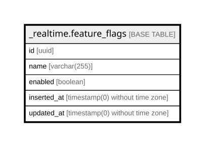

# _realtime.feature_flags

## Columns

| Name | Type | Default | Nullable | Children | Parents | Comment |
| ---- | ---- | ------- | -------- | -------- | ------- | ------- |
| id | uuid |  | false |  |  |  |
| name | varchar(255) |  | false |  |  |  |
| enabled | boolean | false | false |  |  |  |
| inserted_at | timestamp(0) without time zone |  | false |  |  |  |
| updated_at | timestamp(0) without time zone |  | false |  |  |  |

## Constraints

| Name | Type | Definition |
| ---- | ---- | ---------- |
| feature_flags_pkey | PRIMARY KEY | PRIMARY KEY (id) |

## Indexes

| Name | Definition |
| ---- | ---------- |
| feature_flags_pkey | CREATE UNIQUE INDEX feature_flags_pkey ON _realtime.feature_flags USING btree (id) |
| feature_flags_name_index | CREATE UNIQUE INDEX feature_flags_name_index ON _realtime.feature_flags USING btree (name) |

## Relations

---

> Generated by [tbls](https://github.com/k1LoW/tbls)
