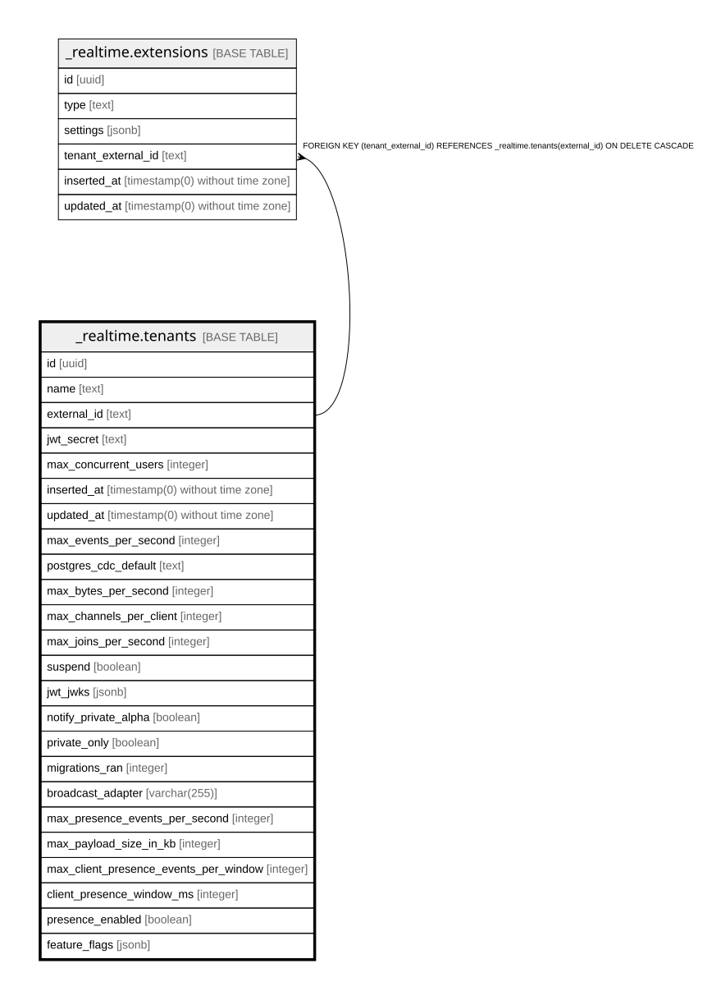

# _realtime.tenants

## Columns

| Name | Type | Default | Nullable | Children | Parents | Comment |
| ---- | ---- | ------- | -------- | -------- | ------- | ------- |
| id | uuid |  | false |  |  |  |
| name | text |  | true |  |  |  |
| external_id | text |  | true | [_realtime.extensions](_realtime.extensions.md) |  |  |
| jwt_secret | text |  | true |  |  |  |
| max_concurrent_users | integer | 200 | false |  |  |  |
| inserted_at | timestamp(0) without time zone |  | false |  |  |  |
| updated_at | timestamp(0) without time zone |  | false |  |  |  |
| max_events_per_second | integer | 100 | false |  |  |  |
| postgres_cdc_default | text | 'postgres_cdc_rls'::text | true |  |  |  |
| max_bytes_per_second | integer | 100000 | false |  |  |  |
| max_channels_per_client | integer | 100 | false |  |  |  |
| max_joins_per_second | integer | 500 | false |  |  |  |
| suspend | boolean | false | true |  |  |  |
| jwt_jwks | jsonb |  | true |  |  |  |
| notify_private_alpha | boolean | false | true |  |  |  |
| private_only | boolean | false | false |  |  |  |
| migrations_ran | integer | 0 | true |  |  |  |
| broadcast_adapter | varchar(255) | 'gen_rpc'::character varying | true |  |  |  |
| max_presence_events_per_second | integer | 1000 | true |  |  |  |
| max_payload_size_in_kb | integer | 3000 | true |  |  |  |
| max_client_presence_events_per_window | integer |  | true |  |  |  |
| client_presence_window_ms | integer |  | true |  |  |  |
| presence_enabled | boolean | false | false |  |  |  |
| feature_flags | jsonb | '{}'::jsonb | false |  |  |  |

## Constraints

| Name | Type | Definition |
| ---- | ---- | ---------- |
| jwt_secret_or_jwt_jwks_required | CHECK | CHECK (((jwt_secret IS NOT NULL) OR (jwt_jwks IS NOT NULL))) |
| tenants_pkey | PRIMARY KEY | PRIMARY KEY (id) |

## Indexes

| Name | Definition |
| ---- | ---------- |
| tenants_pkey | CREATE UNIQUE INDEX tenants_pkey ON _realtime.tenants USING btree (id) |
| tenants_external_id_index | CREATE UNIQUE INDEX tenants_external_id_index ON _realtime.tenants USING btree (external_id) |

## Relations

---

> Generated by [tbls](https://github.com/k1LoW/tbls)
