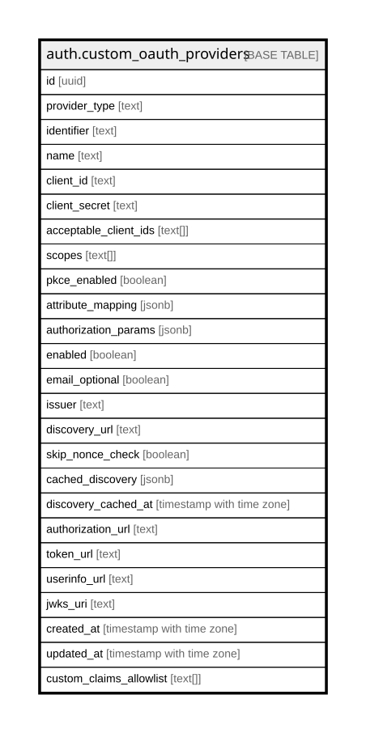

# auth.custom_oauth_providers

## Columns

| Name | Type | Default | Nullable | Children | Parents | Comment |
| ---- | ---- | ------- | -------- | -------- | ------- | ------- |
| id | uuid | gen_random_uuid() | false |  |  |  |
| provider_type | text |  | false |  |  |  |
| identifier | text |  | false |  |  |  |
| name | text |  | false |  |  |  |
| client_id | text |  | false |  |  |  |
| client_secret | text |  | false |  |  |  |
| acceptable_client_ids | text[] | '{}'::text[] | false |  |  |  |
| scopes | text[] | '{}'::text[] | false |  |  |  |
| pkce_enabled | boolean | true | false |  |  |  |
| attribute_mapping | jsonb | '{}'::jsonb | false |  |  |  |
| authorization_params | jsonb | '{}'::jsonb | false |  |  |  |
| enabled | boolean | true | false |  |  |  |
| email_optional | boolean | false | false |  |  |  |
| issuer | text |  | true |  |  |  |
| discovery_url | text |  | true |  |  |  |
| skip_nonce_check | boolean | false | false |  |  |  |
| cached_discovery | jsonb |  | true |  |  |  |
| discovery_cached_at | timestamp with time zone |  | true |  |  |  |
| authorization_url | text |  | true |  |  |  |
| token_url | text |  | true |  |  |  |
| userinfo_url | text |  | true |  |  |  |
| jwks_uri | text |  | true |  |  |  |
| created_at | timestamp with time zone | now() | false |  |  |  |
| updated_at | timestamp with time zone | now() | false |  |  |  |
| custom_claims_allowlist | text[] | '{}'::text[] | false |  |  |  |

## Constraints

| Name | Type | Definition |
| ---- | ---- | ---------- |
| custom_oauth_providers_authorization_url_https | CHECK | CHECK (((authorization_url IS NULL) OR (authorization_url ~~ 'https://%'::text))) |
| custom_oauth_providers_authorization_url_length | CHECK | CHECK (((authorization_url IS NULL) OR (char_length(authorization_url) <= 2048))) |
| custom_oauth_providers_client_id_length | CHECK | CHECK (((char_length(client_id) >= 1) AND (char_length(client_id) <= 512))) |
| custom_oauth_providers_discovery_url_length | CHECK | CHECK (((discovery_url IS NULL) OR (char_length(discovery_url) <= 2048))) |
| custom_oauth_providers_identifier_format | CHECK | CHECK ((identifier ~ '^[a-z0-9][a-z0-9:-]{0,48}[a-z0-9]$'::text)) |
| custom_oauth_providers_issuer_length | CHECK | CHECK (((issuer IS NULL) OR ((char_length(issuer) >= 1) AND (char_length(issuer) <= 2048)))) |
| custom_oauth_providers_jwks_uri_https | CHECK | CHECK (((jwks_uri IS NULL) OR (jwks_uri ~~ 'https://%'::text))) |
| custom_oauth_providers_jwks_uri_length | CHECK | CHECK (((jwks_uri IS NULL) OR (char_length(jwks_uri) <= 2048))) |
| custom_oauth_providers_name_length | CHECK | CHECK (((char_length(name) >= 1) AND (char_length(name) <= 100))) |
| custom_oauth_providers_oauth2_requires_endpoints | CHECK | CHECK (((provider_type <> 'oauth2'::text) OR ((authorization_url IS NOT NULL) AND (token_url IS NOT NULL) AND (userinfo_url IS NOT NULL)))) |
| custom_oauth_providers_oidc_discovery_url_https | CHECK | CHECK (((provider_type <> 'oidc'::text) OR (discovery_url IS NULL) OR (discovery_url ~~ 'https://%'::text))) |
| custom_oauth_providers_oidc_issuer_https | CHECK | CHECK (((provider_type <> 'oidc'::text) OR (issuer IS NULL) OR (issuer ~~ 'https://%'::text))) |
| custom_oauth_providers_oidc_requires_issuer | CHECK | CHECK (((provider_type <> 'oidc'::text) OR (issuer IS NOT NULL))) |
| custom_oauth_providers_provider_type_check | CHECK | CHECK ((provider_type = ANY (ARRAY['oauth2'::text, 'oidc'::text]))) |
| custom_oauth_providers_token_url_https | CHECK | CHECK (((token_url IS NULL) OR (token_url ~~ 'https://%'::text))) |
| custom_oauth_providers_token_url_length | CHECK | CHECK (((token_url IS NULL) OR (char_length(token_url) <= 2048))) |
| custom_oauth_providers_userinfo_url_https | CHECK | CHECK (((userinfo_url IS NULL) OR (userinfo_url ~~ 'https://%'::text))) |
| custom_oauth_providers_userinfo_url_length | CHECK | CHECK (((userinfo_url IS NULL) OR (char_length(userinfo_url) <= 2048))) |
| custom_oauth_providers_pkey | PRIMARY KEY | PRIMARY KEY (id) |
| custom_oauth_providers_identifier_key | UNIQUE | UNIQUE (identifier) |

## Indexes

| Name | Definition |
| ---- | ---------- |
| custom_oauth_providers_pkey | CREATE UNIQUE INDEX custom_oauth_providers_pkey ON auth.custom_oauth_providers USING btree (id) |
| custom_oauth_providers_identifier_key | CREATE UNIQUE INDEX custom_oauth_providers_identifier_key ON auth.custom_oauth_providers USING btree (identifier) |
| custom_oauth_providers_identifier_idx | CREATE INDEX custom_oauth_providers_identifier_idx ON auth.custom_oauth_providers USING btree (identifier) |
| custom_oauth_providers_provider_type_idx | CREATE INDEX custom_oauth_providers_provider_type_idx ON auth.custom_oauth_providers USING btree (provider_type) |
| custom_oauth_providers_enabled_idx | CREATE INDEX custom_oauth_providers_enabled_idx ON auth.custom_oauth_providers USING btree (enabled) |
| custom_oauth_providers_created_at_idx | CREATE INDEX custom_oauth_providers_created_at_idx ON auth.custom_oauth_providers USING btree (created_at) |

## Relations

---

> Generated by [tbls](https://github.com/k1LoW/tbls)
