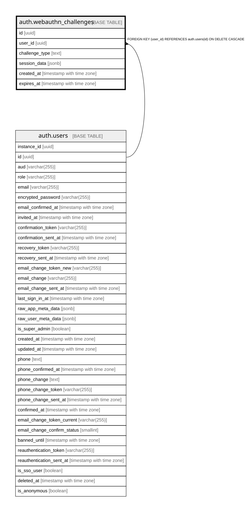

# auth.webauthn_challenges

## Columns

| Name | Type | Default | Nullable | Children | Parents | Comment |
| ---- | ---- | ------- | -------- | -------- | ------- | ------- |
| id | uuid | gen_random_uuid() | false |  |  |  |
| user_id | uuid |  | true |  | [auth.users](auth.users.md) |  |
| challenge_type | text |  | false |  |  |  |
| session_data | jsonb |  | false |  |  |  |
| created_at | timestamp with time zone | now() | false |  |  |  |
| expires_at | timestamp with time zone |  | false |  |  |  |

## Constraints

| Name | Type | Definition |
| ---- | ---- | ---------- |
| webauthn_challenges_challenge_type_check | CHECK | CHECK ((challenge_type = ANY (ARRAY['signup'::text, 'registration'::text, 'authentication'::text]))) |
| webauthn_challenges_user_id_fkey | FOREIGN KEY | FOREIGN KEY (user_id) REFERENCES auth.users(id) ON DELETE CASCADE |
| webauthn_challenges_pkey | PRIMARY KEY | PRIMARY KEY (id) |

## Indexes

| Name | Definition |
| ---- | ---------- |
| webauthn_challenges_pkey | CREATE UNIQUE INDEX webauthn_challenges_pkey ON auth.webauthn_challenges USING btree (id) |
| webauthn_challenges_user_id_idx | CREATE INDEX webauthn_challenges_user_id_idx ON auth.webauthn_challenges USING btree (user_id) |
| webauthn_challenges_expires_at_idx | CREATE INDEX webauthn_challenges_expires_at_idx ON auth.webauthn_challenges USING btree (expires_at) |

## Relations

---

> Generated by [tbls](https://github.com/k1LoW/tbls)
