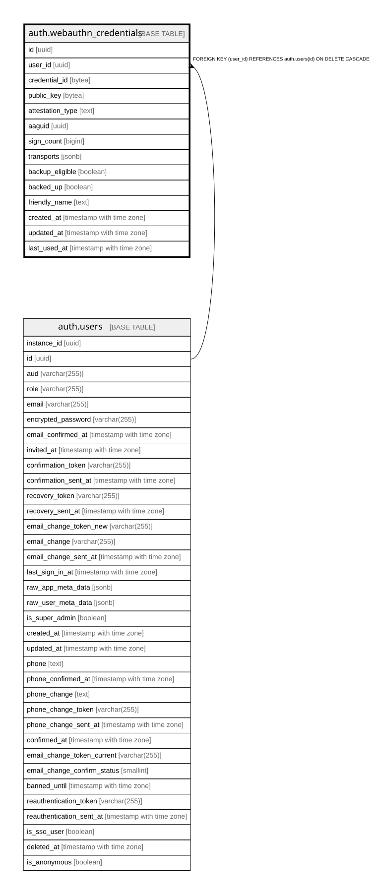

# auth.webauthn_credentials

## Columns

| Name | Type | Default | Nullable | Children | Parents | Comment |
| ---- | ---- | ------- | -------- | -------- | ------- | ------- |
| id | uuid | gen_random_uuid() | false |  |  |  |
| user_id | uuid |  | false |  | [auth.users](auth.users.md) |  |
| credential_id | bytea |  | false |  |  |  |
| public_key | bytea |  | false |  |  |  |
| attestation_type | text | ''::text | false |  |  |  |
| aaguid | uuid |  | true |  |  |  |
| sign_count | bigint | 0 | false |  |  |  |
| transports | jsonb | '[]'::jsonb | false |  |  |  |
| backup_eligible | boolean | false | false |  |  |  |
| backed_up | boolean | false | false |  |  |  |
| friendly_name | text | ''::text | false |  |  |  |
| created_at | timestamp with time zone | now() | false |  |  |  |
| updated_at | timestamp with time zone | now() | false |  |  |  |
| last_used_at | timestamp with time zone |  | true |  |  |  |

## Constraints

| Name | Type | Definition |
| ---- | ---- | ---------- |
| webauthn_credentials_user_id_fkey | FOREIGN KEY | FOREIGN KEY (user_id) REFERENCES auth.users(id) ON DELETE CASCADE |
| webauthn_credentials_pkey | PRIMARY KEY | PRIMARY KEY (id) |

## Indexes

| Name | Definition |
| ---- | ---------- |
| webauthn_credentials_pkey | CREATE UNIQUE INDEX webauthn_credentials_pkey ON auth.webauthn_credentials USING btree (id) |
| webauthn_credentials_credential_id_key | CREATE UNIQUE INDEX webauthn_credentials_credential_id_key ON auth.webauthn_credentials USING btree (credential_id) |
| webauthn_credentials_user_id_idx | CREATE INDEX webauthn_credentials_user_id_idx ON auth.webauthn_credentials USING btree (user_id) |

## Relations

---

> Generated by [tbls](https://github.com/k1LoW/tbls)
