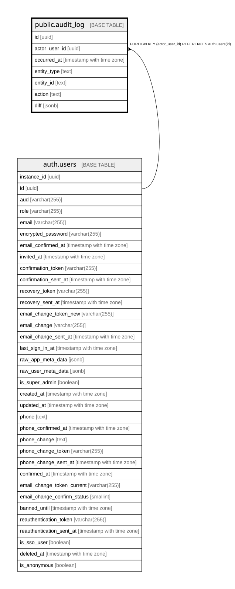

# public.audit_log

## Description

Generisches Mutationsprotokoll (Abschnitt 2.12): Benutzer, Zeitpunkt, Entity, Aktion, Vorher-/Nachher-Diff ohne personenbezogene Buchungsdaten. Nur fuer Admins lesbar. Befuellung ist Aufgabe der Admin-Maske-Publish-Server-Action (separate Runde), kein automatischer Trigger.

## Columns

| Name | Type | Default | Nullable | Children | Parents | Comment |
| ---- | ---- | ------- | -------- | -------- | ------- | ------- |
| id | uuid | gen_random_uuid() | false |  |  |  |
| actor_user_id | uuid |  | true |  | [auth.users](auth.users.md) |  |
| occurred_at | timestamp with time zone | now() | false |  |  |  |
| entity_type | text |  | false |  |  |  |
| entity_id | text |  | false |  |  |  |
| action | text |  | false |  |  |  |
| diff | jsonb |  | true |  |  |  |

## Constraints

| Name | Type | Definition |
| ---- | ---- | ---------- |
| audit_log_actor_user_id_fkey | FOREIGN KEY | FOREIGN KEY (actor_user_id) REFERENCES auth.users(id) |
| audit_log_pkey | PRIMARY KEY | PRIMARY KEY (id) |

## Indexes

| Name | Definition |
| ---- | ---------- |
| audit_log_pkey | CREATE UNIQUE INDEX audit_log_pkey ON public.audit_log USING btree (id) |
| idx_audit_log_entity | CREATE INDEX idx_audit_log_entity ON public.audit_log USING btree (entity_type, entity_id) |

## Relations

---

> Generated by [tbls](https://github.com/k1LoW/tbls)
