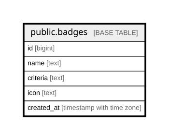

# public.badges

## Columns

| Name | Type | Default | Nullable | Children | Parents | Comment |
| ---- | ---- | ------- | -------- | -------- | ------- | ------- |
| id | bigint |  | false |  |  |  |
| name | text |  | true |  |  |  |
| criteria | text |  | true |  |  |  |
| icon | text |  | true |  |  |  |
| created_at | timestamp with time zone | now() | false |  |  |  |

## Constraints

| Name | Type | Definition |
| ---- | ---- | ---------- |
| badges_pkey | PRIMARY KEY | PRIMARY KEY (id) |

## Indexes

| Name | Definition |
| ---- | ---------- |
| badges_pkey | CREATE UNIQUE INDEX badges_pkey ON public.badges USING btree (id) |

## Relations

---

> Generated by [tbls](https://github.com/k1LoW/tbls)
