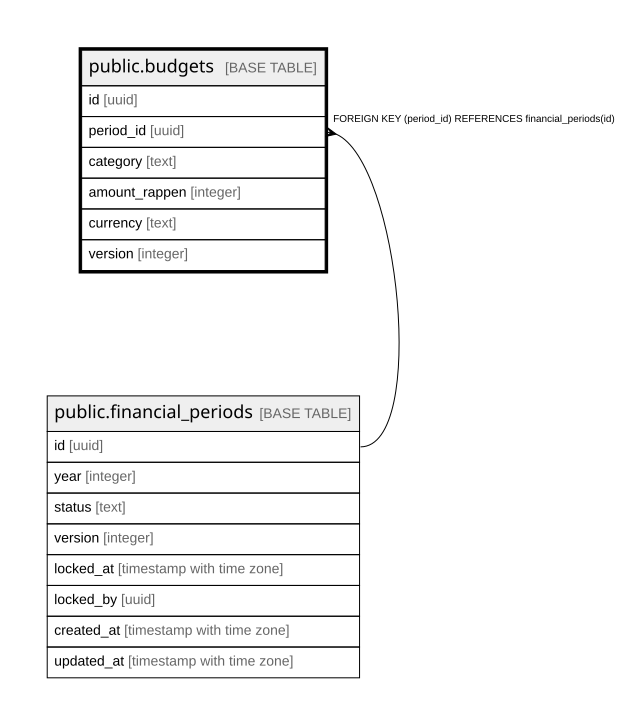

# public.budgets

## Description

Budget je Kategorie und Jahr (Schritt 10d). Admin-only.

## Columns

| Name | Type | Default | Nullable | Children | Parents | Comment |
| ---- | ---- | ------- | -------- | -------- | ------- | ------- |
| id | uuid | gen_random_uuid() | false |  |  |  |
| period_id | uuid |  | false |  | [public.financial_periods](public.financial_periods.md) |  |
| category | text |  | false |  |  |  |
| amount_rappen | integer |  | false |  |  |  |
| currency | text | 'CHF'::text | false |  |  |  |
| version | integer | 1 | false |  |  |  |

## Constraints

| Name | Type | Definition |
| ---- | ---- | ---------- |
| budgets_amount_rappen_check | CHECK | CHECK ((amount_rappen >= 0)) |
| budgets_period_id_fkey | FOREIGN KEY | FOREIGN KEY (period_id) REFERENCES financial_periods(id) |
| budgets_pkey | PRIMARY KEY | PRIMARY KEY (id) |
| budgets_period_id_category_key | UNIQUE | UNIQUE (period_id, category) |

## Indexes

| Name | Definition |
| ---- | ---------- |
| budgets_pkey | CREATE UNIQUE INDEX budgets_pkey ON public.budgets USING btree (id) |
| budgets_period_id_category_key | CREATE UNIQUE INDEX budgets_period_id_category_key ON public.budgets USING btree (period_id, category) |

## Triggers

| Name | Definition |
| ---- | ---------- |
| budgets_bump_version | CREATE TRIGGER budgets_bump_version BEFORE UPDATE ON public.budgets FOR EACH ROW EXECUTE FUNCTION bump_version_and_updated_at() |

## Relations

---

> Generated by [tbls](https://github.com/k1LoW/tbls)
