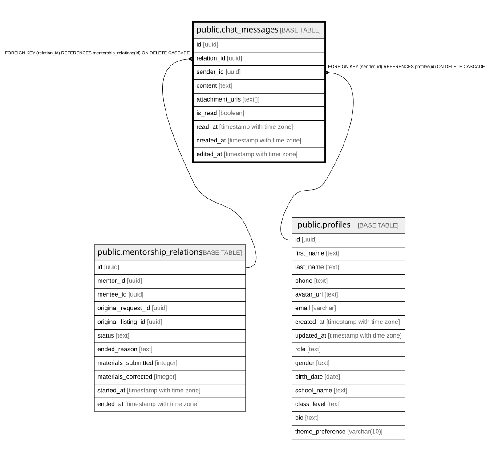

# public.chat_messages

## Columns

| Name | Type | Default | Nullable | Children | Parents | Comment |
| ---- | ---- | ------- | -------- | -------- | ------- | ------- |
| id | uuid | gen_random_uuid() | false |  |  |  |
| relation_id | uuid |  | false |  | [public.mentorship_relations](public.mentorship_relations.md) |  |
| sender_id | uuid |  | false |  | [public.profiles](public.profiles.md) |  |
| content | text |  | false |  |  |  |
| attachment_urls | text[] |  | true |  |  |  |
| is_read | boolean | false | true |  |  |  |
| read_at | timestamp with time zone |  | true |  |  |  |
| created_at | timestamp with time zone | now() | true |  |  |  |
| edited_at | timestamp with time zone |  | true |  |  |  |

## Constraints

| Name | Type | Definition |
| ---- | ---- | ---------- |
| chat_messages_pkey | PRIMARY KEY | PRIMARY KEY (id) |
| chat_messages_relation_id_fkey | FOREIGN KEY | FOREIGN KEY (relation_id) REFERENCES mentorship_relations(id) ON DELETE CASCADE |
| chat_messages_sender_id_fkey | FOREIGN KEY | FOREIGN KEY (sender_id) REFERENCES profiles(id) ON DELETE CASCADE |

## Indexes

| Name | Definition |
| ---- | ---------- |
| chat_messages_pkey | CREATE UNIQUE INDEX chat_messages_pkey ON public.chat_messages USING btree (id) |
| idx_chat_created | CREATE INDEX idx_chat_created ON public.chat_messages USING btree (created_at DESC) |
| idx_chat_relation | CREATE INDEX idx_chat_relation ON public.chat_messages USING btree (relation_id) |
| idx_chat_sender | CREATE INDEX idx_chat_sender ON public.chat_messages USING btree (sender_id) |

## Relations

---

> Generated by [tbls](https://github.com/k1LoW/tbls)
