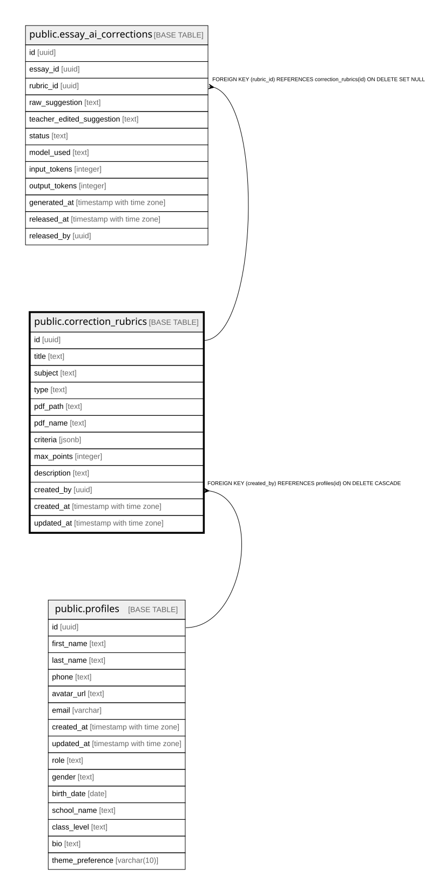

# public.correction_rubrics

## Columns

| Name | Type | Default | Nullable | Children | Parents | Comment |
| ---- | ---- | ------- | -------- | -------- | ------- | ------- |
| id | uuid | gen_random_uuid() | false | [public.essay_ai_corrections](public.essay_ai_corrections.md) |  |  |
| title | text |  | false |  |  |  |
| subject | text |  | true |  |  |  |
| type | text |  | false |  |  |  |
| pdf_path | text |  | true |  |  |  |
| pdf_name | text |  | true |  |  |  |
| criteria | jsonb |  | true |  |  |  |
| max_points | integer |  | true |  |  |  |
| description | text |  | true |  |  |  |
| created_by | uuid |  | false |  | [public.profiles](public.profiles.md) |  |
| created_at | timestamp with time zone | now() | true |  |  |  |
| updated_at | timestamp with time zone | now() | true |  |  |  |

## Constraints

| Name | Type | Definition |
| ---- | ---- | ---------- |
| correction_rubrics_type_check | CHECK | CHECK ((type = ANY (ARRAY['pdf'::text, 'structured'::text]))) |
| correction_rubrics_pkey | PRIMARY KEY | PRIMARY KEY (id) |
| correction_rubrics_created_by_fkey | FOREIGN KEY | FOREIGN KEY (created_by) REFERENCES profiles(id) ON DELETE CASCADE |

## Indexes

| Name | Definition |
| ---- | ---------- |
| correction_rubrics_pkey | CREATE UNIQUE INDEX correction_rubrics_pkey ON public.correction_rubrics USING btree (id) |
| idx_correction_rubrics_created_by | CREATE INDEX idx_correction_rubrics_created_by ON public.correction_rubrics USING btree (created_by) |
| idx_correction_rubrics_subject | CREATE INDEX idx_correction_rubrics_subject ON public.correction_rubrics USING btree (subject) |

## Triggers

| Name | Definition |
| ---- | ---------- |
| correction_rubrics_updated_at | CREATE TRIGGER correction_rubrics_updated_at BEFORE UPDATE ON public.correction_rubrics FOR EACH ROW EXECUTE FUNCTION update_correction_rubrics_updated_at() |

## Relations

---

> Generated by [tbls](https://github.com/k1LoW/tbls)
