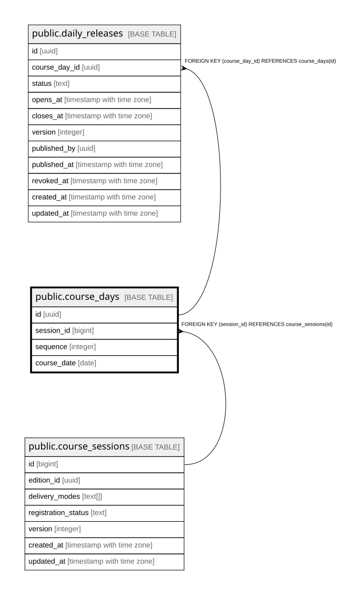

# public.course_days

## Description

Kurstage einer course_session (Schritt 10b, Abschnitt 2.13). Admin-only -- kein Schueler-Leserecht in dieser Runde, da nur die Admin-Maske (nicht eine Schueler-Seite) Teil dieser Route ist.

## Columns

| Name | Type | Default | Nullable | Children | Parents | Comment |
| ---- | ---- | ------- | -------- | -------- | ------- | ------- |
| id | uuid | gen_random_uuid() | false | [public.daily_releases](public.daily_releases.md) |  |  |
| session_id | bigint |  | false |  | [public.course_sessions](public.course_sessions.md) |  |
| sequence | integer |  | false |  |  |  |
| course_date | date |  | false |  |  |  |

## Constraints

| Name | Type | Definition |
| ---- | ---- | ---------- |
| course_days_sequence_check | CHECK | CHECK ((sequence >= 1)) |
| course_days_session_id_fkey | FOREIGN KEY | FOREIGN KEY (session_id) REFERENCES course_sessions(id) |
| course_days_pkey | PRIMARY KEY | PRIMARY KEY (id) |
| course_days_session_id_sequence_key | UNIQUE | UNIQUE (session_id, sequence) |
| course_days_session_id_course_date_key | UNIQUE | UNIQUE (session_id, course_date) |

## Indexes

| Name | Definition |
| ---- | ---------- |
| course_days_pkey | CREATE UNIQUE INDEX course_days_pkey ON public.course_days USING btree (id) |
| course_days_session_id_sequence_key | CREATE UNIQUE INDEX course_days_session_id_sequence_key ON public.course_days USING btree (session_id, sequence) |
| course_days_session_id_course_date_key | CREATE UNIQUE INDEX course_days_session_id_course_date_key ON public.course_days USING btree (session_id, course_date) |
| idx_course_days_session_id | CREATE INDEX idx_course_days_session_id ON public.course_days USING btree (session_id) |

## Relations

---

> Generated by [tbls](https://github.com/k1LoW/tbls)
