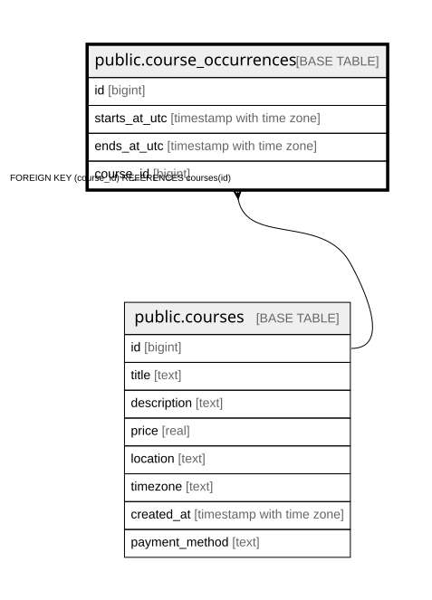

# public.course_occurrences

## Columns

| Name | Type | Default | Nullable | Children | Parents | Comment |
| ---- | ---- | ------- | -------- | -------- | ------- | ------- |
| id | bigint |  | false |  |  |  |
| starts_at_utc | timestamp with time zone |  | false |  |  |  |
| ends_at_utc | timestamp with time zone |  | false |  |  |  |
| course_id | bigint |  | true |  | [public.courses](public.courses.md) |  |

## Constraints

| Name | Type | Definition |
| ---- | ---- | ---------- |
| course_occurrences_check | CHECK | CHECK ((ends_at_utc > starts_at_utc)) |
| course_occurrences_pkey | PRIMARY KEY | PRIMARY KEY (id) |
| course_occurrences_course_id_fkey | FOREIGN KEY | FOREIGN KEY (course_id) REFERENCES courses(id) |

## Indexes

| Name | Definition |
| ---- | ---------- |
| course_occurrences_pkey | CREATE UNIQUE INDEX course_occurrences_pkey ON public.course_occurrences USING btree (id) |

## Relations

---

> Generated by [tbls](https://github.com/k1LoW/tbls)
