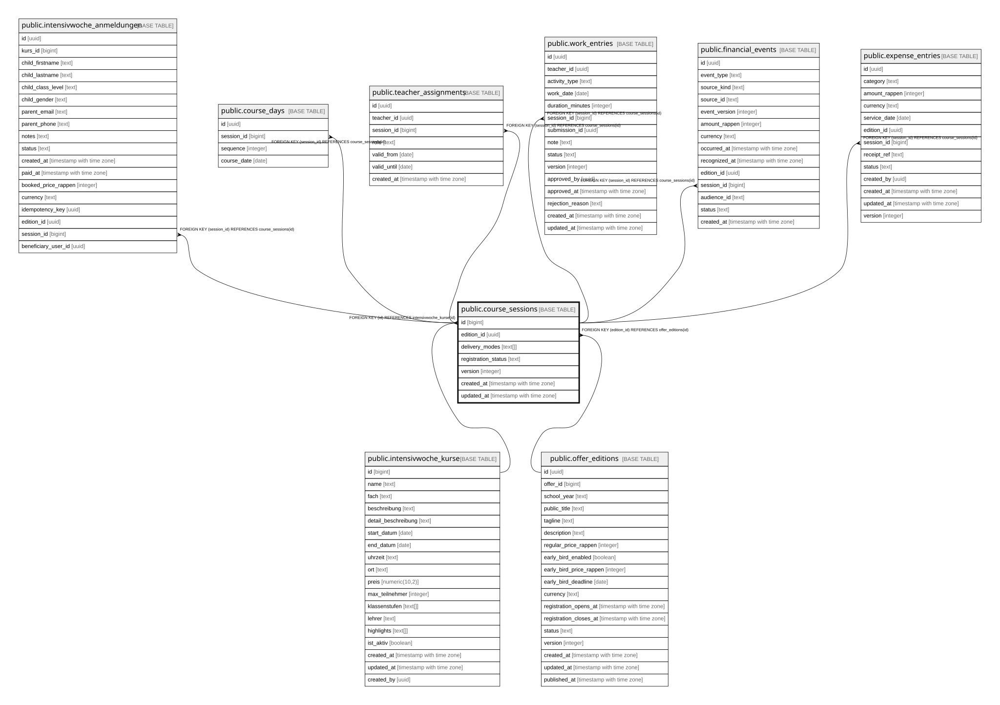

# public.course_sessions

## Description

Optionale 1:1-Erweiterung von intensivwoche_kurse (Abschnitt 2.12) -- id ist zugleich PK und FK, kein zweites Durchfuehrungssystem. Name/Datum/Standort/Kapazitaet/Aktivitaet bleiben kanonisch in intensivwoche_kurse. Oeffentlich nur wenn die zugehoerige Edition published ist. Schreibzugriff nur ueber service_role bis die Admin-Maske existiert.

## Columns

| Name | Type | Default | Nullable | Children | Parents | Comment |
| ---- | ---- | ------- | -------- | -------- | ------- | ------- |
| id | bigint |  | false | [public.intensivwoche_anmeldungen](public.intensivwoche_anmeldungen.md) [public.course_days](public.course_days.md) [public.teacher_assignments](public.teacher_assignments.md) [public.work_entries](public.work_entries.md) [public.financial_events](public.financial_events.md) [public.expense_entries](public.expense_entries.md) | [public.intensivwoche_kurse](public.intensivwoche_kurse.md) |  |
| edition_id | uuid |  | false |  | [public.offer_editions](public.offer_editions.md) |  |
| delivery_modes | text[] | ARRAY['onsite'::text] | false |  |  |  |
| registration_status | text | 'bookable'::text | false |  |  |  |
| version | integer | 1 | false |  |  |  |
| created_at | timestamp with time zone | now() | false |  |  |  |
| updated_at | timestamp with time zone | now() | false |  |  |  |

## Constraints

| Name | Type | Definition |
| ---- | ---- | ---------- |
| course_sessions_registration_status_check | CHECK | CHECK ((registration_status = ANY (ARRAY['bookable'::text, 'waitlist'::text, 'cancelled'::text]))) |
| course_sessions_id_fkey | FOREIGN KEY | FOREIGN KEY (id) REFERENCES intensivwoche_kurse(id) |
| course_sessions_edition_id_fkey | FOREIGN KEY | FOREIGN KEY (edition_id) REFERENCES offer_editions(id) |
| course_sessions_pkey | PRIMARY KEY | PRIMARY KEY (id) |

## Indexes

| Name | Definition |
| ---- | ---------- |
| course_sessions_pkey | CREATE UNIQUE INDEX course_sessions_pkey ON public.course_sessions USING btree (id) |
| idx_course_sessions_edition_id | CREATE INDEX idx_course_sessions_edition_id ON public.course_sessions USING btree (edition_id) |

## Triggers

| Name | Definition |
| ---- | ---------- |
| course_sessions_bump_version | CREATE TRIGGER course_sessions_bump_version BEFORE UPDATE ON public.course_sessions FOR EACH ROW EXECUTE FUNCTION bump_version_and_updated_at() |

## Relations

---

> Generated by [tbls](https://github.com/k1LoW/tbls)
