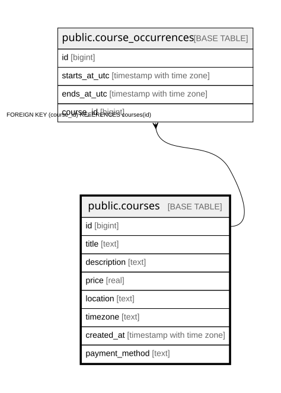

# public.courses

## Columns

| Name | Type | Default | Nullable | Children | Parents | Comment |
| ---- | ---- | ------- | -------- | -------- | ------- | ------- |
| id | bigint |  | false | [public.course_occurrences](public.course_occurrences.md) |  |  |
| title | text |  | true |  |  |  |
| description | text |  | true |  |  |  |
| price | real |  | true |  |  |  |
| location | text |  | true |  |  |  |
| timezone | text |  | true |  |  |  |
| created_at | timestamp with time zone | now() | false |  |  |  |
| payment_method | text |  | true |  |  |  |

## Constraints

| Name | Type | Definition |
| ---- | ---- | ---------- |
| courses_pkey | PRIMARY KEY | PRIMARY KEY (id) |

## Indexes

| Name | Definition |
| ---- | ---------- |
| courses_pkey | CREATE UNIQUE INDEX courses_pkey ON public.courses USING btree (id) |

## Relations

---

> Generated by [tbls](https://github.com/k1LoW/tbls)
