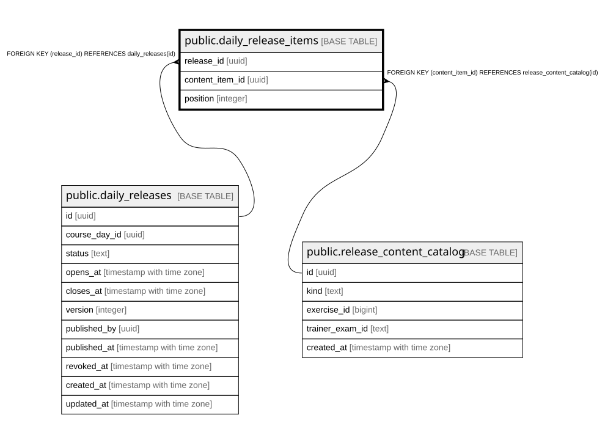

# public.daily_release_items

## Description

Kuratierte Inhalte + Reihenfolge je Freigabe (Schritt 10b). Die Sichtbarkeitsregel liegt bereits vollstaendig in daily_releases_enrolled_read; hier reicht die Existenz der (dank RLS bereits gefilterten) Elternzeile.

## Columns

| Name | Type | Default | Nullable | Children | Parents | Comment |
| ---- | ---- | ------- | -------- | -------- | ------- | ------- |
| release_id | uuid |  | false |  | [public.daily_releases](public.daily_releases.md) |  |
| content_item_id | uuid |  | false |  | [public.release_content_catalog](public.release_content_catalog.md) |  |
| position | integer |  | false |  |  |  |

## Constraints

| Name | Type | Definition |
| ---- | ---- | ---------- |
| daily_release_items_content_item_id_fkey | FOREIGN KEY | FOREIGN KEY (content_item_id) REFERENCES release_content_catalog(id) |
| daily_release_items_release_id_fkey | FOREIGN KEY | FOREIGN KEY (release_id) REFERENCES daily_releases(id) |
| daily_release_items_pkey | PRIMARY KEY | PRIMARY KEY (release_id, content_item_id) |

## Indexes

| Name | Definition |
| ---- | ---------- |
| daily_release_items_pkey | CREATE UNIQUE INDEX daily_release_items_pkey ON public.daily_release_items USING btree (release_id, content_item_id) |

## Relations

---

> Generated by [tbls](https://github.com/k1LoW/tbls)
