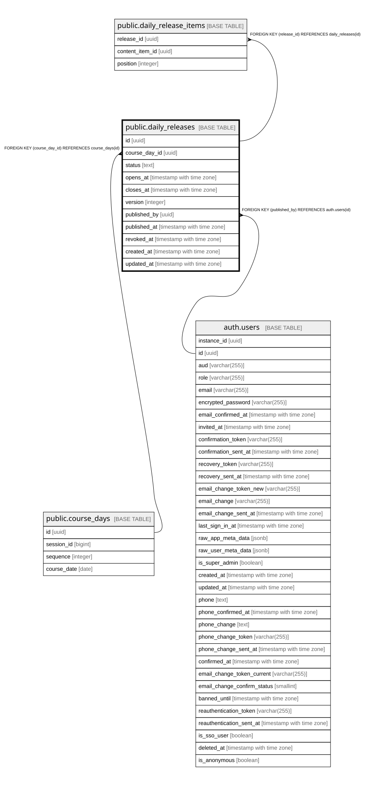

# public.daily_releases

## Description

Genau eine aktuelle Freigabe pro Kurstag (Schritt 10b, Abschnitt 2.13). Admin-Vollzugriff, eingeschriebene Lernende sehen nur status=active innerhalb des Zeitfensters fuer ihre eigene course_session.

## Columns

| Name | Type | Default | Nullable | Children | Parents | Comment |
| ---- | ---- | ------- | -------- | -------- | ------- | ------- |
| id | uuid | gen_random_uuid() | false | [public.daily_release_items](public.daily_release_items.md) |  |  |
| course_day_id | uuid |  | false |  | [public.course_days](public.course_days.md) |  |
| status | text | 'draft'::text | false |  |  |  |
| opens_at | timestamp with time zone |  | true |  |  |  |
| closes_at | timestamp with time zone |  | true |  |  |  |
| version | integer | 1 | false |  |  |  |
| published_by | uuid |  | true |  | [auth.users](auth.users.md) |  |
| published_at | timestamp with time zone |  | true |  |  |  |
| revoked_at | timestamp with time zone |  | true |  |  |  |
| created_at | timestamp with time zone | now() | false |  |  |  |
| updated_at | timestamp with time zone | now() | false |  |  |  |

## Constraints

| Name | Type | Definition |
| ---- | ---- | ---------- |
| daily_releases_status_check | CHECK | CHECK ((status = ANY (ARRAY['draft'::text, 'scheduled'::text, 'active'::text, 'revoked'::text]))) |
| daily_releases_window_order | CHECK | CHECK (((opens_at IS NULL) OR (closes_at IS NULL) OR (opens_at < closes_at))) |
| daily_releases_published_by_fkey | FOREIGN KEY | FOREIGN KEY (published_by) REFERENCES auth.users(id) |
| daily_releases_course_day_id_fkey | FOREIGN KEY | FOREIGN KEY (course_day_id) REFERENCES course_days(id) |
| daily_releases_pkey | PRIMARY KEY | PRIMARY KEY (id) |
| daily_releases_course_day_id_key | UNIQUE | UNIQUE (course_day_id) |

## Indexes

| Name | Definition |
| ---- | ---------- |
| daily_releases_pkey | CREATE UNIQUE INDEX daily_releases_pkey ON public.daily_releases USING btree (id) |
| daily_releases_course_day_id_key | CREATE UNIQUE INDEX daily_releases_course_day_id_key ON public.daily_releases USING btree (course_day_id) |

## Triggers

| Name | Definition |
| ---- | ---------- |
| daily_releases_bump_version | CREATE TRIGGER daily_releases_bump_version BEFORE UPDATE ON public.daily_releases FOR EACH ROW EXECUTE FUNCTION bump_version_and_updated_at() |

## Relations

---

> Generated by [tbls](https://github.com/k1LoW/tbls)
