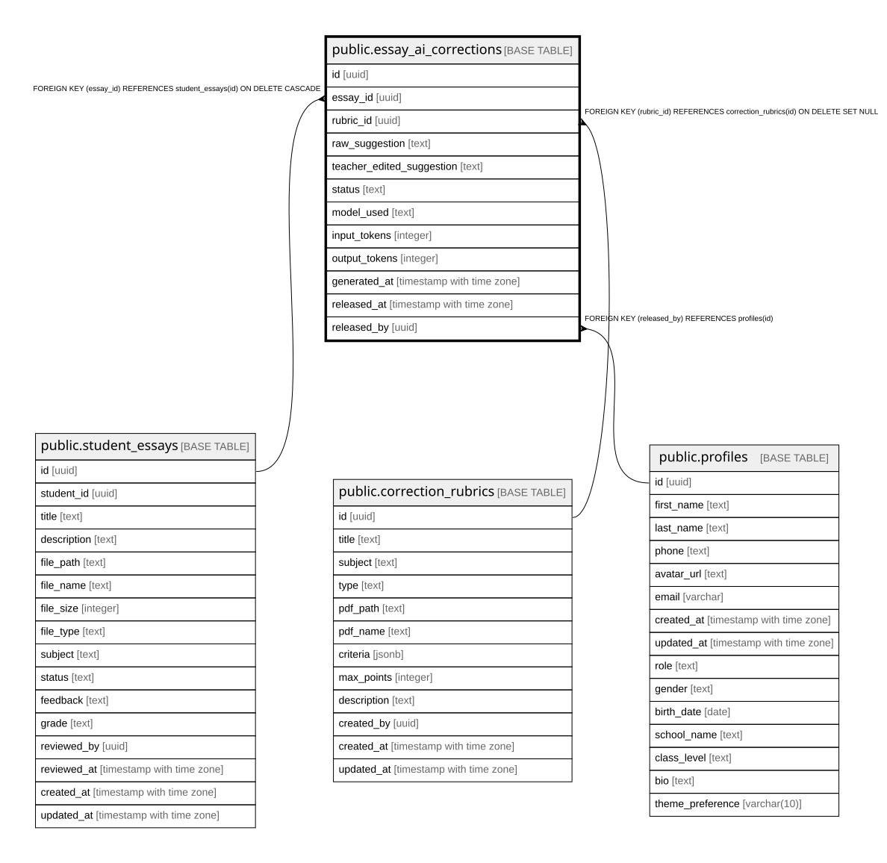

# public.essay_ai_corrections

## Columns

| Name | Type | Default | Nullable | Children | Parents | Comment |
| ---- | ---- | ------- | -------- | -------- | ------- | ------- |
| id | uuid | gen_random_uuid() | false |  |  |  |
| essay_id | uuid |  | false |  | [public.student_essays](public.student_essays.md) |  |
| rubric_id | uuid |  | true |  | [public.correction_rubrics](public.correction_rubrics.md) |  |
| raw_suggestion | text | ''::text | false |  |  |  |
| teacher_edited_suggestion | text |  | true |  |  |  |
| status | text | 'generating'::text | false |  |  |  |
| model_used | text | 'claude-sonnet-4-6'::text | false |  |  |  |
| input_tokens | integer |  | true |  |  |  |
| output_tokens | integer |  | true |  |  |  |
| generated_at | timestamp with time zone | now() | true |  |  |  |
| released_at | timestamp with time zone |  | true |  |  |  |
| released_by | uuid |  | true |  | [public.profiles](public.profiles.md) |  |

## Constraints

| Name | Type | Definition |
| ---- | ---- | ---------- |
| essay_ai_corrections_status_check | CHECK | CHECK ((status = ANY (ARRAY['generating'::text, 'ready'::text, 'released'::text]))) |
| essay_ai_corrections_rubric_id_fkey | FOREIGN KEY | FOREIGN KEY (rubric_id) REFERENCES correction_rubrics(id) ON DELETE SET NULL |
| essay_ai_corrections_essay_id_key | UNIQUE | UNIQUE (essay_id) |
| essay_ai_corrections_pkey | PRIMARY KEY | PRIMARY KEY (id) |
| essay_ai_corrections_released_by_fkey | FOREIGN KEY | FOREIGN KEY (released_by) REFERENCES profiles(id) |
| essay_ai_corrections_essay_id_fkey | FOREIGN KEY | FOREIGN KEY (essay_id) REFERENCES student_essays(id) ON DELETE CASCADE |

## Indexes

| Name | Definition |
| ---- | ---------- |
| essay_ai_corrections_essay_id_key | CREATE UNIQUE INDEX essay_ai_corrections_essay_id_key ON public.essay_ai_corrections USING btree (essay_id) |
| essay_ai_corrections_pkey | CREATE UNIQUE INDEX essay_ai_corrections_pkey ON public.essay_ai_corrections USING btree (id) |
| idx_essay_ai_corrections_essay_id | CREATE INDEX idx_essay_ai_corrections_essay_id ON public.essay_ai_corrections USING btree (essay_id) |
| idx_essay_ai_corrections_status | CREATE INDEX idx_essay_ai_corrections_status ON public.essay_ai_corrections USING btree (status) |

## Relations

---

> Generated by [tbls](https://github.com/k1LoW/tbls)
