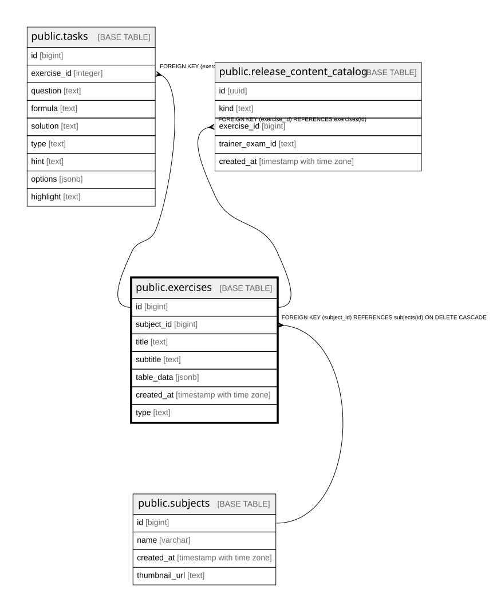

# public.exercises

## Columns

| Name | Type | Default | Nullable | Children | Parents | Comment |
| ---- | ---- | ------- | -------- | -------- | ------- | ------- |
| id | bigint |  | false | [public.tasks](public.tasks.md) [public.release_content_catalog](public.release_content_catalog.md) |  |  |
| subject_id | bigint |  | true |  | [public.subjects](public.subjects.md) |  |
| title | text |  | true |  |  |  |
| subtitle | text |  | true |  |  |  |
| table_data | jsonb |  | true |  |  |  |
| created_at | timestamp with time zone | now() | false |  |  |  |
| type | text |  | true |  |  |  |

## Constraints

| Name | Type | Definition |
| ---- | ---- | ---------- |
| exercises_pkey | PRIMARY KEY | PRIMARY KEY (id) |
| exercises_subject_id_fkey | FOREIGN KEY | FOREIGN KEY (subject_id) REFERENCES subjects(id) ON DELETE CASCADE |

## Indexes

| Name | Definition |
| ---- | ---------- |
| exercises_pkey | CREATE UNIQUE INDEX exercises_pkey ON public.exercises USING btree (id) |

## Relations

---

> Generated by [tbls](https://github.com/k1LoW/tbls)
