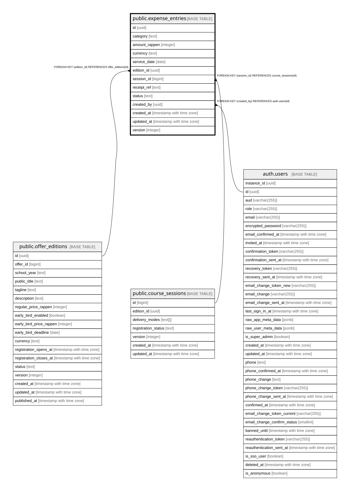

# public.expense_entries

## Description

Raum-/Material-/Marketing-/externe/Betriebskosten (Schritt 10d). Admin-only. status=approved spiegelt einmalig (ON CONFLICT DO NOTHING) einen course_expense/overhead-Eintrag nach financial_events -- spaetere Bearbeitung nach Genehmigung erzeugt keinen zweiten Ledger-Eintrag.

## Columns

| Name | Type | Default | Nullable | Children | Parents | Comment |
| ---- | ---- | ------- | -------- | -------- | ------- | ------- |
| id | uuid | gen_random_uuid() | false |  |  |  |
| category | text |  | false |  |  |  |
| amount_rappen | integer |  | false |  |  |  |
| currency | text | 'CHF'::text | false |  |  |  |
| service_date | date |  | false |  |  |  |
| edition_id | uuid |  | true |  | [public.offer_editions](public.offer_editions.md) |  |
| session_id | bigint |  | true |  | [public.course_sessions](public.course_sessions.md) |  |
| receipt_ref | text |  | true |  |  |  |
| status | text | 'draft'::text | false |  |  |  |
| created_by | uuid |  | false |  | [auth.users](auth.users.md) |  |
| created_at | timestamp with time zone | now() | false |  |  |  |
| updated_at | timestamp with time zone | now() | false |  |  |  |
| version | integer | 1 | false |  |  |  |

## Constraints

| Name | Type | Definition |
| ---- | ---- | ---------- |
| expense_entries_amount_rappen_check | CHECK | CHECK ((amount_rappen > 0)) |
| expense_entries_category_check | CHECK | CHECK ((category = ANY (ARRAY['room'::text, 'material'::text, 'marketing'::text, 'external_service'::text, 'overhead'::text]))) |
| expense_entries_status_check | CHECK | CHECK ((status = ANY (ARRAY['draft'::text, 'approved'::text, 'cancelled'::text]))) |
| expense_entries_created_by_fkey | FOREIGN KEY | FOREIGN KEY (created_by) REFERENCES auth.users(id) |
| expense_entries_edition_id_fkey | FOREIGN KEY | FOREIGN KEY (edition_id) REFERENCES offer_editions(id) |
| expense_entries_session_id_fkey | FOREIGN KEY | FOREIGN KEY (session_id) REFERENCES course_sessions(id) |
| expense_entries_pkey | PRIMARY KEY | PRIMARY KEY (id) |

## Indexes

| Name | Definition |
| ---- | ---------- |
| expense_entries_pkey | CREATE UNIQUE INDEX expense_entries_pkey ON public.expense_entries USING btree (id) |
| idx_expense_entries_service_date | CREATE INDEX idx_expense_entries_service_date ON public.expense_entries USING btree (service_date) |
| idx_expense_entries_edition_id | CREATE INDEX idx_expense_entries_edition_id ON public.expense_entries USING btree (edition_id) |

## Triggers

| Name | Definition |
| ---- | ---------- |
| expense_entries_bump_version | CREATE TRIGGER expense_entries_bump_version BEFORE UPDATE ON public.expense_entries FOR EACH ROW EXECUTE FUNCTION bump_version_and_updated_at() |
| sync_expense_financial_event_trigger | CREATE TRIGGER sync_expense_financial_event_trigger AFTER INSERT OR UPDATE ON public.expense_entries FOR EACH ROW EXECUTE FUNCTION sync_expense_financial_event() |

## Relations

---

> Generated by [tbls](https://github.com/k1LoW/tbls)
