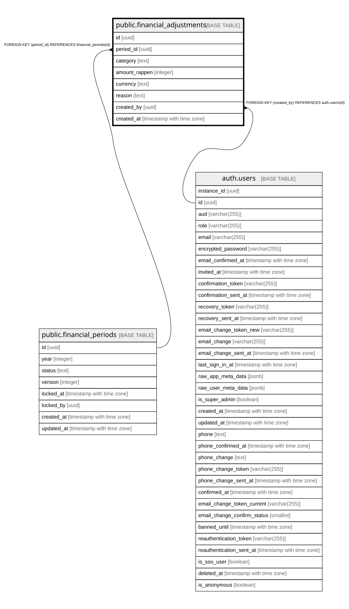

# public.financial_adjustments

## Description

Auditierte manuelle Korrekturbuchung (Schritt 10d) -- spiegelt sich automatisch nach financial_events (event_type=manual_adjustment).

## Columns

| Name | Type | Default | Nullable | Children | Parents | Comment |
| ---- | ---- | ------- | -------- | -------- | ------- | ------- |
| id | uuid | gen_random_uuid() | false |  |  |  |
| period_id | uuid |  | false |  | [public.financial_periods](public.financial_periods.md) |  |
| category | text |  | true |  |  |  |
| amount_rappen | integer |  | false |  |  |  |
| currency | text | 'CHF'::text | false |  |  |  |
| reason | text |  | false |  |  |  |
| created_by | uuid |  | false |  | [auth.users](auth.users.md) |  |
| created_at | timestamp with time zone | now() | false |  |  |  |

## Constraints

| Name | Type | Definition |
| ---- | ---- | ---------- |
| financial_adjustments_created_by_fkey | FOREIGN KEY | FOREIGN KEY (created_by) REFERENCES auth.users(id) |
| financial_adjustments_period_id_fkey | FOREIGN KEY | FOREIGN KEY (period_id) REFERENCES financial_periods(id) |
| financial_adjustments_pkey | PRIMARY KEY | PRIMARY KEY (id) |

## Indexes

| Name | Definition |
| ---- | ---------- |
| financial_adjustments_pkey | CREATE UNIQUE INDEX financial_adjustments_pkey ON public.financial_adjustments USING btree (id) |

## Triggers

| Name | Definition |
| ---- | ---------- |
| sync_financial_adjustment_event_trigger | CREATE TRIGGER sync_financial_adjustment_event_trigger AFTER INSERT ON public.financial_adjustments FOR EACH ROW EXECUTE FUNCTION sync_financial_adjustment_event() |

## Relations

---

> Generated by [tbls](https://github.com/k1LoW/tbls)
