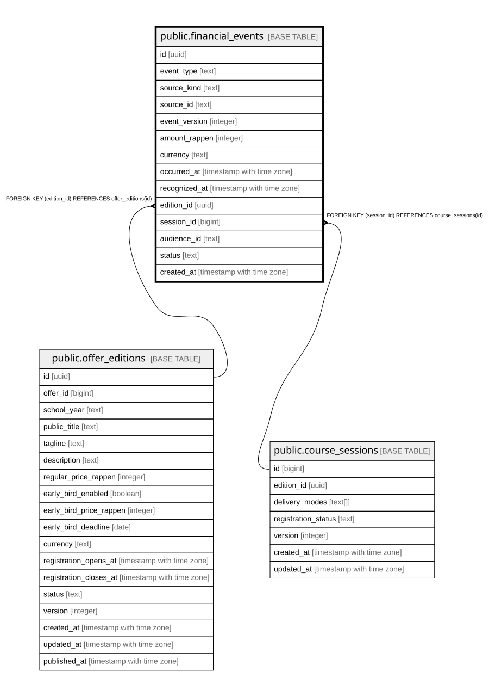

# public.financial_events

## Description

Idempotenter, append-only Reporting-Ledger (Schritt 10d, Abschnitt 2.15). Wird ausschliesslich durch SECURITY-DEFINER-Trigger/RPCs befuellt (sync_anmeldung_financial_events, sync_expense_financial_event, sync_financial_adjustment_event, admin_close_payroll_period) -- kein direkter INSERT/UPDATE/DELETE fuer authenticated, admin liest nur.

## Columns

| Name | Type | Default | Nullable | Children | Parents | Comment |
| ---- | ---- | ------- | -------- | -------- | ------- | ------- |
| id | uuid | gen_random_uuid() | false |  |  |  |
| event_type | text |  | false |  |  |  |
| source_kind | text |  | false |  |  |  |
| source_id | text |  | false |  |  |  |
| event_version | integer | 1 | false |  |  |  |
| amount_rappen | integer |  | false |  |  |  |
| currency | text | 'CHF'::text | false |  |  |  |
| occurred_at | timestamp with time zone | now() | false |  |  |  |
| recognized_at | timestamp with time zone | now() | false |  |  |  |
| edition_id | uuid |  | true |  | [public.offer_editions](public.offer_editions.md) |  |
| session_id | bigint |  | true |  | [public.course_sessions](public.course_sessions.md) |  |
| audience_id | text |  | true |  |  |  |
| status | text | 'confirmed'::text | false |  |  |  |
| created_at | timestamp with time zone | now() | false |  |  |  |

## Constraints

| Name | Type | Definition |
| ---- | ---- | ---------- |
| financial_events_event_type_check | CHECK | CHECK ((event_type = ANY (ARRAY['booking'::text, 'payment'::text, 'refund'::text, 'payroll_cost'::text, 'course_expense'::text, 'overhead'::text, 'manual_adjustment'::text]))) |
| financial_events_status_check | CHECK | CHECK ((status = ANY (ARRAY['pending'::text, 'confirmed'::text, 'cancelled'::text]))) |
| financial_events_edition_id_fkey | FOREIGN KEY | FOREIGN KEY (edition_id) REFERENCES offer_editions(id) |
| financial_events_session_id_fkey | FOREIGN KEY | FOREIGN KEY (session_id) REFERENCES course_sessions(id) |
| financial_events_pkey | PRIMARY KEY | PRIMARY KEY (id) |
| financial_events_source_kind_source_id_event_type_event_ver_key | UNIQUE | UNIQUE (source_kind, source_id, event_type, event_version) |

## Indexes

| Name | Definition |
| ---- | ---------- |
| financial_events_pkey | CREATE UNIQUE INDEX financial_events_pkey ON public.financial_events USING btree (id) |
| financial_events_source_kind_source_id_event_type_event_ver_key | CREATE UNIQUE INDEX financial_events_source_kind_source_id_event_type_event_ver_key ON public.financial_events USING btree (source_kind, source_id, event_type, event_version) |
| idx_financial_events_recognized_at | CREATE INDEX idx_financial_events_recognized_at ON public.financial_events USING btree (recognized_at) |
| idx_financial_events_edition_id | CREATE INDEX idx_financial_events_edition_id ON public.financial_events USING btree (edition_id) |

## Relations

---

> Generated by [tbls](https://github.com/k1LoW/tbls)
