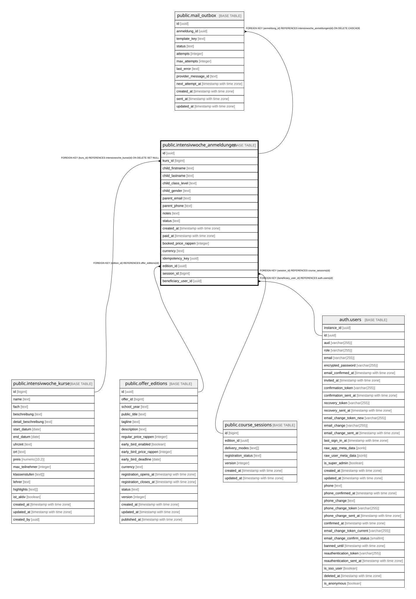

# public.intensivwoche_anmeldungen

## Description

Öffentliche Anmeldungen für Intensivwochen-Kurse. Schreibzugriff ausschließlich über die SECURITY DEFINER Funktion book_intensivwoche_kurs(); RLS erlaubt SELECT/UPDATE/DELETE nur für Admins (is_admin()). anon behält nur SELECT (für die aggregierende, security_invoker View intensivwoche_kurse_mit_anmeldungen) — mangels RLS-Policy sieht anon dabei keine einzelnen Zeilen.

## Columns

| Name | Type | Default | Nullable | Children | Parents | Comment |
| ---- | ---- | ------- | -------- | -------- | ------- | ------- |
| id | uuid | gen_random_uuid() | false | [public.mail_outbox](public.mail_outbox.md) |  |  |
| kurs_id | bigint |  | true |  | [public.intensivwoche_kurse](public.intensivwoche_kurse.md) |  |
| child_firstname | text |  | false |  |  |  |
| child_lastname | text |  | false |  |  |  |
| child_class_level | text |  | false |  |  |  |
| child_gender | text |  | false |  |  |  |
| parent_email | text |  | false |  |  |  |
| parent_phone | text |  | false |  |  |  |
| notes | text |  | true |  |  |  |
| status | text | 'eingegangen'::text | false |  |  |  |
| created_at | timestamp with time zone | now() | false |  |  |  |
| paid_at | timestamp with time zone |  | true |  |  |  |
| booked_price_rappen | integer |  | true |  |  | Unveränderlicher Preis-Snapshot in Rappen zum Buchungszeitpunkt. NULL bei Altzeilen vor dieser Migration. Wird von book_intensivwoche_kurs() (Migration 014) gesetzt, niemals nachträglich aus intensivwoche_kurse.preis neu berechnet. |
| currency | text | 'CHF'::text | false |  |  |  |
| idempotency_key | uuid |  | true |  |  |  |
| edition_id | uuid |  | true |  | [public.offer_editions](public.offer_editions.md) |  |
| session_id | bigint |  | true |  | [public.course_sessions](public.course_sessions.md) |  |
| beneficiary_user_id | uuid |  | true |  | [auth.users](auth.users.md) |  |

## Constraints

| Name | Type | Definition |
| ---- | ---- | ---------- |
| anmeldungen_child_class_level_length_check | CHECK | CHECK (((char_length(TRIM(BOTH FROM child_class_level)) >= 1) AND (char_length(TRIM(BOTH FROM child_class_level)) <= 20))) |
| anmeldungen_child_firstname_length_check | CHECK | CHECK (((char_length(TRIM(BOTH FROM child_firstname)) >= 2) AND (char_length(TRIM(BOTH FROM child_firstname)) <= 50))) |
| anmeldungen_child_lastname_length_check | CHECK | CHECK (((char_length(TRIM(BOTH FROM child_lastname)) >= 2) AND (char_length(TRIM(BOTH FROM child_lastname)) <= 50))) |
| anmeldungen_notes_length_check | CHECK | CHECK (((notes IS NULL) OR (char_length(notes) <= 500))) |
| anmeldungen_parent_email_format_check | CHECK | CHECK (((char_length(parent_email) <= 254) AND (parent_email ~ '^[^@[:space:]]+@[^@[:space:]]+\.[^@[:space:]]+$'::text))) |
| anmeldungen_parent_phone_format_check | CHECK | CHECK ((((char_length(parent_phone) >= 10) AND (char_length(parent_phone) <= 20)) AND (parent_phone ~ '^[\d\s+\-()]+$'::text))) |
| booked_price_rappen_non_negative | CHECK | CHECK (((booked_price_rappen IS NULL) OR (booked_price_rappen >= 0))) |
| intensivwoche_anmeldungen_child_gender_check | CHECK | CHECK ((child_gender = ANY (ARRAY['m'::text, 'w'::text, 'd'::text]))) |
| intensivwoche_anmeldungen_status_check | CHECK | CHECK ((status = ANY (ARRAY['eingegangen'::text, 'bestaetigt'::text, 'bezahlt'::text, 'storniert'::text]))) |
| intensivwoche_anmeldungen_beneficiary_user_id_fkey | FOREIGN KEY | FOREIGN KEY (beneficiary_user_id) REFERENCES auth.users(id) |
| intensivwoche_anmeldungen_pkey | PRIMARY KEY | PRIMARY KEY (id) |
| intensivwoche_anmeldungen_kurs_id_fkey | FOREIGN KEY | FOREIGN KEY (kurs_id) REFERENCES intensivwoche_kurse(id) ON DELETE SET NULL |
| intensivwoche_anmeldungen_edition_id_fkey | FOREIGN KEY | FOREIGN KEY (edition_id) REFERENCES offer_editions(id) |
| intensivwoche_anmeldungen_session_id_fkey | FOREIGN KEY | FOREIGN KEY (session_id) REFERENCES course_sessions(id) |

## Indexes

| Name | Definition |
| ---- | ---------- |
| intensivwoche_anmeldungen_pkey | CREATE UNIQUE INDEX intensivwoche_anmeldungen_pkey ON public.intensivwoche_anmeldungen USING btree (id) |
| idx_intensivwoche_anmeldungen_created_at | CREATE INDEX idx_intensivwoche_anmeldungen_created_at ON public.intensivwoche_anmeldungen USING btree (created_at DESC) |
| idx_intensivwoche_anmeldungen_kurs_id | CREATE INDEX idx_intensivwoche_anmeldungen_kurs_id ON public.intensivwoche_anmeldungen USING btree (kurs_id) |
| idx_intensivwoche_anmeldungen_status | CREATE INDEX idx_intensivwoche_anmeldungen_status ON public.intensivwoche_anmeldungen USING btree (status) |
| idx_anmeldungen_kurs_email_child_unique | CREATE UNIQUE INDEX idx_anmeldungen_kurs_email_child_unique ON public.intensivwoche_anmeldungen USING btree (kurs_id, lower(parent_email), lower(TRIM(BOTH FROM child_firstname)), lower(TRIM(BOTH FROM child_lastname))) WHERE (status <> 'storniert'::text) |
| idx_anmeldungen_idempotency_key_unique | CREATE UNIQUE INDEX idx_anmeldungen_idempotency_key_unique ON public.intensivwoche_anmeldungen USING btree (idempotency_key) WHERE (idempotency_key IS NOT NULL) |
| idx_anmeldungen_edition_id | CREATE INDEX idx_anmeldungen_edition_id ON public.intensivwoche_anmeldungen USING btree (edition_id) |
| idx_anmeldungen_session_id | CREATE INDEX idx_anmeldungen_session_id ON public.intensivwoche_anmeldungen USING btree (session_id) |
| idx_anmeldungen_beneficiary_user_id | CREATE INDEX idx_anmeldungen_beneficiary_user_id ON public.intensivwoche_anmeldungen USING btree (beneficiary_user_id) |

## Triggers

| Name | Definition | Comment |
| ---- | ---------- | ------- |
| anmeldungen_price_snapshot_immutable | CREATE TRIGGER anmeldungen_price_snapshot_immutable BEFORE UPDATE ON public.intensivwoche_anmeldungen FOR EACH ROW EXECUTE FUNCTION enforce_anmeldung_price_snapshot_immutable() |  |
| link_anmeldung_beneficiary_before_insert | CREATE TRIGGER link_anmeldung_beneficiary_before_insert BEFORE INSERT ON public.intensivwoche_anmeldungen FOR EACH ROW EXECUTE FUNCTION link_anmeldung_beneficiary() |  |
| sync_anmeldung_financial_events_trigger | CREATE TRIGGER sync_anmeldung_financial_events_trigger AFTER INSERT OR UPDATE ON public.intensivwoche_anmeldungen FOR EACH ROW EXECUTE FUNCTION sync_anmeldung_financial_events() |  |
| intensivwoche_anmeldungen_enqueue_mail | CREATE TRIGGER intensivwoche_anmeldungen_enqueue_mail AFTER INSERT ON public.intensivwoche_anmeldungen FOR EACH ROW EXECUTE FUNCTION enqueue_booking_confirmation_mail() | Erzeugt automatisch eine mail_outbox-Zeile fuer jede neue Anmeldung, unabhaengig vom Schreibpfad (aktuell nur book_intensivwoche_kurs()). |

## Relations

---

> Generated by [tbls](https://github.com/k1LoW/tbls)
