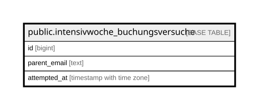

# public.intensivwoche_buchungsversuche

## Description

Zähl-Log für den Rate-Limiter in book_intensivwoche_kurs() (max. 5 Versuche / 10 Minuten je parent_email). Nur über die SECURITY DEFINER Funktion beschrieben/gelesen, RLS ohne Policies, keine Grants an anon/authenticated. Wird bewusst nicht automatisch bereinigt (Phase B); künftiges Pruning ist ein separater, additiver Schritt.

## Columns

| Name | Type | Default | Nullable | Children | Parents | Comment |
| ---- | ---- | ------- | -------- | -------- | ------- | ------- |
| id | bigint |  | false |  |  |  |
| parent_email | text |  | false |  |  |  |
| attempted_at | timestamp with time zone | now() | false |  |  |  |

## Constraints

| Name | Type | Definition |
| ---- | ---- | ---------- |
| intensivwoche_buchungsversuche_pkey | PRIMARY KEY | PRIMARY KEY (id) |

## Indexes

| Name | Definition |
| ---- | ---------- |
| intensivwoche_buchungsversuche_pkey | CREATE UNIQUE INDEX intensivwoche_buchungsversuche_pkey ON public.intensivwoche_buchungsversuche USING btree (id) |
| idx_buchungsversuche_email_time | CREATE INDEX idx_buchungsversuche_email_time ON public.intensivwoche_buchungsversuche USING btree (lower(parent_email), attempted_at) |

## Relations

---

> Generated by [tbls](https://github.com/k1LoW/tbls)
