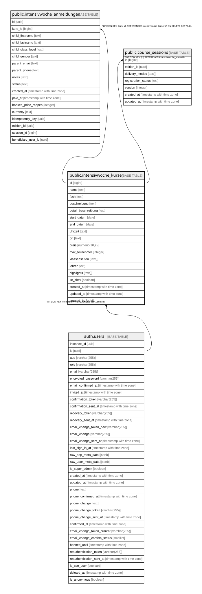

# public.intensivwoche_kurse

## Description

Intensivwoche-Kurse. RLS: Anon kann nur aktive Kurse lesen, Authenticated hat vollen Zugriff.

## Columns

| Name | Type | Default | Nullable | Children | Parents | Comment |
| ---- | ---- | ------- | -------- | -------- | ------- | ------- |
| id | bigint | nextval('intensivwoche_kurse_id_seq'::regclass) | false | [public.intensivwoche_anmeldungen](public.intensivwoche_anmeldungen.md) [public.course_sessions](public.course_sessions.md) |  |  |
| name | text |  | false |  |  |  |
| fach | text |  | false |  |  |  |
| beschreibung | text |  | false |  |  |  |
| detail_beschreibung | text |  | true |  |  |  |
| start_datum | date |  | false |  |  |  |
| end_datum | date |  | false |  |  |  |
| uhrzeit | text |  | false |  |  |  |
| ort | text |  | false |  |  |  |
| preis | numeric(10,2) |  | false |  |  |  |
| max_teilnehmer | integer | 12 | false |  |  |  |
| klassenstufen | text[] | ARRAY['5. Klasse'::text, '6. Klasse'::text] | false |  |  |  |
| lehrer | text |  | false |  |  |  |
| highlights | text[] | ARRAY[]::text[] | true |  |  |  |
| ist_aktiv | boolean | true | false |  |  |  |
| created_at | timestamp with time zone | now() | false |  |  |  |
| updated_at | timestamp with time zone | now() | false |  |  |  |
| created_by | uuid |  | true |  | [auth.users](auth.users.md) |  |

## Constraints

| Name | Type | Definition |
| ---- | ---- | ---------- |
| intensivwoche_kurse_fach_check | CHECK | CHECK ((fach = ANY (ARRAY['mathematik'::text, 'deutsch'::text, 'franzoesisch'::text, 'natur-mensch-gesellschaft'::text]))) |
| valid_date_range | CHECK | CHECK ((end_datum >= start_datum)) |
| intensivwoche_kurse_created_by_fkey | FOREIGN KEY | FOREIGN KEY (created_by) REFERENCES auth.users(id) |
| intensivwoche_kurse_pkey | PRIMARY KEY | PRIMARY KEY (id) |

## Indexes

| Name | Definition |
| ---- | ---------- |
| intensivwoche_kurse_pkey | CREATE UNIQUE INDEX intensivwoche_kurse_pkey ON public.intensivwoche_kurse USING btree (id) |
| idx_intensivwoche_kurse_fach | CREATE INDEX idx_intensivwoche_kurse_fach ON public.intensivwoche_kurse USING btree (fach) |
| idx_intensivwoche_kurse_ist_aktiv | CREATE INDEX idx_intensivwoche_kurse_ist_aktiv ON public.intensivwoche_kurse USING btree (ist_aktiv) |
| idx_intensivwoche_kurse_start_datum | CREATE INDEX idx_intensivwoche_kurse_start_datum ON public.intensivwoche_kurse USING btree (start_datum) |
| idx_kurse_created_by | CREATE INDEX idx_kurse_created_by ON public.intensivwoche_kurse USING btree (created_by) |

## Triggers

| Name | Definition |
| ---- | ---------- |
| update_intensivwoche_kurse_updated_at | CREATE TRIGGER update_intensivwoche_kurse_updated_at BEFORE UPDATE ON public.intensivwoche_kurse FOR EACH ROW EXECUTE FUNCTION update_updated_at_column() |

## Relations

---

> Generated by [tbls](https://github.com/k1LoW/tbls)
