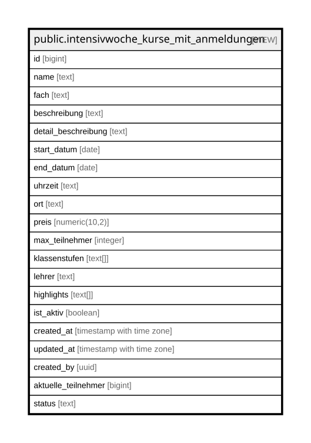

# public.intensivwoche_kurse_mit_anmeldungen

## Description

Oeffentliche Kursuebersicht mit aggregierter Belegung. security_invoker=true schuetzt alle Spalten/Joins korrekt per Aufrufer-RLS; aktuelle_teilnehmer/status werden bewusst ueber die SECURITY DEFINER-Funktion count_active_anmeldungen() berechnet, damit anon/authenticated eine korrekte Aggregatzahl sehen, ohne je eine einzelne intensivwoche_anmeldungen-Zeile lesen zu koennen.

<details>
<summary><strong>Table Definition</strong></summary>

```sql
CREATE VIEW intensivwoche_kurse_mit_anmeldungen AS (
 SELECT k.id,
    k.name,
    k.fach,
    k.beschreibung,
    k.detail_beschreibung,
    k.start_datum,
    k.end_datum,
    k.uhrzeit,
    k.ort,
    k.preis,
    k.max_teilnehmer,
    k.klassenstufen,
    k.lehrer,
    k.highlights,
    k.ist_aktiv,
    k.created_at,
    k.updated_at,
    k.created_by,
    a.anzahl_anmeldungen AS aktuelle_teilnehmer,
        CASE
            WHEN (a.anzahl_anmeldungen >= k.max_teilnehmer) THEN 'ausgebucht'::text
            WHEN (a.anzahl_anmeldungen >= (k.max_teilnehmer - 2)) THEN 'wenige-plaetze'::text
            ELSE 'offen'::text
        END AS status
   FROM (intensivwoche_kurse k
     CROSS JOIN LATERAL ( SELECT count_active_anmeldungen(k.id) AS anzahl_anmeldungen) a)
)
```

</details>

## Columns

| Name | Type | Default | Nullable | Children | Parents | Comment |
| ---- | ---- | ------- | -------- | -------- | ------- | ------- |
| id | bigint |  | true |  |  |  |
| name | text |  | true |  |  |  |
| fach | text |  | true |  |  |  |
| beschreibung | text |  | true |  |  |  |
| detail_beschreibung | text |  | true |  |  |  |
| start_datum | date |  | true |  |  |  |
| end_datum | date |  | true |  |  |  |
| uhrzeit | text |  | true |  |  |  |
| ort | text |  | true |  |  |  |
| preis | numeric(10,2) |  | true |  |  |  |
| max_teilnehmer | integer |  | true |  |  |  |
| klassenstufen | text[] |  | true |  |  |  |
| lehrer | text |  | true |  |  |  |
| highlights | text[] |  | true |  |  |  |
| ist_aktiv | boolean |  | true |  |  |  |
| created_at | timestamp with time zone |  | true |  |  |  |
| updated_at | timestamp with time zone |  | true |  |  |  |
| created_by | uuid |  | true |  |  |  |
| aktuelle_teilnehmer | bigint |  | true |  |  |  |
| status | text |  | true |  |  |  |

## Referenced Tables

| Name | Columns | Comment | Type |
| ---- | ------- | ------- | ---- |
| [public.intensivwoche_kurse](public.intensivwoche_kurse.md) | 18 | Intensivwoche-Kurse. RLS: Anon kann nur aktive Kurse lesen, Authenticated hat vollen Zugriff. | BASE TABLE |
| [LATERAL](LATERAL.md) | 0 |  |  |

## Relations



---

> Generated by [tbls](https://github.com/k1LoW/tbls)
