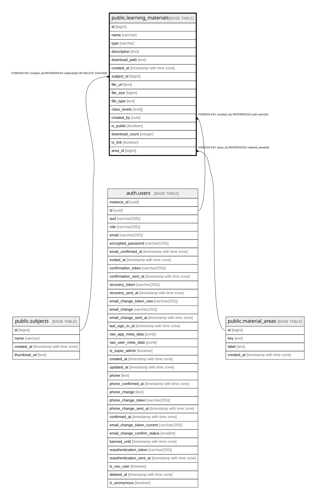

# public.learning_materials

## Columns

| Name | Type | Default | Nullable | Children | Parents | Comment |
| ---- | ---- | ------- | -------- | -------- | ------- | ------- |
| id | bigint |  | false |  |  |  |
| name | varchar |  | true |  |  |  |
| type | varchar |  | true |  |  |  |
| description | text |  | true |  |  |  |
| download_path | text | ''::text | true |  |  |  |
| created_at | timestamp with time zone | now() | false |  |  |  |
| subject_id | bigint |  | true |  | [public.subjects](public.subjects.md) |  |
| file_url | text |  | true |  |  |  |
| file_size | bigint |  | true |  |  |  |
| file_type | text |  | true |  |  |  |
| class_levels | text[] | ARRAY['5. Klasse'::text, '6. Klasse'::text] | true |  |  |  |
| created_by | uuid |  | true |  | [auth.users](auth.users.md) |  |
| is_public | boolean | true | true |  |  |  |
| download_count | integer | 0 | true |  |  |  |
| is_link | boolean | false | true |  |  | True if this material is a link/bookmark rather than an uploaded file |
| area_id | bigint |  | true |  | [public.material_areas](public.material_areas.md) | FK auf material_areas. Nullable: Zeilen mit mehrdeutigen/alten class_levels-Kombinationen (z.B. gleichzeitig 5./6. Klasse) bleiben bewusst NULL und gelten als needs_review, bis sie fachlich aufgeloest sind (Abschnitt 2.11). |

## Constraints

| Name | Type | Definition |
| ---- | ---- | ---------- |
| learning_materials_created_by_fkey | FOREIGN KEY | FOREIGN KEY (created_by) REFERENCES auth.users(id) |
| learning_materials_pkey | PRIMARY KEY | PRIMARY KEY (id) |
| learning_materials_subject_id_fkey | FOREIGN KEY | FOREIGN KEY (subject_id) REFERENCES subjects(id) ON DELETE CASCADE |
| learning_materials_area_id_fkey | FOREIGN KEY | FOREIGN KEY (area_id) REFERENCES material_areas(id) |

## Indexes

| Name | Definition |
| ---- | ---------- |
| learning_materials_pkey | CREATE UNIQUE INDEX learning_materials_pkey ON public.learning_materials USING btree (id) |
| idx_learning_materials_area_id | CREATE INDEX idx_learning_materials_area_id ON public.learning_materials USING btree (area_id) |

## Relations

---

> Generated by [tbls](https://github.com/k1LoW/tbls)
