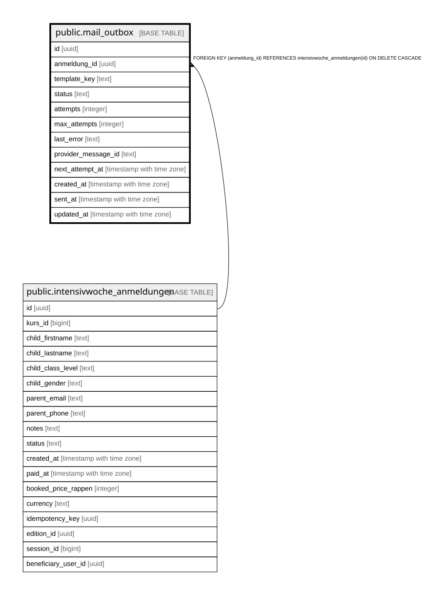

# public.mail_outbox

## Description

Idempotente Versand-/Retry-Warteschlange fuer Buchungsbestaetigungen (Abschnitt 10.4). Enthaelt bewusst keine Kopie von Name/E-Mail/Notizen -- nur eine Referenz auf intensivwoche_anmeldungen plus Versandstatus.

## Columns

| Name | Type | Default | Nullable | Children | Parents | Comment |
| ---- | ---- | ------- | -------- | -------- | ------- | ------- |
| id | uuid | gen_random_uuid() | false |  |  |  |
| anmeldung_id | uuid |  | false |  | [public.intensivwoche_anmeldungen](public.intensivwoche_anmeldungen.md) |  |
| template_key | text | 'booking_confirmation'::text | false |  |  |  |
| status | text | 'pending'::text | false |  |  | pending: noch nicht (erfolgreich) versendet. sent: erfolgreich zugestellt (Provider hat angenommen). failed: max_attempts erreicht, braucht manuelle Pruefung im Admin. |
| attempts | integer | 0 | false |  |  |  |
| max_attempts | integer | 5 | false |  |  |  |
| last_error | text |  | true |  |  |  |
| provider_message_id | text |  | true |  |  |  |
| next_attempt_at | timestamp with time zone | now() | false |  |  | Fruehester Zeitpunkt fuer den naechsten Versandversuch (exponentielles Backoff durch lib/mail/dispatch-outbox.ts gesetzt), verhindert Retry-Sturm bei einem vorübergehenden Provider-Ausfall. |
| created_at | timestamp with time zone | now() | false |  |  |  |
| sent_at | timestamp with time zone |  | true |  |  |  |
| updated_at | timestamp with time zone | now() | false |  |  |  |

## Constraints

| Name | Type | Definition |
| ---- | ---- | ---------- |
| mail_outbox_attempts_non_negative | CHECK | CHECK ((attempts >= 0)) |
| mail_outbox_status_check | CHECK | CHECK ((status = ANY (ARRAY['pending'::text, 'sent'::text, 'failed'::text]))) |
| mail_outbox_anmeldung_id_fkey | FOREIGN KEY | FOREIGN KEY (anmeldung_id) REFERENCES intensivwoche_anmeldungen(id) ON DELETE CASCADE |
| mail_outbox_pkey | PRIMARY KEY | PRIMARY KEY (id) |
| mail_outbox_unique_anmeldung_template | UNIQUE | UNIQUE (anmeldung_id, template_key) |

## Indexes

| Name | Definition |
| ---- | ---------- |
| mail_outbox_pkey | CREATE UNIQUE INDEX mail_outbox_pkey ON public.mail_outbox USING btree (id) |
| mail_outbox_unique_anmeldung_template | CREATE UNIQUE INDEX mail_outbox_unique_anmeldung_template ON public.mail_outbox USING btree (anmeldung_id, template_key) |

## Relations

---

> Generated by [tbls](https://github.com/k1LoW/tbls)
