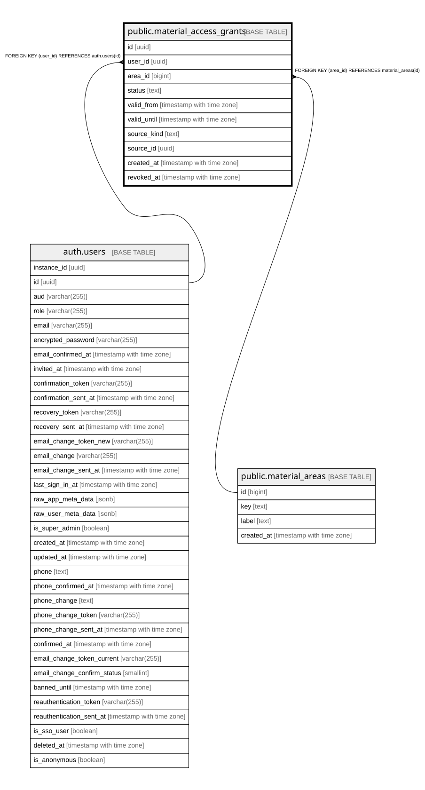

# public.material_access_grants

## Description

Effektiver Materialzugriff (Abschnitt 2.11). Entzug/Ablauf setzen status/revoked_at, niemals ein Hard-Delete. Admins duerfen admin_grant-Eintraege direkt erteilen/aktualisieren (Schritt 11a); self_study_enrollment-Eintraege bleiben bis zum spaeteren Zahlungs-Flow service_role-only.

## Columns

| Name | Type | Default | Nullable | Children | Parents | Comment |
| ---- | ---- | ------- | -------- | -------- | ------- | ------- |
| id | uuid | gen_random_uuid() | false |  |  |  |
| user_id | uuid |  | false |  | [auth.users](auth.users.md) |  |
| area_id | bigint |  | false |  | [public.material_areas](public.material_areas.md) |  |
| status | text | 'active'::text | false |  |  |  |
| valid_from | timestamp with time zone | now() | false |  |  |  |
| valid_until | timestamp with time zone |  | true |  |  |  |
| source_kind | text |  | false |  |  |  |
| source_id | uuid |  | true |  |  |  |
| created_at | timestamp with time zone | now() | false |  |  |  |
| revoked_at | timestamp with time zone |  | true |  |  |  |

## Constraints

| Name | Type | Definition |
| ---- | ---- | ---------- |
| material_access_grants_source_kind_check | CHECK | CHECK ((source_kind = ANY (ARRAY['self_study_enrollment'::text, 'admin_grant'::text]))) |
| material_access_grants_status_check | CHECK | CHECK ((status = ANY (ARRAY['active'::text, 'revoked'::text, 'expired'::text]))) |
| material_access_grants_user_id_fkey | FOREIGN KEY | FOREIGN KEY (user_id) REFERENCES auth.users(id) |
| material_access_grants_area_id_fkey | FOREIGN KEY | FOREIGN KEY (area_id) REFERENCES material_areas(id) |
| material_access_grants_pkey | PRIMARY KEY | PRIMARY KEY (id) |

## Indexes

| Name | Definition |
| ---- | ---------- |
| material_access_grants_pkey | CREATE UNIQUE INDEX material_access_grants_pkey ON public.material_access_grants USING btree (id) |
| idx_material_access_grants_user_area | CREATE INDEX idx_material_access_grants_user_area ON public.material_access_grants USING btree (user_id, area_id) |

## Relations

---

> Generated by [tbls](https://github.com/k1LoW/tbls)
