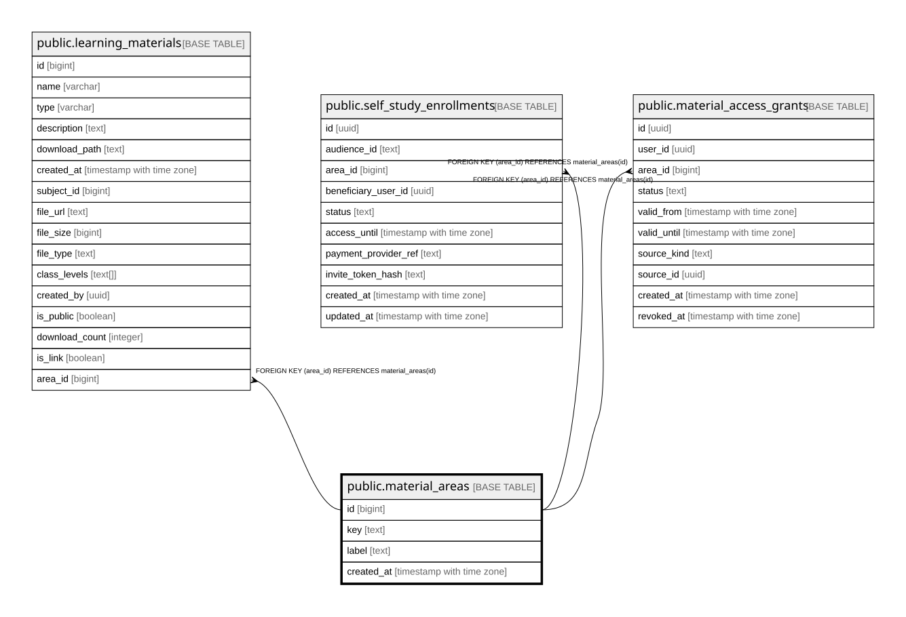

# public.material_areas

## Description

Vier stabile Materialbereiche (Abschnitt 2.11). Nur Lookup-Daten, kein Geschäftsbestand -- oeffentlich lesbar, Schreibzugriff nur ueber service_role.

## Columns

| Name | Type | Default | Nullable | Children | Parents | Comment |
| ---- | ---- | ------- | -------- | -------- | ------- | ------- |
| id | bigint |  | false | [public.learning_materials](public.learning_materials.md) [public.self_study_enrollments](public.self_study_enrollments.md) [public.material_access_grants](public.material_access_grants.md) |  |  |
| key | text |  | false |  |  |  |
| label | text |  | false |  |  |  |
| created_at | timestamp with time zone | now() | false |  |  |  |

## Constraints

| Name | Type | Definition |
| ---- | ---- | ---------- |
| material_areas_pkey | PRIMARY KEY | PRIMARY KEY (id) |
| material_areas_key_key | UNIQUE | UNIQUE (key) |

## Indexes

| Name | Definition |
| ---- | ---------- |
| material_areas_pkey | CREATE UNIQUE INDEX material_areas_pkey ON public.material_areas USING btree (id) |
| material_areas_key_key | CREATE UNIQUE INDEX material_areas_key_key ON public.material_areas USING btree (key) |

## Relations

---

> Generated by [tbls](https://github.com/k1LoW/tbls)
