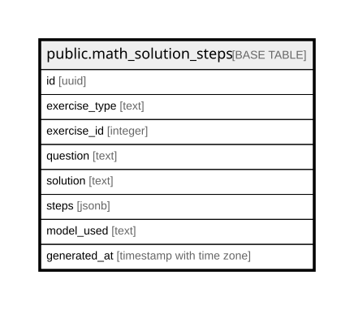

# public.math_solution_steps

## Columns

| Name | Type | Default | Nullable | Children | Parents | Comment |
| ---- | ---- | ------- | -------- | -------- | ------- | ------- |
| id | uuid | gen_random_uuid() | false |  |  |  |
| exercise_type | text |  | false |  |  |  |
| exercise_id | integer |  | false |  |  |  |
| question | text |  | false |  |  |  |
| solution | text |  | false |  |  |  |
| steps | jsonb |  | false |  |  |  |
| model_used | text | 'claude-sonnet-4-6'::text | false |  |  |  |
| generated_at | timestamp with time zone | now() | true |  |  |  |

## Constraints

| Name | Type | Definition |
| ---- | ---- | ---------- |
| math_solution_steps_exercise_type_exercise_id_key | UNIQUE | UNIQUE (exercise_type, exercise_id) |
| math_solution_steps_pkey | PRIMARY KEY | PRIMARY KEY (id) |

## Indexes

| Name | Definition |
| ---- | ---------- |
| math_solution_steps_exercise_type_exercise_id_key | CREATE UNIQUE INDEX math_solution_steps_exercise_type_exercise_id_key ON public.math_solution_steps USING btree (exercise_type, exercise_id) |
| math_solution_steps_pkey | CREATE UNIQUE INDEX math_solution_steps_pkey ON public.math_solution_steps USING btree (id) |

## Relations

---

> Generated by [tbls](https://github.com/k1LoW/tbls)
