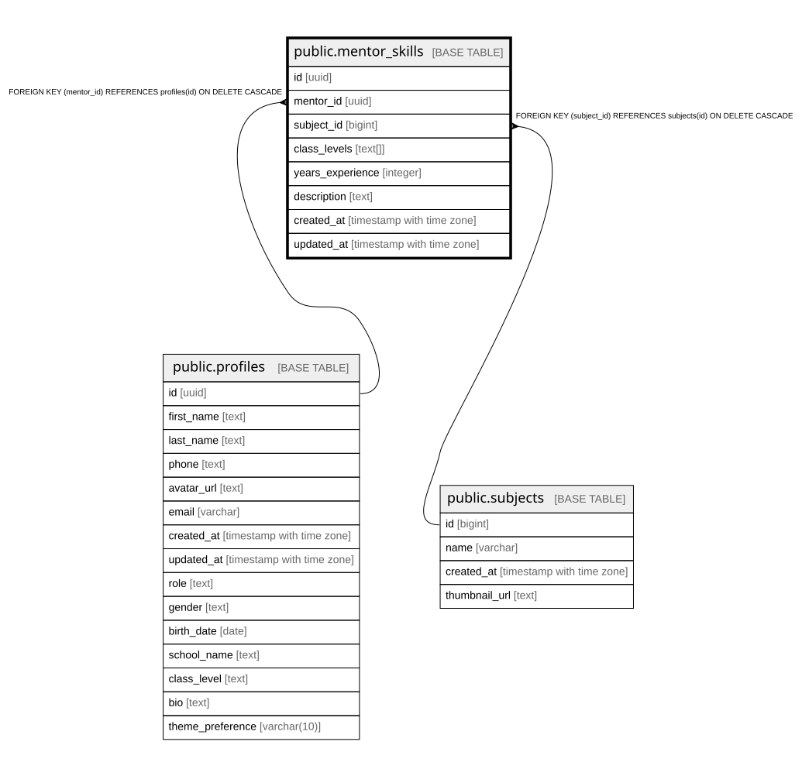

# public.mentor_skills

## Columns

| Name | Type | Default | Nullable | Children | Parents | Comment |
| ---- | ---- | ------- | -------- | -------- | ------- | ------- |
| id | uuid | gen_random_uuid() | false |  |  |  |
| mentor_id | uuid |  | false |  | [public.profiles](public.profiles.md) |  |
| subject_id | bigint |  | false |  | [public.subjects](public.subjects.md) |  |
| class_levels | text[] | '{}'::text[] | false |  |  |  |
| years_experience | integer |  | true |  |  |  |
| description | text |  | true |  |  |  |
| created_at | timestamp with time zone | now() | true |  |  |  |
| updated_at | timestamp with time zone | now() | true |  |  |  |

## Constraints

| Name | Type | Definition |
| ---- | ---- | ---------- |
| mentor_skills_mentor_id_subject_id_key | UNIQUE | UNIQUE (mentor_id, subject_id) |
| mentor_skills_pkey | PRIMARY KEY | PRIMARY KEY (id) |
| mentor_skills_mentor_id_fkey | FOREIGN KEY | FOREIGN KEY (mentor_id) REFERENCES profiles(id) ON DELETE CASCADE |
| mentor_skills_subject_id_fkey | FOREIGN KEY | FOREIGN KEY (subject_id) REFERENCES subjects(id) ON DELETE CASCADE |

## Indexes

| Name | Definition |
| ---- | ---------- |
| mentor_skills_mentor_id_subject_id_key | CREATE UNIQUE INDEX mentor_skills_mentor_id_subject_id_key ON public.mentor_skills USING btree (mentor_id, subject_id) |
| mentor_skills_pkey | CREATE UNIQUE INDEX mentor_skills_pkey ON public.mentor_skills USING btree (id) |
| idx_mentor_skills_mentor | CREATE INDEX idx_mentor_skills_mentor ON public.mentor_skills USING btree (mentor_id) |
| idx_mentor_skills_subject | CREATE INDEX idx_mentor_skills_subject ON public.mentor_skills USING btree (subject_id) |

## Triggers

| Name | Definition |
| ---- | ---------- |
| update_mentor_skills_updated_at | CREATE TRIGGER update_mentor_skills_updated_at BEFORE UPDATE ON public.mentor_skills FOR EACH ROW EXECUTE FUNCTION update_mentorship_updated_at() |

## Relations

---

> Generated by [tbls](https://github.com/k1LoW/tbls)
