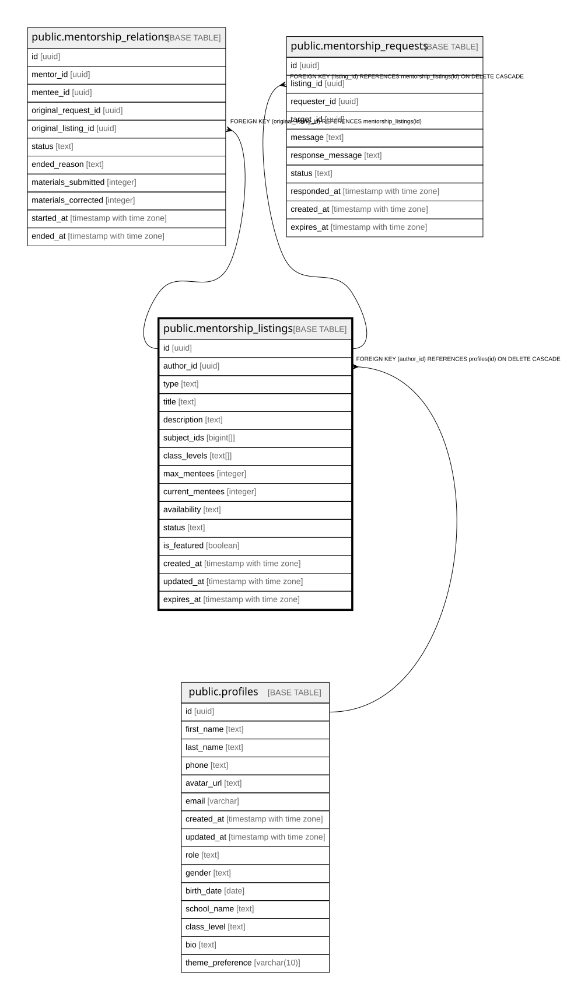

# public.mentorship_listings

## Columns

| Name | Type | Default | Nullable | Children | Parents | Comment |
| ---- | ---- | ------- | -------- | -------- | ------- | ------- |
| id | uuid | gen_random_uuid() | false | [public.mentorship_relations](public.mentorship_relations.md) [public.mentorship_requests](public.mentorship_requests.md) |  |  |
| author_id | uuid |  | false |  | [public.profiles](public.profiles.md) |  |
| type | text |  | false |  |  |  |
| title | text |  | false |  |  |  |
| description | text |  | true |  |  |  |
| subject_ids | bigint[] | '{}'::bigint[] | false |  |  |  |
| class_levels | text[] | '{}'::text[] | false |  |  |  |
| max_mentees | integer |  | true |  |  |  |
| current_mentees | integer | 0 | true |  |  |  |
| availability | text |  | true |  |  |  |
| status | text | 'DRAFT'::text | false |  |  |  |
| is_featured | boolean | false | true |  |  |  |
| created_at | timestamp with time zone | now() | true |  |  |  |
| updated_at | timestamp with time zone | now() | true |  |  |  |
| expires_at | timestamp with time zone |  | true |  |  |  |

## Constraints

| Name | Type | Definition |
| ---- | ---- | ---------- |
| mentorship_listings_status_check | CHECK | CHECK ((status = ANY (ARRAY['DRAFT'::text, 'ACTIVE'::text, 'PAUSED'::text, 'CLOSED'::text]))) |
| mentorship_listings_type_check | CHECK | CHECK ((type = ANY (ARRAY['OFFER'::text, 'REQUEST'::text]))) |
| mentorship_listings_pkey | PRIMARY KEY | PRIMARY KEY (id) |
| mentorship_listings_author_id_fkey | FOREIGN KEY | FOREIGN KEY (author_id) REFERENCES profiles(id) ON DELETE CASCADE |

## Indexes

| Name | Definition |
| ---- | ---------- |
| mentorship_listings_pkey | CREATE UNIQUE INDEX mentorship_listings_pkey ON public.mentorship_listings USING btree (id) |
| idx_listings_author | CREATE INDEX idx_listings_author ON public.mentorship_listings USING btree (author_id) |
| idx_listings_search | CREATE INDEX idx_listings_search ON public.mentorship_listings USING gin (to_tsvector('german'::regconfig, ((title || ' '::text) || COALESCE(description, ''::text)))) |
| idx_listings_status | CREATE INDEX idx_listings_status ON public.mentorship_listings USING btree (status) |
| idx_listings_type | CREATE INDEX idx_listings_type ON public.mentorship_listings USING btree (type) |

## Triggers

| Name | Definition |
| ---- | ---------- |
| update_mentorship_listings_updated_at | CREATE TRIGGER update_mentorship_listings_updated_at BEFORE UPDATE ON public.mentorship_listings FOR EACH ROW EXECUTE FUNCTION update_mentorship_updated_at() |

## Relations

---

> Generated by [tbls](https://github.com/k1LoW/tbls)
