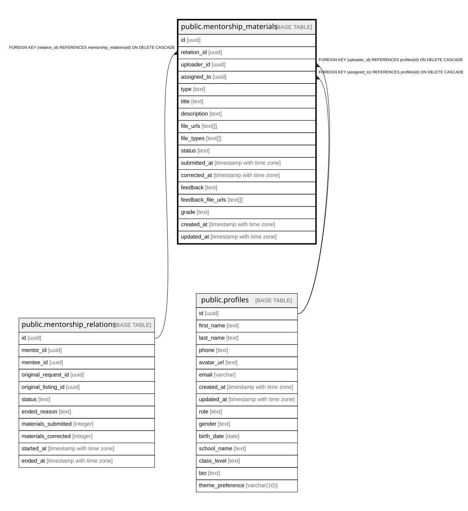

# public.mentorship_materials

## Columns

| Name | Type | Default | Nullable | Children | Parents | Comment |
| ---- | ---- | ------- | -------- | -------- | ------- | ------- |
| id | uuid | gen_random_uuid() | false |  |  |  |
| relation_id | uuid |  | false |  | [public.mentorship_relations](public.mentorship_relations.md) |  |
| uploader_id | uuid |  | false |  | [public.profiles](public.profiles.md) |  |
| assigned_to | uuid |  | false |  | [public.profiles](public.profiles.md) |  |
| type | text | 'OTHER'::text | false |  |  |  |
| title | text |  | false |  |  |  |
| description | text |  | true |  |  |  |
| file_urls | text[] | '{}'::text[] | false |  |  |  |
| file_types | text[] | '{}'::text[] | false |  |  |  |
| status | text | 'PENDING'::text | false |  |  |  |
| submitted_at | timestamp with time zone | now() | true |  |  |  |
| corrected_at | timestamp with time zone |  | true |  |  |  |
| feedback | text |  | true |  |  |  |
| feedback_file_urls | text[] |  | true |  |  |  |
| grade | text |  | true |  |  |  |
| created_at | timestamp with time zone | now() | true |  |  |  |
| updated_at | timestamp with time zone | now() | true |  |  |  |

## Constraints

| Name | Type | Definition |
| ---- | ---- | ---------- |
| mentorship_materials_status_check | CHECK | CHECK ((status = ANY (ARRAY['PENDING'::text, 'IN_PROGRESS'::text, 'CORRECTED'::text, 'RETURNED'::text]))) |
| mentorship_materials_type_check | CHECK | CHECK ((type = ANY (ARRAY['ESSAY'::text, 'WORKSHEET'::text, 'HOMEWORK'::text, 'OTHER'::text]))) |
| mentorship_materials_pkey | PRIMARY KEY | PRIMARY KEY (id) |
| mentorship_materials_relation_id_fkey | FOREIGN KEY | FOREIGN KEY (relation_id) REFERENCES mentorship_relations(id) ON DELETE CASCADE |
| mentorship_materials_assigned_to_fkey | FOREIGN KEY | FOREIGN KEY (assigned_to) REFERENCES profiles(id) ON DELETE CASCADE |
| mentorship_materials_uploader_id_fkey | FOREIGN KEY | FOREIGN KEY (uploader_id) REFERENCES profiles(id) ON DELETE CASCADE |

## Indexes

| Name | Definition |
| ---- | ---------- |
| mentorship_materials_pkey | CREATE UNIQUE INDEX mentorship_materials_pkey ON public.mentorship_materials USING btree (id) |
| idx_materials_assigned | CREATE INDEX idx_materials_assigned ON public.mentorship_materials USING btree (assigned_to) |
| idx_materials_relation | CREATE INDEX idx_materials_relation ON public.mentorship_materials USING btree (relation_id) |
| idx_materials_status | CREATE INDEX idx_materials_status ON public.mentorship_materials USING btree (status) |
| idx_materials_uploader | CREATE INDEX idx_materials_uploader ON public.mentorship_materials USING btree (uploader_id) |

## Triggers

| Name | Definition |
| ---- | ---------- |
| update_mentorship_materials_updated_at | CREATE TRIGGER update_mentorship_materials_updated_at BEFORE UPDATE ON public.mentorship_materials FOR EACH ROW EXECUTE FUNCTION update_mentorship_updated_at() |

## Relations

---

> Generated by [tbls](https://github.com/k1LoW/tbls)
