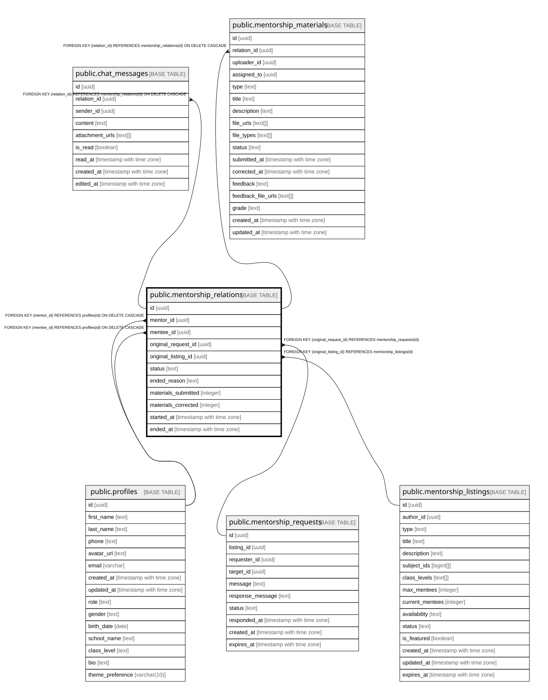

# public.mentorship_relations

## Columns

| Name | Type | Default | Nullable | Children | Parents | Comment |
| ---- | ---- | ------- | -------- | -------- | ------- | ------- |
| id | uuid | gen_random_uuid() | false | [public.chat_messages](public.chat_messages.md) [public.mentorship_materials](public.mentorship_materials.md) |  |  |
| mentor_id | uuid |  | false |  | [public.profiles](public.profiles.md) |  |
| mentee_id | uuid |  | false |  | [public.profiles](public.profiles.md) |  |
| original_request_id | uuid |  | true |  | [public.mentorship_requests](public.mentorship_requests.md) |  |
| original_listing_id | uuid |  | true |  | [public.mentorship_listings](public.mentorship_listings.md) |  |
| status | text | 'ACTIVE'::text | false |  |  |  |
| ended_reason | text |  | true |  |  |  |
| materials_submitted | integer | 0 | true |  |  |  |
| materials_corrected | integer | 0 | true |  |  |  |
| started_at | timestamp with time zone | now() | true |  |  |  |
| ended_at | timestamp with time zone |  | true |  |  |  |

## Constraints

| Name | Type | Definition |
| ---- | ---- | ---------- |
| mentorship_relations_status_check | CHECK | CHECK ((status = ANY (ARRAY['ACTIVE'::text, 'PAUSED'::text, 'ENDED'::text]))) |
| mentorship_relations_original_listing_id_fkey | FOREIGN KEY | FOREIGN KEY (original_listing_id) REFERENCES mentorship_listings(id) |
| mentorship_relations_mentor_id_mentee_id_key | UNIQUE | UNIQUE (mentor_id, mentee_id) |
| mentorship_relations_pkey | PRIMARY KEY | PRIMARY KEY (id) |
| mentorship_relations_original_request_id_fkey | FOREIGN KEY | FOREIGN KEY (original_request_id) REFERENCES mentorship_requests(id) |
| mentorship_relations_mentee_id_fkey | FOREIGN KEY | FOREIGN KEY (mentee_id) REFERENCES profiles(id) ON DELETE CASCADE |
| mentorship_relations_mentor_id_fkey | FOREIGN KEY | FOREIGN KEY (mentor_id) REFERENCES profiles(id) ON DELETE CASCADE |

## Indexes

| Name | Definition |
| ---- | ---------- |
| mentorship_relations_mentor_id_mentee_id_key | CREATE UNIQUE INDEX mentorship_relations_mentor_id_mentee_id_key ON public.mentorship_relations USING btree (mentor_id, mentee_id) |
| mentorship_relations_pkey | CREATE UNIQUE INDEX mentorship_relations_pkey ON public.mentorship_relations USING btree (id) |
| idx_relations_mentee | CREATE INDEX idx_relations_mentee ON public.mentorship_relations USING btree (mentee_id) |
| idx_relations_mentor | CREATE INDEX idx_relations_mentor ON public.mentorship_relations USING btree (mentor_id) |
| idx_relations_status | CREATE INDEX idx_relations_status ON public.mentorship_relations USING btree (status) |

## Relations

---

> Generated by [tbls](https://github.com/k1LoW/tbls)
