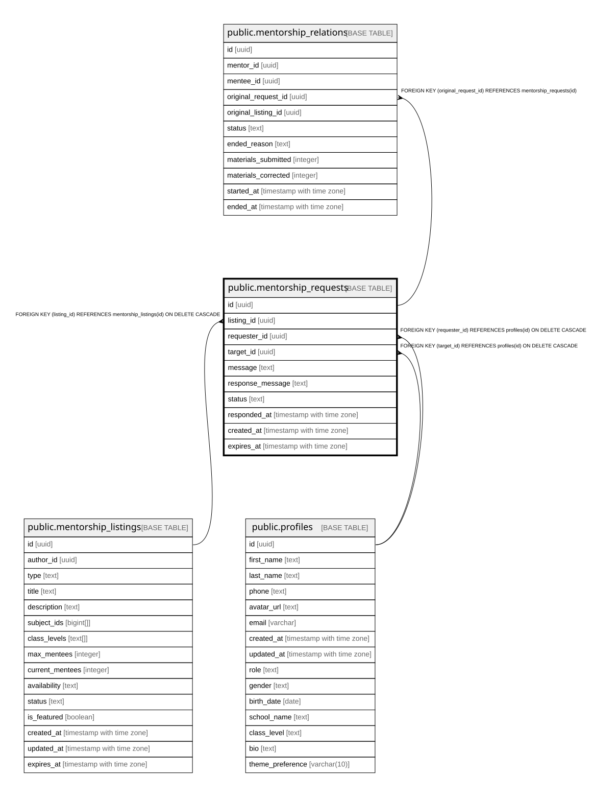

# public.mentorship_requests

## Columns

| Name | Type | Default | Nullable | Children | Parents | Comment |
| ---- | ---- | ------- | -------- | -------- | ------- | ------- |
| id | uuid | gen_random_uuid() | false | [public.mentorship_relations](public.mentorship_relations.md) |  |  |
| listing_id | uuid |  | false |  | [public.mentorship_listings](public.mentorship_listings.md) |  |
| requester_id | uuid |  | false |  | [public.profiles](public.profiles.md) |  |
| target_id | uuid |  | false |  | [public.profiles](public.profiles.md) |  |
| message | text |  | true |  |  |  |
| response_message | text |  | true |  |  |  |
| status | text | 'PENDING'::text | false |  |  |  |
| responded_at | timestamp with time zone |  | true |  |  |  |
| created_at | timestamp with time zone | now() | true |  |  |  |
| expires_at | timestamp with time zone | (now() + '7 days'::interval) | true |  |  |  |

## Constraints

| Name | Type | Definition |
| ---- | ---- | ---------- |
| mentorship_requests_status_check | CHECK | CHECK ((status = ANY (ARRAY['PENDING'::text, 'ACCEPTED'::text, 'REJECTED'::text, 'CANCELLED'::text, 'EXPIRED'::text]))) |
| mentorship_requests_listing_id_fkey | FOREIGN KEY | FOREIGN KEY (listing_id) REFERENCES mentorship_listings(id) ON DELETE CASCADE |
| mentorship_requests_listing_id_requester_id_key | UNIQUE | UNIQUE (listing_id, requester_id) |
| mentorship_requests_pkey | PRIMARY KEY | PRIMARY KEY (id) |
| mentorship_requests_requester_id_fkey | FOREIGN KEY | FOREIGN KEY (requester_id) REFERENCES profiles(id) ON DELETE CASCADE |
| mentorship_requests_target_id_fkey | FOREIGN KEY | FOREIGN KEY (target_id) REFERENCES profiles(id) ON DELETE CASCADE |

## Indexes

| Name | Definition |
| ---- | ---------- |
| mentorship_requests_listing_id_requester_id_key | CREATE UNIQUE INDEX mentorship_requests_listing_id_requester_id_key ON public.mentorship_requests USING btree (listing_id, requester_id) |
| mentorship_requests_pkey | CREATE UNIQUE INDEX mentorship_requests_pkey ON public.mentorship_requests USING btree (id) |
| idx_requests_listing | CREATE INDEX idx_requests_listing ON public.mentorship_requests USING btree (listing_id) |
| idx_requests_requester | CREATE INDEX idx_requests_requester ON public.mentorship_requests USING btree (requester_id) |
| idx_requests_status | CREATE INDEX idx_requests_status ON public.mentorship_requests USING btree (status) |
| idx_requests_target | CREATE INDEX idx_requests_target ON public.mentorship_requests USING btree (target_id) |

## Relations

---

> Generated by [tbls](https://github.com/k1LoW/tbls)
