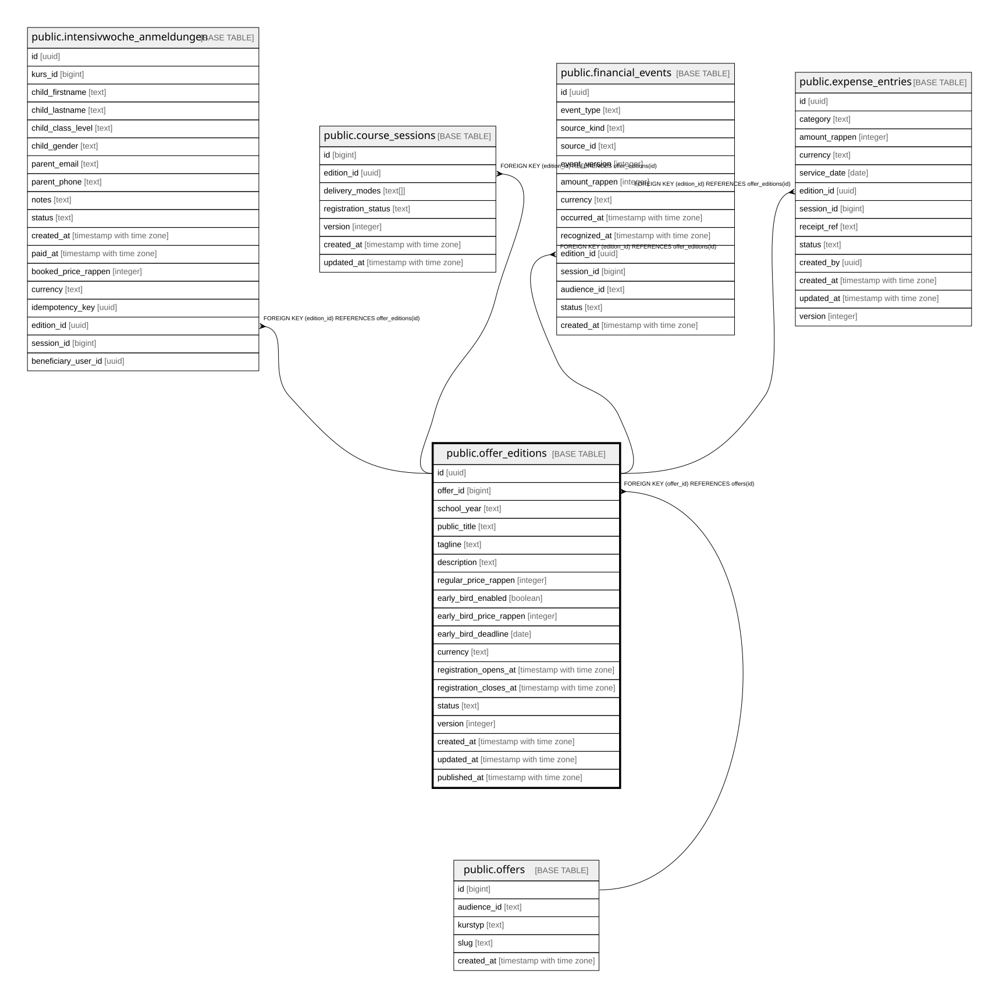

# public.offer_editions

## Description

Jaehrliche Durchfuehrung eines Offers (Abschnitt 2.12): Preise, Texte, Fruehbucher-Konfiguration, Optimistic-Concurrency-Version, Status. Oeffentlich nur wenn status=published, sonst nur fuer lehrperson/admin (is_content_manager()). Schreibzugriff nur ueber service_role bis die Admin-Maske existiert.

## Columns

| Name | Type | Default | Nullable | Children | Parents | Comment |
| ---- | ---- | ------- | -------- | -------- | ------- | ------- |
| id | uuid | gen_random_uuid() | false | [public.intensivwoche_anmeldungen](public.intensivwoche_anmeldungen.md) [public.course_sessions](public.course_sessions.md) [public.financial_events](public.financial_events.md) [public.expense_entries](public.expense_entries.md) |  |  |
| offer_id | bigint |  | false |  | [public.offers](public.offers.md) |  |
| school_year | text |  | false |  |  |  |
| public_title | text |  | false |  |  |  |
| tagline | text |  | false |  |  |  |
| description | text |  | false |  |  |  |
| regular_price_rappen | integer |  | false |  |  |  |
| early_bird_enabled | boolean | true | false |  |  |  |
| early_bird_price_rappen | integer |  | true |  |  |  |
| early_bird_deadline | date |  | true |  |  |  |
| currency | text | 'CHF'::text | false |  |  |  |
| registration_opens_at | timestamp with time zone |  | true |  |  |  |
| registration_closes_at | timestamp with time zone |  | true |  |  |  |
| status | text | 'draft'::text | false |  |  |  |
| version | integer | 1 | false |  |  |  |
| created_at | timestamp with time zone | now() | false |  |  |  |
| updated_at | timestamp with time zone | now() | false |  |  |  |
| published_at | timestamp with time zone |  | true |  |  |  |

## Constraints

| Name | Type | Definition |
| ---- | ---- | ---------- |
| offer_editions_early_bird_consistency | CHECK | CHECK ((((early_bird_enabled = false) AND (early_bird_price_rappen IS NULL) AND (early_bird_deadline IS NULL)) OR ((early_bird_enabled = true) AND (early_bird_price_rappen IS NOT NULL) AND (early_bird_deadline IS NOT NULL) AND (early_bird_price_rappen < regular_price_rappen)))) |
| offer_editions_regular_price_rappen_check | CHECK | CHECK ((regular_price_rappen >= 0)) |
| offer_editions_status_check | CHECK | CHECK ((status = ANY (ARRAY['draft'::text, 'published'::text, 'archived'::text]))) |
| offer_editions_offer_id_fkey | FOREIGN KEY | FOREIGN KEY (offer_id) REFERENCES offers(id) |
| offer_editions_pkey | PRIMARY KEY | PRIMARY KEY (id) |
| offer_editions_offer_id_school_year_key | UNIQUE | UNIQUE (offer_id, school_year) |

## Indexes

| Name | Definition |
| ---- | ---------- |
| offer_editions_pkey | CREATE UNIQUE INDEX offer_editions_pkey ON public.offer_editions USING btree (id) |
| offer_editions_offer_id_school_year_key | CREATE UNIQUE INDEX offer_editions_offer_id_school_year_key ON public.offer_editions USING btree (offer_id, school_year) |
| idx_offer_editions_offer_id | CREATE INDEX idx_offer_editions_offer_id ON public.offer_editions USING btree (offer_id) |

## Triggers

| Name | Definition |
| ---- | ---------- |
| offer_editions_bump_version | CREATE TRIGGER offer_editions_bump_version BEFORE UPDATE ON public.offer_editions FOR EACH ROW EXECUTE FUNCTION bump_version_and_updated_at() |

## Relations

---

> Generated by [tbls](https://github.com/k1LoW/tbls)
