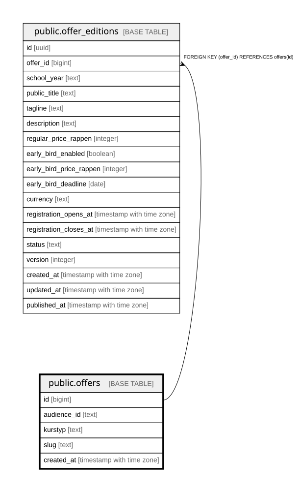

# public.offers

## Description

Stabiler fachlicher Schluessel je Angebot (Abschnitt 2.12): (audience_id, kurstyp, slug). Oeffentlich lesbar, Schreibzugriff nur ueber service_role bis die Admin-Maske existiert.

## Columns

| Name | Type | Default | Nullable | Children | Parents | Comment |
| ---- | ---- | ------- | -------- | -------- | ------- | ------- |
| id | bigint |  | false | [public.offer_editions](public.offer_editions.md) |  |  |
| audience_id | text |  | false |  |  |  |
| kurstyp | text |  | false |  |  |  |
| slug | text |  | false |  |  |  |
| created_at | timestamp with time zone | now() | false |  |  |  |

## Constraints

| Name | Type | Definition |
| ---- | ---- | ---------- |
| offers_kurstyp_check | CHECK | CHECK ((kurstyp = ANY (ARRAY['halbjahreskurs'::text, 'intensivkurs'::text, 'pruefungssimulation'::text, 'selbststudium'::text]))) |
| offers_pkey | PRIMARY KEY | PRIMARY KEY (id) |
| offers_audience_id_kurstyp_slug_key | UNIQUE | UNIQUE (audience_id, kurstyp, slug) |

## Indexes

| Name | Definition |
| ---- | ---------- |
| offers_pkey | CREATE UNIQUE INDEX offers_pkey ON public.offers USING btree (id) |
| offers_audience_id_kurstyp_slug_key | CREATE UNIQUE INDEX offers_audience_id_kurstyp_slug_key ON public.offers USING btree (audience_id, kurstyp, slug) |

## Relations

---

> Generated by [tbls](https://github.com/k1LoW/tbls)
