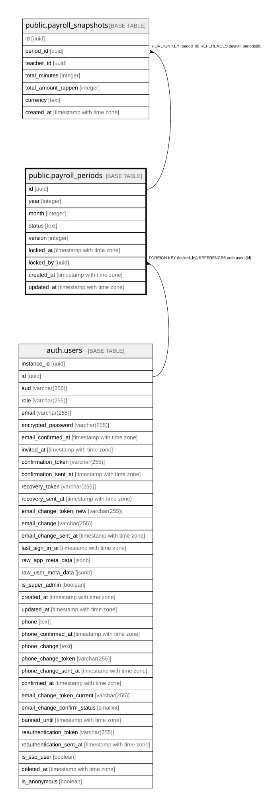

# public.payroll_periods

## Description

Monatlicher Lohnperioden-Status (Schritt 10c). Admin-only in jeder Hinsicht.

## Columns

| Name | Type | Default | Nullable | Children | Parents | Comment |
| ---- | ---- | ------- | -------- | -------- | ------- | ------- |
| id | uuid | gen_random_uuid() | false | [public.payroll_snapshots](public.payroll_snapshots.md) |  |  |
| year | integer |  | false |  |  |  |
| month | integer |  | false |  |  |  |
| status | text | 'open'::text | false |  |  |  |
| version | integer | 1 | false |  |  |  |
| locked_at | timestamp with time zone |  | true |  |  |  |
| locked_by | uuid |  | true |  | [auth.users](auth.users.md) |  |
| created_at | timestamp with time zone | now() | false |  |  |  |
| updated_at | timestamp with time zone | now() | false |  |  |  |

## Constraints

| Name | Type | Definition |
| ---- | ---- | ---------- |
| payroll_periods_month_check | CHECK | CHECK (((month >= 1) AND (month <= 12))) |
| payroll_periods_status_check | CHECK | CHECK ((status = ANY (ARRAY['open'::text, 'review'::text, 'locked'::text]))) |
| payroll_periods_year_check | CHECK | CHECK (((year >= 2020) AND (year <= 2100))) |
| payroll_periods_locked_by_fkey | FOREIGN KEY | FOREIGN KEY (locked_by) REFERENCES auth.users(id) |
| payroll_periods_pkey | PRIMARY KEY | PRIMARY KEY (id) |
| payroll_periods_year_month_key | UNIQUE | UNIQUE (year, month) |

## Indexes

| Name | Definition |
| ---- | ---------- |
| payroll_periods_pkey | CREATE UNIQUE INDEX payroll_periods_pkey ON public.payroll_periods USING btree (id) |
| payroll_periods_year_month_key | CREATE UNIQUE INDEX payroll_periods_year_month_key ON public.payroll_periods USING btree (year, month) |

## Triggers

| Name | Definition |
| ---- | ---------- |
| payroll_periods_bump_version | CREATE TRIGGER payroll_periods_bump_version BEFORE UPDATE ON public.payroll_periods FOR EACH ROW EXECUTE FUNCTION bump_version_and_updated_at() |

## Relations

---

> Generated by [tbls](https://github.com/k1LoW/tbls)
