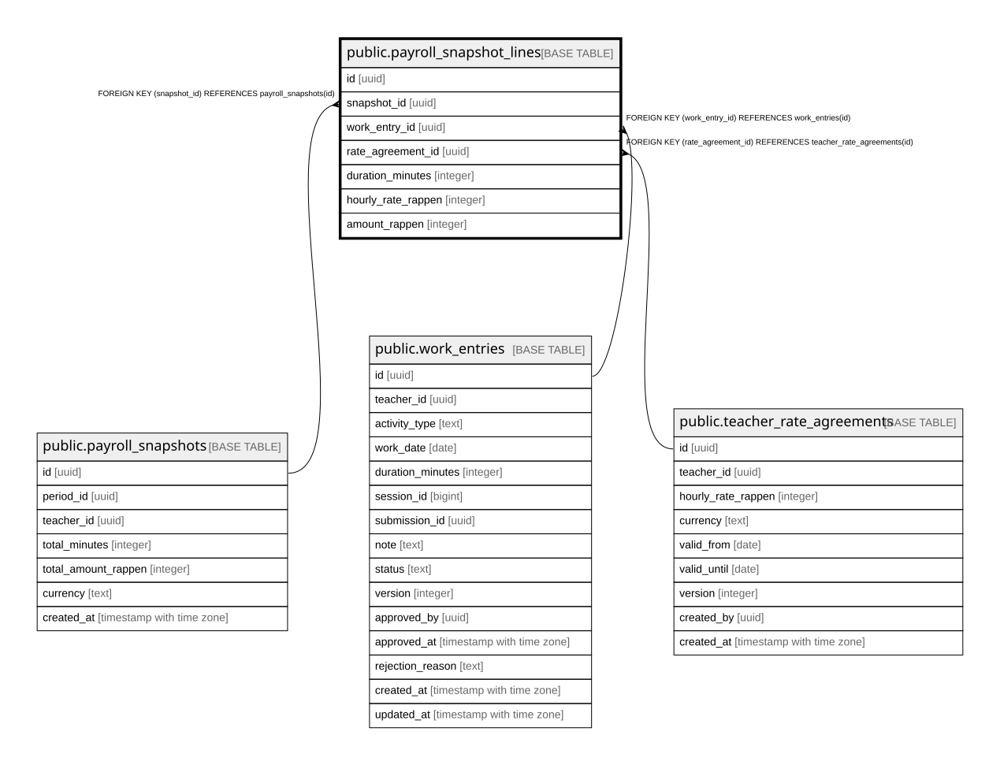

# public.payroll_snapshot_lines

## Description

Unveraenderliche Einzelzeilen eines Payroll-Snapshots (Schritt 10c) -- ein work_entry kann per UNIQUE(work_entry_id) nur in genau einem Snapshot verrechnet werden.

## Columns

| Name | Type | Default | Nullable | Children | Parents | Comment |
| ---- | ---- | ------- | -------- | -------- | ------- | ------- |
| id | uuid | gen_random_uuid() | false |  |  |  |
| snapshot_id | uuid |  | false |  | [public.payroll_snapshots](public.payroll_snapshots.md) |  |
| work_entry_id | uuid |  | false |  | [public.work_entries](public.work_entries.md) |  |
| rate_agreement_id | uuid |  | false |  | [public.teacher_rate_agreements](public.teacher_rate_agreements.md) |  |
| duration_minutes | integer |  | false |  |  |  |
| hourly_rate_rappen | integer |  | false |  |  |  |
| amount_rappen | integer |  | false |  |  |  |

## Constraints

| Name | Type | Definition |
| ---- | ---- | ---------- |
| payroll_snapshot_lines_amount_rappen_check | CHECK | CHECK ((amount_rappen >= 0)) |
| payroll_snapshot_lines_duration_minutes_check | CHECK | CHECK ((duration_minutes > 0)) |
| payroll_snapshot_lines_hourly_rate_rappen_check | CHECK | CHECK ((hourly_rate_rappen > 0)) |
| payroll_snapshot_lines_work_entry_id_fkey | FOREIGN KEY | FOREIGN KEY (work_entry_id) REFERENCES work_entries(id) |
| payroll_snapshot_lines_rate_agreement_id_fkey | FOREIGN KEY | FOREIGN KEY (rate_agreement_id) REFERENCES teacher_rate_agreements(id) |
| payroll_snapshot_lines_snapshot_id_fkey | FOREIGN KEY | FOREIGN KEY (snapshot_id) REFERENCES payroll_snapshots(id) |
| payroll_snapshot_lines_pkey | PRIMARY KEY | PRIMARY KEY (id) |
| payroll_snapshot_lines_work_entry_id_key | UNIQUE | UNIQUE (work_entry_id) |

## Indexes

| Name | Definition |
| ---- | ---------- |
| payroll_snapshot_lines_pkey | CREATE UNIQUE INDEX payroll_snapshot_lines_pkey ON public.payroll_snapshot_lines USING btree (id) |
| payroll_snapshot_lines_work_entry_id_key | CREATE UNIQUE INDEX payroll_snapshot_lines_work_entry_id_key ON public.payroll_snapshot_lines USING btree (work_entry_id) |
| idx_payroll_snapshot_lines_snapshot_id | CREATE INDEX idx_payroll_snapshot_lines_snapshot_id ON public.payroll_snapshot_lines USING btree (snapshot_id) |

## Relations

---

> Generated by [tbls](https://github.com/k1LoW/tbls)
