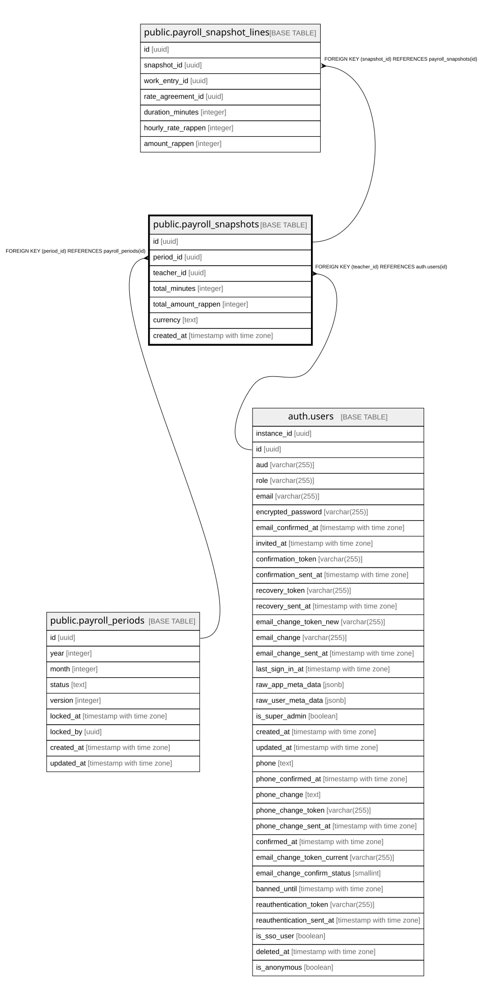

# public.payroll_snapshots

## Description

Unveraenderliches Ergebnis eines Monatsabschlusses je Lehrperson (Schritt 10c). Wird ausschliesslich durch admin_close_payroll_period() befuellt.

## Columns

| Name | Type | Default | Nullable | Children | Parents | Comment |
| ---- | ---- | ------- | -------- | -------- | ------- | ------- |
| id | uuid | gen_random_uuid() | false | [public.payroll_snapshot_lines](public.payroll_snapshot_lines.md) |  |  |
| period_id | uuid |  | false |  | [public.payroll_periods](public.payroll_periods.md) |  |
| teacher_id | uuid |  | false |  | [auth.users](auth.users.md) |  |
| total_minutes | integer |  | false |  |  |  |
| total_amount_rappen | integer |  | false |  |  |  |
| currency | text | 'CHF'::text | false |  |  |  |
| created_at | timestamp with time zone | now() | false |  |  |  |

## Constraints

| Name | Type | Definition |
| ---- | ---- | ---------- |
| payroll_snapshots_total_amount_rappen_check | CHECK | CHECK ((total_amount_rappen >= 0)) |
| payroll_snapshots_total_minutes_check | CHECK | CHECK ((total_minutes >= 0)) |
| payroll_snapshots_teacher_id_fkey | FOREIGN KEY | FOREIGN KEY (teacher_id) REFERENCES auth.users(id) |
| payroll_snapshots_period_id_fkey | FOREIGN KEY | FOREIGN KEY (period_id) REFERENCES payroll_periods(id) |
| payroll_snapshots_pkey | PRIMARY KEY | PRIMARY KEY (id) |
| payroll_snapshots_period_id_teacher_id_key | UNIQUE | UNIQUE (period_id, teacher_id) |

## Indexes

| Name | Definition |
| ---- | ---------- |
| payroll_snapshots_pkey | CREATE UNIQUE INDEX payroll_snapshots_pkey ON public.payroll_snapshots USING btree (id) |
| payroll_snapshots_period_id_teacher_id_key | CREATE UNIQUE INDEX payroll_snapshots_period_id_teacher_id_key ON public.payroll_snapshots USING btree (period_id, teacher_id) |
| idx_payroll_snapshots_period_id | CREATE INDEX idx_payroll_snapshots_period_id ON public.payroll_snapshots USING btree (period_id) |

## Relations

---

> Generated by [tbls](https://github.com/k1LoW/tbls)
