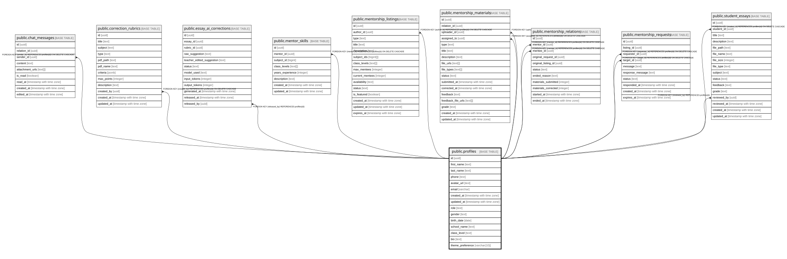

# public.profiles

## Columns

| Name | Type | Default | Nullable | Children | Parents | Comment |
| ---- | ---- | ------- | -------- | -------- | ------- | ------- |
| id | uuid |  | false | [public.chat_messages](public.chat_messages.md) [public.correction_rubrics](public.correction_rubrics.md) [public.essay_ai_corrections](public.essay_ai_corrections.md) [public.mentor_skills](public.mentor_skills.md) [public.mentorship_listings](public.mentorship_listings.md) [public.mentorship_materials](public.mentorship_materials.md) [public.mentorship_relations](public.mentorship_relations.md) [public.mentorship_requests](public.mentorship_requests.md) [public.student_essays](public.student_essays.md) |  |  |
| first_name | text |  | true |  |  |  |
| last_name | text |  | true |  |  |  |
| phone | text |  | true |  |  |  |
| avatar_url | text |  | true |  |  |  |
| email | varchar |  | true |  |  |  |
| created_at | timestamp with time zone | now() | true |  |  |  |
| updated_at | timestamp with time zone | now() | true |  |  |  |
| role | text | 'user'::text | true |  |  | User role for RBAC: user, admin, moderator |
| gender | text |  | true |  |  | Geschlecht: male, female, other, prefer_not_to_say |
| birth_date | date |  | true |  |  | Geburtsdatum für Altersberechnung |
| school_name | text |  | true |  |  | Name der Schule |
| class_level | text |  | true |  |  | Klassenstufe (z.B. 6. Klasse) |
| bio | text |  | true |  |  | Kurze Beschreibung/Bio |
| theme_preference | varchar(10) | 'light'::character varying | true |  |  | User theme preference: light, dark, or system |

## Constraints

| Name | Type | Definition |
| ---- | ---- | ---------- |
| profiles_gender_check | CHECK | CHECK ((gender = ANY (ARRAY['male'::text, 'female'::text, 'other'::text, 'prefer_not_to_say'::text]))) |
| profiles_role_check | CHECK | CHECK ((role = ANY (ARRAY['user'::text, 'lehrperson'::text, 'admin'::text]))) |
| profiles_theme_preference_check | CHECK | CHECK (((theme_preference)::text = ANY (ARRAY[('light'::character varying)::text, ('dark'::character varying)::text, ('system'::character varying)::text]))) |
| profiles_pkey | PRIMARY KEY | PRIMARY KEY (id) |

## Indexes

| Name | Definition |
| ---- | ---------- |
| profiles_pkey | CREATE UNIQUE INDEX profiles_pkey ON public.profiles USING btree (id) |

## Relations

---

> Generated by [tbls](https://github.com/k1LoW/tbls)
