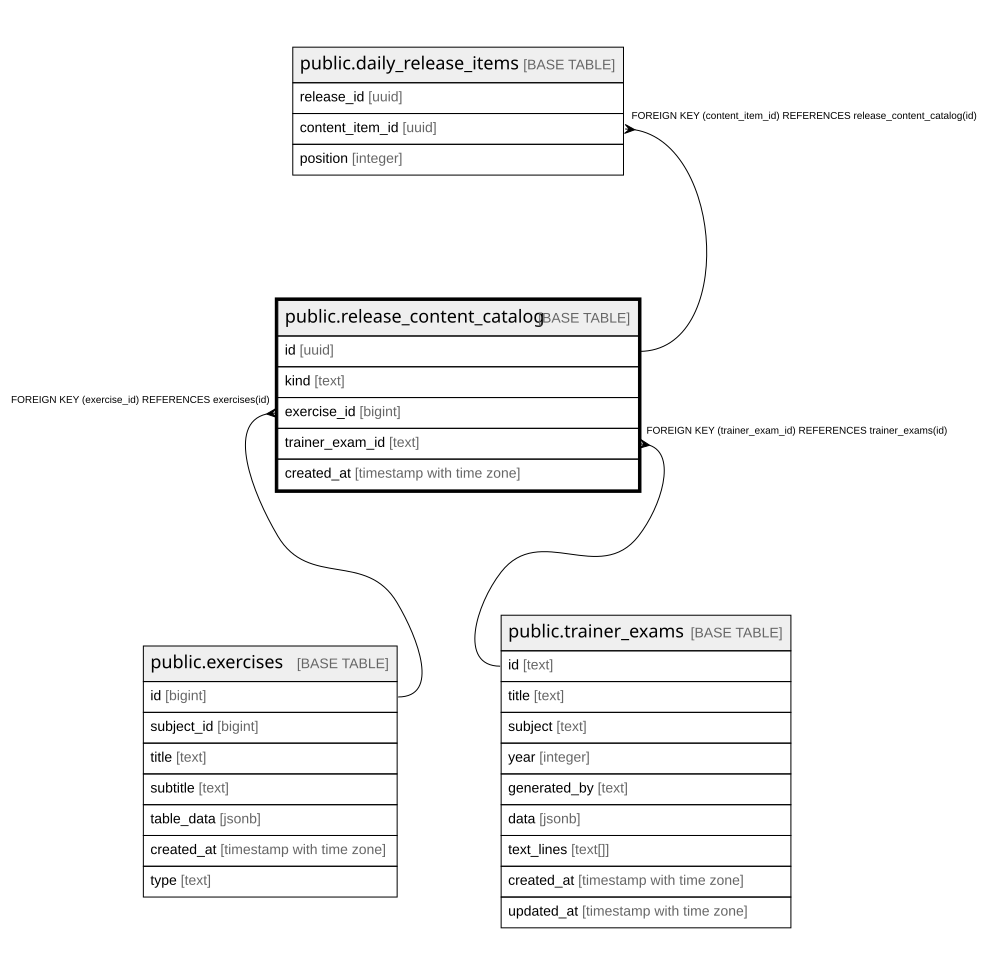

# public.release_content_catalog

## Description

Referenzierbare Teilmenge aus exercises/trainer_exams fuer Tagesfreigaben (Schritt 10b). Kein Materialduplikat -- nur echte FKs mit XOR-CHECK.

## Columns

| Name | Type | Default | Nullable | Children | Parents | Comment |
| ---- | ---- | ------- | -------- | -------- | ------- | ------- |
| id | uuid | gen_random_uuid() | false | [public.daily_release_items](public.daily_release_items.md) |  |  |
| kind | text |  | false |  |  |  |
| exercise_id | bigint |  | true |  | [public.exercises](public.exercises.md) |  |
| trainer_exam_id | text |  | true |  | [public.trainer_exams](public.trainer_exams.md) |  |
| created_at | timestamp with time zone | now() | false |  |  |  |

## Constraints

| Name | Type | Definition |
| ---- | ---- | ---------- |
| release_content_catalog_kind_check | CHECK | CHECK ((kind = ANY (ARRAY['exercise'::text, 'trainer_exam'::text]))) |
| release_content_catalog_source_xor | CHECK | CHECK ((((kind = 'exercise'::text) AND (exercise_id IS NOT NULL) AND (trainer_exam_id IS NULL)) OR ((kind = 'trainer_exam'::text) AND (trainer_exam_id IS NOT NULL) AND (exercise_id IS NULL)))) |
| release_content_catalog_exercise_id_fkey | FOREIGN KEY | FOREIGN KEY (exercise_id) REFERENCES exercises(id) |
| release_content_catalog_trainer_exam_id_fkey | FOREIGN KEY | FOREIGN KEY (trainer_exam_id) REFERENCES trainer_exams(id) |
| release_content_catalog_pkey | PRIMARY KEY | PRIMARY KEY (id) |
| release_content_catalog_exercise_id_key | UNIQUE | UNIQUE (exercise_id) |
| release_content_catalog_trainer_exam_id_key | UNIQUE | UNIQUE (trainer_exam_id) |

## Indexes

| Name | Definition |
| ---- | ---------- |
| release_content_catalog_pkey | CREATE UNIQUE INDEX release_content_catalog_pkey ON public.release_content_catalog USING btree (id) |
| release_content_catalog_exercise_id_key | CREATE UNIQUE INDEX release_content_catalog_exercise_id_key ON public.release_content_catalog USING btree (exercise_id) |
| release_content_catalog_trainer_exam_id_key | CREATE UNIQUE INDEX release_content_catalog_trainer_exam_id_key ON public.release_content_catalog USING btree (trainer_exam_id) |

## Relations

---

> Generated by [tbls](https://github.com/k1LoW/tbls)
