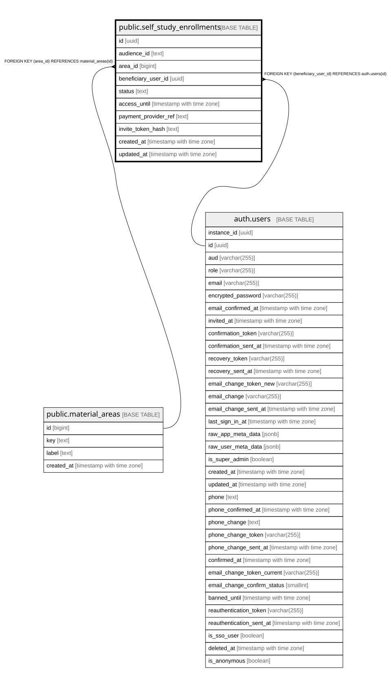

# public.self_study_enrollments

## Description

Fachliche Selbststudium-Einschreibung (Abschnitt 2.11). Kein Klartext-Einladungstoken (nur invite_token_hash). Erzeugung/Aenderung ausschliesslich ueber service_role bis der Zahlungs-/Admin-Flow gebaut ist -- kein INSERT/UPDATE-Grant fuer anon/authenticated in dieser Runde.

## Columns

| Name | Type | Default | Nullable | Children | Parents | Comment |
| ---- | ---- | ------- | -------- | -------- | ------- | ------- |
| id | uuid | gen_random_uuid() | false |  |  |  |
| audience_id | text |  | false |  |  |  |
| area_id | bigint |  | false |  | [public.material_areas](public.material_areas.md) |  |
| beneficiary_user_id | uuid |  | true |  | [auth.users](auth.users.md) |  |
| status | text | 'pending'::text | false |  |  |  |
| access_until | timestamp with time zone |  | true |  |  |  |
| payment_provider_ref | text |  | true |  |  |  |
| invite_token_hash | text |  | true |  |  |  |
| created_at | timestamp with time zone | now() | false |  |  |  |
| updated_at | timestamp with time zone | now() | false |  |  |  |

## Constraints

| Name | Type | Definition |
| ---- | ---- | ---------- |
| self_study_enrollments_status_check | CHECK | CHECK ((status = ANY (ARRAY['pending'::text, 'paid'::text, 'cancelled'::text, 'refunded'::text]))) |
| self_study_enrollments_beneficiary_user_id_fkey | FOREIGN KEY | FOREIGN KEY (beneficiary_user_id) REFERENCES auth.users(id) |
| self_study_enrollments_area_id_fkey | FOREIGN KEY | FOREIGN KEY (area_id) REFERENCES material_areas(id) |
| self_study_enrollments_pkey | PRIMARY KEY | PRIMARY KEY (id) |

## Indexes

| Name | Definition |
| ---- | ---------- |
| self_study_enrollments_pkey | CREATE UNIQUE INDEX self_study_enrollments_pkey ON public.self_study_enrollments USING btree (id) |
| idx_self_study_enrollments_beneficiary | CREATE INDEX idx_self_study_enrollments_beneficiary ON public.self_study_enrollments USING btree (beneficiary_user_id) |

## Relations

---

> Generated by [tbls](https://github.com/k1LoW/tbls)
