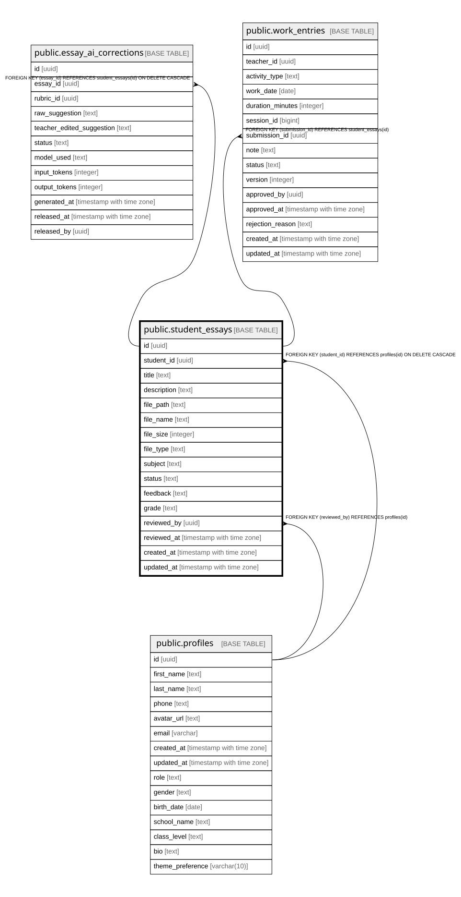

# public.student_essays

## Columns

| Name | Type | Default | Nullable | Children | Parents | Comment |
| ---- | ---- | ------- | -------- | -------- | ------- | ------- |
| id | uuid | gen_random_uuid() | false | [public.essay_ai_corrections](public.essay_ai_corrections.md) [public.work_entries](public.work_entries.md) |  |  |
| student_id | uuid |  | false |  | [public.profiles](public.profiles.md) |  |
| title | text |  | false |  |  |  |
| description | text |  | true |  |  |  |
| file_path | text |  | false |  |  |  |
| file_name | text |  | false |  |  |  |
| file_size | integer |  | false |  |  |  |
| file_type | text |  | false |  |  |  |
| subject | text |  | false |  |  |  |
| status | text | 'draft'::text | true |  |  |  |
| feedback | text |  | true |  |  |  |
| grade | text |  | true |  |  |  |
| reviewed_by | uuid |  | true |  | [public.profiles](public.profiles.md) |  |
| reviewed_at | timestamp with time zone |  | true |  |  |  |
| created_at | timestamp with time zone | now() | true |  |  |  |
| updated_at | timestamp with time zone | now() | true |  |  |  |

## Constraints

| Name | Type | Definition |
| ---- | ---- | ---------- |
| student_essays_file_size_check | CHECK | CHECK ((file_size <= 10485760)) |
| student_essays_file_type_check | CHECK | CHECK ((file_type = ANY (ARRAY['application/pdf'::text, 'application/msword'::text, 'application/vnd.openxmlformats-officedocument.wordprocessingml.document'::text]))) |
| student_essays_status_check | CHECK | CHECK ((status = ANY (ARRAY['draft'::text, 'submitted'::text, 'in_korrektur'::text, 'reviewed'::text, 'returned'::text]))) |
| student_essays_reviewed_by_fkey | FOREIGN KEY | FOREIGN KEY (reviewed_by) REFERENCES profiles(id) |
| student_essays_student_id_fkey | FOREIGN KEY | FOREIGN KEY (student_id) REFERENCES profiles(id) ON DELETE CASCADE |
| student_essays_pkey | PRIMARY KEY | PRIMARY KEY (id) |

## Indexes

| Name | Definition |
| ---- | ---------- |
| student_essays_pkey | CREATE UNIQUE INDEX student_essays_pkey ON public.student_essays USING btree (id) |
| idx_student_essays_status | CREATE INDEX idx_student_essays_status ON public.student_essays USING btree (status) |
| idx_student_essays_student_id | CREATE INDEX idx_student_essays_student_id ON public.student_essays USING btree (student_id) |
| idx_student_essays_subject | CREATE INDEX idx_student_essays_subject ON public.student_essays USING btree (subject) |

## Triggers

| Name | Definition |
| ---- | ---------- |
| student_essays_review_timestamp | CREATE TRIGGER student_essays_review_timestamp BEFORE UPDATE ON public.student_essays FOR EACH ROW EXECUTE FUNCTION set_essay_review_timestamp() |
| student_essays_updated_at | CREATE TRIGGER student_essays_updated_at BEFORE UPDATE ON public.student_essays FOR EACH ROW EXECUTE FUNCTION update_student_essays_updated_at() |

## Relations

---

> Generated by [tbls](https://github.com/k1LoW/tbls)
