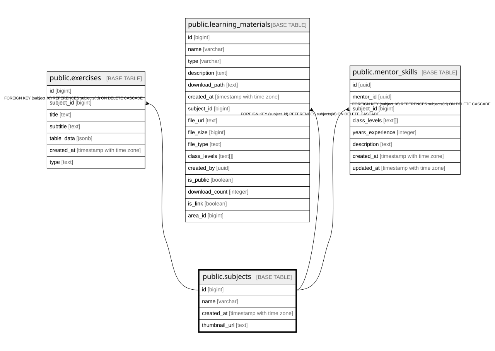

# public.subjects

## Columns

| Name | Type | Default | Nullable | Children | Parents | Comment |
| ---- | ---- | ------- | -------- | -------- | ------- | ------- |
| id | bigint |  | false | [public.exercises](public.exercises.md) [public.learning_materials](public.learning_materials.md) [public.mentor_skills](public.mentor_skills.md) |  |  |
| name | varchar |  | true |  |  |  |
| created_at | timestamp with time zone | now() | false |  |  |  |
| thumbnail_url | text |  | true |  |  |  |

## Constraints

| Name | Type | Definition |
| ---- | ---- | ---------- |
| subject_pkey | PRIMARY KEY | PRIMARY KEY (id) |

## Indexes

| Name | Definition |
| ---- | ---------- |
| subject_pkey | CREATE UNIQUE INDEX subject_pkey ON public.subjects USING btree (id) |

## Relations

---

> Generated by [tbls](https://github.com/k1LoW/tbls)
