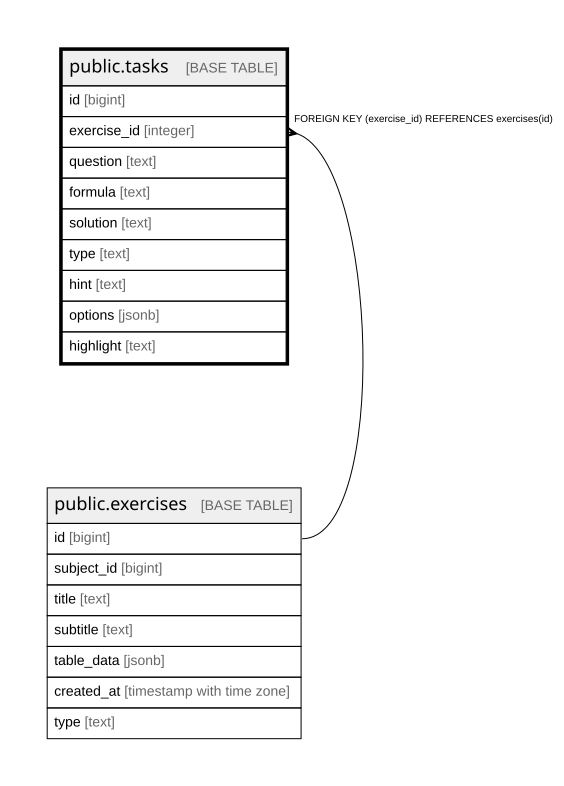

# public.tasks

## Columns

| Name | Type | Default | Nullable | Children | Parents | Comment |
| ---- | ---- | ------- | -------- | -------- | ------- | ------- |
| id | bigint |  | false |  |  |  |
| exercise_id | integer |  | false |  | [public.exercises](public.exercises.md) |  |
| question | text |  | false |  |  |  |
| formula | text |  | true |  |  |  |
| solution | text |  | false |  |  |  |
| type | text |  | true |  |  |  |
| hint | text |  | true |  |  |  |
| options | jsonb |  | true |  |  |  |
| highlight | text |  | true |  |  |  |

## Constraints

| Name | Type | Definition |
| ---- | ---- | ---------- |
| tasks_exercise_id_fkey | FOREIGN KEY | FOREIGN KEY (exercise_id) REFERENCES exercises(id) |
| tasks_pkey | PRIMARY KEY | PRIMARY KEY (id) |

## Indexes

| Name | Definition |
| ---- | ---------- |
| tasks_pkey | CREATE UNIQUE INDEX tasks_pkey ON public.tasks USING btree (id) |

## Relations

---

> Generated by [tbls](https://github.com/k1LoW/tbls)
