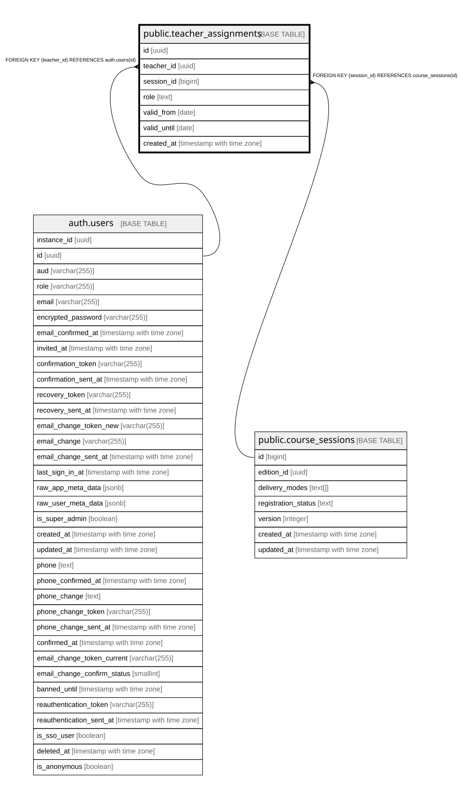

# public.teacher_assignments

## Description

Zuteilung Lehrperson <-> course_session (Schritt 10c). Admin-Vollzugriff; Lehrpersonen sehen nur eigene Zuteilungen (fuer die Kurszeit-Vorauswahl in TeacherWorkEntryForm).

## Columns

| Name | Type | Default | Nullable | Children | Parents | Comment |
| ---- | ---- | ------- | -------- | -------- | ------- | ------- |
| id | uuid | gen_random_uuid() | false |  |  |  |
| teacher_id | uuid |  | false |  | [auth.users](auth.users.md) |  |
| session_id | bigint |  | false |  | [public.course_sessions](public.course_sessions.md) |  |
| role | text |  | false |  |  |  |
| valid_from | date | CURRENT_DATE | false |  |  |  |
| valid_until | date |  | true |  |  |  |
| created_at | timestamp with time zone | now() | false |  |  |  |

## Constraints

| Name | Type | Definition |
| ---- | ---- | ---------- |
| teacher_assignments_date_order | CHECK | CHECK (((valid_until IS NULL) OR (valid_until >= valid_from))) |
| teacher_assignments_role_check | CHECK | CHECK ((role = ANY (ARRAY['lead'::text, 'assistant'::text, 'exam_supervisor'::text]))) |
| teacher_assignments_teacher_id_fkey | FOREIGN KEY | FOREIGN KEY (teacher_id) REFERENCES auth.users(id) |
| teacher_assignments_session_id_fkey | FOREIGN KEY | FOREIGN KEY (session_id) REFERENCES course_sessions(id) |
| teacher_assignments_pkey | PRIMARY KEY | PRIMARY KEY (id) |
| teacher_assignments_teacher_id_session_id_role_key | UNIQUE | UNIQUE (teacher_id, session_id, role) |

## Indexes

| Name | Definition |
| ---- | ---------- |
| teacher_assignments_pkey | CREATE UNIQUE INDEX teacher_assignments_pkey ON public.teacher_assignments USING btree (id) |
| teacher_assignments_teacher_id_session_id_role_key | CREATE UNIQUE INDEX teacher_assignments_teacher_id_session_id_role_key ON public.teacher_assignments USING btree (teacher_id, session_id, role) |
| idx_teacher_assignments_teacher_id | CREATE INDEX idx_teacher_assignments_teacher_id ON public.teacher_assignments USING btree (teacher_id) |
| idx_teacher_assignments_session_id | CREATE INDEX idx_teacher_assignments_session_id ON public.teacher_assignments USING btree (session_id) |

## Relations

---

> Generated by [tbls](https://github.com/k1LoW/tbls)
