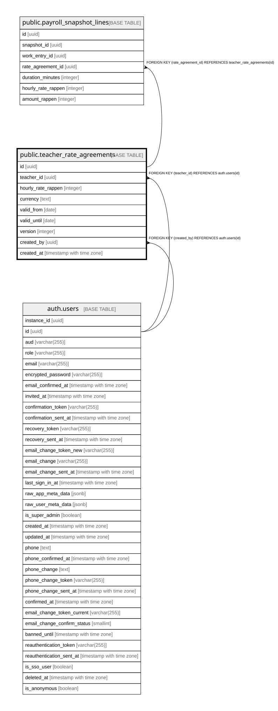

# public.teacher_rate_agreements

## Description

Zeitlich gueltiger, admin-vereinbarter Stundensatz je Lehrperson (Schritt 10c). Nur Admins schreiben; eine neue Vereinbarung ueberschreibt keine fruehere (Abschnitt 2.14), die EXCLUDE-Constraint verhindert ueberlappende Gueltigkeitszeitraeume.

## Columns

| Name | Type | Default | Nullable | Children | Parents | Comment |
| ---- | ---- | ------- | -------- | -------- | ------- | ------- |
| id | uuid | gen_random_uuid() | false | [public.payroll_snapshot_lines](public.payroll_snapshot_lines.md) |  |  |
| teacher_id | uuid |  | false |  | [auth.users](auth.users.md) |  |
| hourly_rate_rappen | integer |  | false |  |  |  |
| currency | text | 'CHF'::text | false |  |  |  |
| valid_from | date |  | false |  |  |  |
| valid_until | date |  | true |  |  |  |
| version | integer | 1 | false |  |  |  |
| created_by | uuid |  | false |  | [auth.users](auth.users.md) |  |
| created_at | timestamp with time zone | now() | false |  |  |  |

## Constraints

| Name | Type | Definition |
| ---- | ---- | ---------- |
| teacher_rate_agreements_date_order | CHECK | CHECK (((valid_until IS NULL) OR (valid_until >= valid_from))) |
| teacher_rate_agreements_hourly_rate_rappen_check | CHECK | CHECK ((hourly_rate_rappen > 0)) |
| teacher_rate_agreements_created_by_fkey | FOREIGN KEY | FOREIGN KEY (created_by) REFERENCES auth.users(id) |
| teacher_rate_agreements_teacher_id_fkey | FOREIGN KEY | FOREIGN KEY (teacher_id) REFERENCES auth.users(id) |
| teacher_rate_agreements_pkey | PRIMARY KEY | PRIMARY KEY (id) |
| teacher_rate_agreements_teacher_id_daterange_excl | x | EXCLUDE USING gist (teacher_id WITH =, daterange(valid_from, COALESCE(valid_until, 'infinity'::date), '[]'::text) WITH &&) |

## Indexes

| Name | Definition |
| ---- | ---------- |
| teacher_rate_agreements_pkey | CREATE UNIQUE INDEX teacher_rate_agreements_pkey ON public.teacher_rate_agreements USING btree (id) |
| teacher_rate_agreements_teacher_id_daterange_excl | CREATE INDEX teacher_rate_agreements_teacher_id_daterange_excl ON public.teacher_rate_agreements USING gist (teacher_id, daterange(valid_from, COALESCE(valid_until, 'infinity'::date), '[]'::text)) |
| idx_teacher_rate_agreements_teacher_id | CREATE INDEX idx_teacher_rate_agreements_teacher_id ON public.teacher_rate_agreements USING btree (teacher_id) |

## Relations

---

> Generated by [tbls](https://github.com/k1LoW/tbls)
