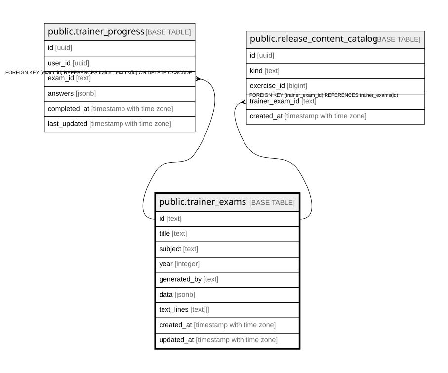

# public.trainer_exams

## Columns

| Name | Type | Default | Nullable | Children | Parents | Comment |
| ---- | ---- | ------- | -------- | -------- | ------- | ------- |
| id | text |  | false | [public.trainer_progress](public.trainer_progress.md) [public.release_content_catalog](public.release_content_catalog.md) |  |  |
| title | text |  | false |  |  |  |
| subject | text |  | false |  |  |  |
| year | integer |  | false |  |  |  |
| generated_by | text |  | true |  |  |  |
| data | jsonb |  | false |  |  |  |
| text_lines | text[] |  | true |  |  |  |
| created_at | timestamp with time zone | now() | true |  |  |  |
| updated_at | timestamp with time zone | now() | true |  |  |  |

## Constraints

| Name | Type | Definition |
| ---- | ---- | ---------- |
| trainer_exams_subject_check | CHECK | CHECK ((subject = ANY (ARRAY['Math'::text, 'German'::text]))) |
| trainer_exams_pkey | PRIMARY KEY | PRIMARY KEY (id) |

## Indexes

| Name | Definition |
| ---- | ---------- |
| trainer_exams_pkey | CREATE UNIQUE INDEX trainer_exams_pkey ON public.trainer_exams USING btree (id) |
| idx_trainer_exams_generated_by | CREATE INDEX idx_trainer_exams_generated_by ON public.trainer_exams USING btree (generated_by) |
| idx_trainer_exams_subject_year | CREATE INDEX idx_trainer_exams_subject_year ON public.trainer_exams USING btree (subject, year) |

## Triggers

| Name | Definition |
| ---- | ---------- |
| update_trainer_exams_updated_at | CREATE TRIGGER update_trainer_exams_updated_at BEFORE UPDATE ON public.trainer_exams FOR EACH ROW EXECUTE FUNCTION update_updated_at_column() |

## Relations

---

> Generated by [tbls](https://github.com/k1LoW/tbls)
